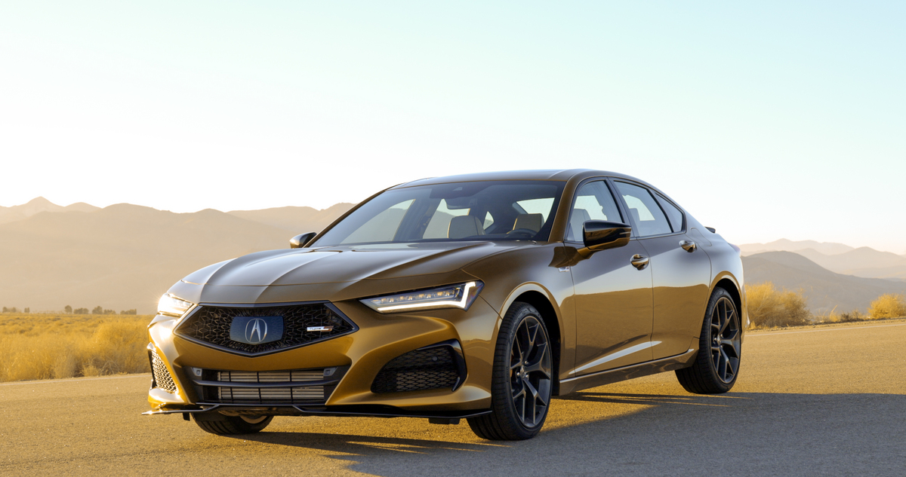

<!--  -->

2021 TLX Type S

- Highly-anticipated 2021 Acura TLX Type S arrives at dealerships nationwide tomorrow

- New video showcases Acura’s new Type S Turbo V6 engine created exclusively for the 2021 Acura TLX Type S and the upcoming 2022 MDX Type S

- Compact in design, the turbocharged 3.0-liter DOHC V6 engine builds on decades of performance engine expertise and incorporates technologies from the NSX supercar

As the highly-anticipated 2021 Acura TLX Type S arrives at dealerships nationwide tomorrow, Acura has released a new video [(youtu.be/CDthJ4AYi90)](youtu.be/CDthJ4AYi90) showcasing the development of the sport sedan’s new Type S Turbo V6 engine: The turbocharged 3.0-liter DOHC V6 incorporates technologies from the twin-turbo NSX supercar to produce 355 horsepower and 354 lb.-ft. of torque, making the TLX Type S the best performing Acura sedan ever. The new Type S engine also will power the upcoming 2022 MDX Type S.

<iframe width="400" height="200" src="https://www.youtube.com/embed/CDthJ4AYi90" frameborder="0" allowfullscreen></iframe>

After more than a decade, Acura’s Type S performance line triumphantly returns as the brand continues to sharpen its focus on Precision Crafted Performance. Previously available on select models from the 2001-2008 model years, Type S is recognized by driving enthusiasts who seek a more dynamic driving experience with more power, improved handling and stronger braking. With the Type S Turbo V6 and Super Handling All-Wheel Drive™ with true torque vectoring, the TLX Type S takes this philosophy to new heights.

The 2021 TLX Type S carries a manufacturer’s suggested retail price (MSRP) of $52,3001 and $53,100 with available High Performance Wheel and Tire Package.

<table style="border: 1px solid black; border-collapse: collapse;text-align:center;margin-bottom:15px">
  <tr>
    <th style="border: 1px solid black; padding: 8px;">Model / Trim</th>
    <th style="border: 1px solid black; padding: 8px;">MSRP2
    </th>
    <th style="border: 1px solid black; padding: 8px;">
    MSRP With Destination3
  </th>
    
 <th style="border: 1px solid black; padding: 8px;">
    EPA Mileage Rating4
   City/Hwy/Combined
     </th>
  </tr>
  <tr >
    <td style="border: 1px solid black; padding: 8px;">2021 TLX Type S</td>
    <td style="border: 1px solid black; padding: 8px;">$52,300</td>
    <td style="border: 1px solid black; padding: 8px;">$53,325</td>
    <td style="border: 1px solid black; padding: 8px;">19 / 25 / 21</td>
  </tr>
  <tr>
    <td style="border: 1px solid black; padding: 8px;">2021 TLX Type S with High Performance Wheel & Tire Package</td>
    <td style="border: 1px solid black; padding: 8px;">$53,100</td>
    <td style="border: 1px solid black; padding: 8px;">$54,125</td>
    <td style="border: 1px solid black; padding: 8px;">19 / 24 / 21</td>
  </tr>
</table>

#### Integrated Development from Concept to Production

Assembled in the company’s 2.5-million sq. ft. Anna Engine Plant in Anna, Ohio, the Type S Turbo V6 was developed in Japan under the guidance of Akio Matsuda, TLX Type S Powertrain Development Leader. However, the concept of the engine began in America with Matsuda playing a key role in its strategic development.

“While I was in Ohio, I was involved in the strategy development phase of this Type S Turbo V6 engine,” Matsuda said. “I remember how excited I was, along with the rest of the Acura engine development team, when it was decided to start developing this high-performance, environmentally responsible engine that we had proposed with our North American associates.”

Research and development teams from Japan and the U.S. included some of the company’s most experienced powertrain engineers, including members of the team who played a part in developing the Civic Type R engine and the bespoke twin-turbocharged V6 engine that gives NSX its grunt. As a result, the new Type S engine benefits from multiple disciplines and learnings from the current 3.5-liter V6, the turbocharged 2.0-liter four-cylinder and the NSX engine itself. The engine development team worked closely with the team from the Anna Engine Plant, where the engine would be manufactured.

“The associates at the Anna Engine Plant put a lot of pride into producing this very special Type S Turbo V6 engine,” said Tim Pohlman, Type S Turbo V6 Manufacturing Project Leader.

Along with the Type S Turbo V6, the all-new TLX Type S features a sport-tuned, quicker shifting 10-speed automatic transmission, which has been strengthened to handle the increased horsepower and torque of the new engine. Additionally, the standard torque vectoring Super Handling All-Wheel Drive™ (SH-AWD®) has been optimized for the performance demands of the Type S driver.

“I remember the first time I was able to feel the performance of the all-new Type S,” said Craig Brazeau, Type S Powertrain Development Engineer. “I was in a prototype car at Acura’s Ohio proving grounds and I can say it was an amazing experience to finally feel that level of performance, see our concept come to life and witness the culmination of all the technologies that we worked on together in developing this amazingly fun to drive sports sedan.”

#### Type S Turbo V6 Engine

Exclusive to Type S models, the Type S Turbo V6 features all-aluminum construction, compact dimensions, dual overhead camshafts, 24-valves, direct injection and a single twin-scroll turbocharger. Its block is unique, sharing only bore spacing and a 60-degree angle with the highly-regarded 3.5-liter V6 that has powered various Acura models. Significant differences between the two include the 3.0-liter’s 6-bolt sintered main caps for increased crank rigidity and durability and a fully square 86 mm bore and stroke.

Numerous engineering steps were taken to ensure the new engine’s compact size and low profile that enabled it to fit in the TLX engine room. This includes the placement of the turbocharger adjacent to the engine above the transmission and the use of low-profile cylinder heads. Separate cam bearing caps have been replaced by caps directly incorporating into the valve cover itself, lowering the engine’s height and reducing the number of parts. Fully assembled, the engine is 8 mm shorter than the naturally aspirated 3.5-liter V6.

Featuring a robust rotating assembly to meet the demands of extreme performance and durability, the Type S Turbo V6 employs a high-stress forged steel crankshaft and forged steel connecting rods. To help reduce emissions, the top piston ring carrier of its pistons is a high-density Ni-resist cast iron, which features better wear characteristics and better sealing.

#### Single Twin-Scroll Turbocharger

The Type S Turbo V6 employs a single twin-scroll turbocharger, which is fed exhaust pressure by the rear and front cylinder banks through independent internal paths. Turbo lag is minimized, and throttle response is optimized as the engine’s rear bank of cylinders pressurizes the smaller diameter scroll of the turbo’s turbine, while the front bank feeds the larger diameter.

For quick turbo response, the exhaust manifold is cast directly into the cylinder head itself and to improve the engine’s torque characteristics, Variable Timing Control™ (VTC™) is used on both intake and exhaust cams. With maximum boost of 15.1 psi, the engine’s 354 lb.-ft. of peak torque is available starting from an exceptionally low 1,400 rpm.

Meeting emissions targets required developing an exhaust system to properly manage heat to quickly get the catalytic converter to its optimum operating temperature. Heat management of the turbo system is addressed using double-walled and finned exhaust pipes leading from the exhaust ports to the turbo housing, marking the first use of this kind of technology in an Acura engine. Additionally, the V-band connecting the turbo housing to the catalytic converter reduces heat transfer to the converter and allows the converter to be placed much closer to the turbo exhaust outlet.

An additional radiator is employed to better manage overall engine temperatures, and the open-surface Diamond Pentagon mesh grille used on TLX Type S increases airflow to the engine compartment by about 10 percent. The boost charge is cooled through an intercooler unique to the engine, measuring 3.2 inches thick, 23.6-inches long and 4.9 inches high.

**Variable Cylinder Management™A** primary goal of the new Type S Turbo V6 was to implement Variable Cylinder Management™ (VCM™) to improve fuel efficiency and reduce emissions. VCM™ operates the engine with three cylinders in a wide range of situations, switching seamlessly to six-cylinder operation when more power is needed. To prevent pumping losses, the engine’s Electronic Control Unit (ECU) closes the valves on the inactive cylinders. On the SOHC 3.5-liter engine, this is accomplished by using VTEC®, which locks the rocker arms activating the valves together to prevent the valves from opening when VCM™ is active.

Due to the low-profile of the new DOHC cylinder heads, this arrangement has been replaced with a more compact rocker arm and hydraulic lash adjuster design. When all six cylinders are in use, a pin in the valve lifter assembly is held in place with oil pressure. When VCM™ is activated under light cruise and when off-boost, the ECU drops the oil pressure, allowing the pin to slide out of the lifter, creating a gap that prevents the valve from opening. When the ECU determines all six cylinders are needed, the system re-pressurizes the oil, sliding the pin back in place and reactivating the valves for full power, all before the turbo can create boost.

#### Active Vibration Control

To maintain smooth operation when VCM™ is engaged, new engine mounts and Active Vibration Control (AVC) are used. Unique to the Type S Turbo V6, AVC cancels out vibrations from the chassis as well as the engine, making the operation of VCM™ almost imperceptible to the vehicle’s occupants.

#### Active Exhaust

TLX Type S also features an Active Exhaust system, adopted from the NSX. The Active Exhaust opens a butterfly valve in each muffler to enhance the V6 engine’s natural sound for a distinct auditory and more emotional driving experience. When the butterfly valves are fully opened, the exhaust is 5-7 decibels louder, as measured from about 20 inches (500mm) 45-degrees laterally from the exhaust tip. In addition, the exhaust system valve is used to vary the exhaust system flow rate, which helps reduce the potential for “booming” from the exhaust system, as well as helping with the gear-shift “pop” sound.

Active Exhaust system operation is dependent on the selected Integrated Dynamics System mode. In Comfort mode, the valves are closed at startup and at idle, and remain closed until 4,000 rpm. In Normal mode, the engine starts and idles with the valves open for a more exciting startup experience. Once the transmission is shifted into gear, the valves close and remain closed until 4,000 rpm. In Sport mode, the valves are fully open at idle and at launch but close during cruising, and in Sport+ the valves are open at all times.

For more information on the 2021 Acura TLX Type S [click here](https://acuranews.com/en-US/releases/release-53541be6030b25a47a2899aba1114808-2021-acura-tlx-type-s-press-kit).

More details about the 2022 MDX Type S will be available closer to its on-sale date.
