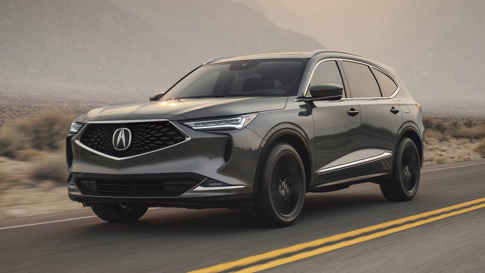
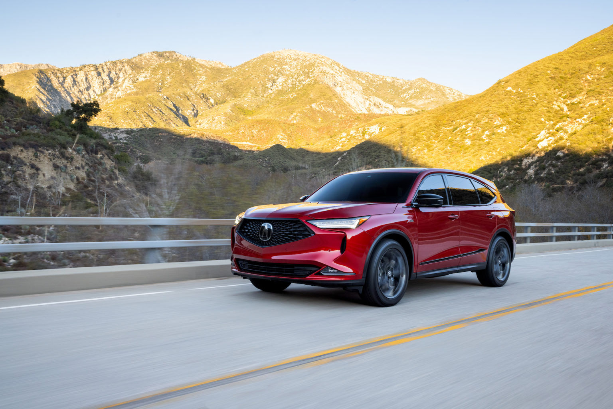

<!--  -->

[https://acuranews.com/en-US/releases/release-0d4299c7fc28e9f9054be9d00724bc52-2022-mdx-asserts-its-role-as-the-flagship-of-the-acura-brand-in-new-launch-campaign](https://acuranews.com/en-US/releases/release-0d4299c7fc28e9f9054be9d00724bc52-2022-mdx-asserts-its-role-as-the-flagship-of-the-acura-brand-in-new-launch-campaign)

- All-new, fourth-generation MDX
- New integrated campaign highlights more than 35 years of Acura performance - heritage to introduce MDX as the brand’s new flagship
- With a dramatic redesign, the 2022 MDX is the most premium, performance-focused and technologically sophisticated SUV in Acura history

In advance of arriving at dealerships Feb. 2, Acura’s all-new [2022 MDX](https://www.acura.com/suvs/mdx) launch campaign [acura.us/mdxlaunchcampaign](acura.us/mdxlaunchcampaign) demonstrates how Acura’s long-time racing and sports car success is powering the fourth-generation SUV to its new role as the flagship of the brand.

Set to the soundtrack of Queen’s “Tear It Up,” the new Acura campaign highlights key components of the all-new MDX, including its bold and athletic exterior design along with a new, sophisticated and elegant interior featuring the most high-tech and advanced cockpit in the brand’s history. MDX performance is underpinned by a first-ever double-wishbone front suspension applied to its all-new, ultra-rigid platform, featured in an accompanying spot (acura.us/mdxperformance) that also demonstrates MDX’s towing capability. Full 2022 MDX information is available [here.](https://acuranews.com/en-US/releases/2022-acura-mdx-debuts-as-new-brand-flagship)

The integrated campaign takes viewers on an exciting trip through Acura’s pinnacle vehicles and racecars to highlight that MDX shares the “same DNA” as the original 1991 NSX, 2001 Integra Type R and the 2021 NSX. Acura’s racing heritage is reflected with the Comptech Spice Acura GTP Lights racecar that Parker Johnstone drove to three consecutive IMSA Camel Lights Driver’s Championships from 1991 to 1993, along with an appearance by the back-to-back IMSA Championship-winning NSX GT3 Evo.

The campaign was developed in collaboration with agency of record MullenLowe LA, and will be featured across broadcast, digital and social media. Key national broadcast highlights include cable and live sports – NBA, NCAA and March Madness match-ups. The 2022 MDX campaign will also be featured on streaming platforms with :30 and :15 versions of the TV creative, along with :06 versions featured across social media. Acura’s MDX spots will also run in Spanish and Chinese-language.

Other key campaign components include:

- “Origin Story,” a social media activation launching next month on Acura’s social channels with a series of videos that dive further into the “same DNA” performance and innovation story that led to MDX.

- “Working Mom,” a dedicated Spanish-language :30 TV spot, that will run across national Hispanic networks including Telemundo and Univision, showcasing the duality of the 2022 MDX as a high-performance and ultramodern family SUV to reach Hispanic audiences.

- High-impact digital editorial partnerships with Travel + Leisure, Conde Nast, Martini, as well as Hispanic outlets such as People en Español and Mama’s Latina.

- Integration of high-impact digital media to reach key Chinese audiences, working with niche publishers such as Asian Media Group.

2022 MDX A-Spec

.

.

We are excited to get these new models in at our location in Saskatoon, Sk!
