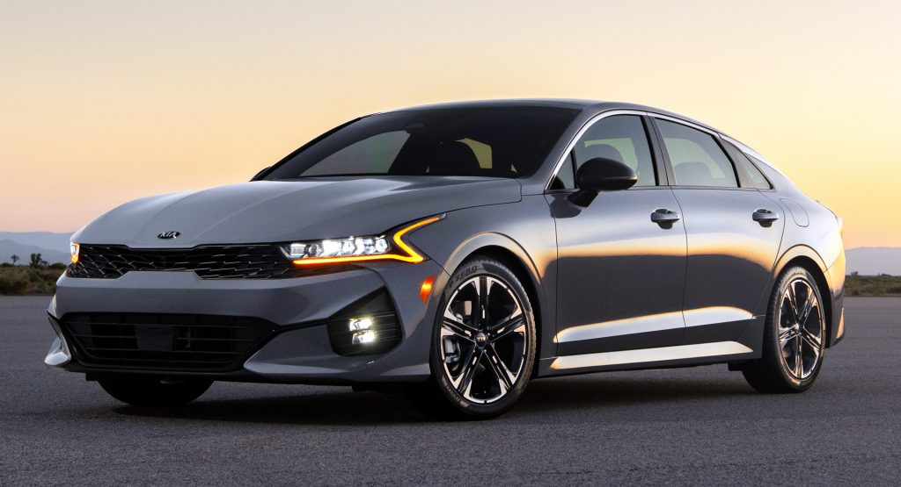
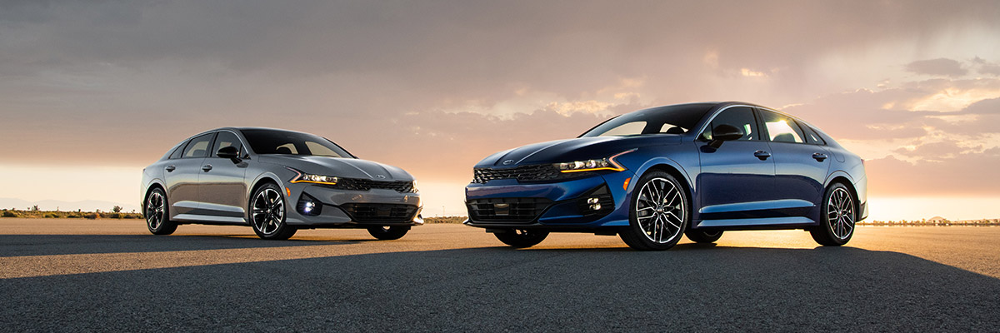
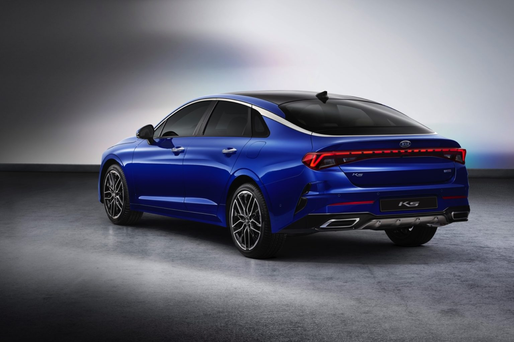

<!--  -->

https://www.kia.ca/kia-news/395

• The K5 comes in 4 trims in Canada; LX, EX and GT-line, all with standard AWD

• K5 GT will also be available shortly after, with 290HP mated to a DCT transmission for those looking for more performance

• K5 boasts Kia’s leading design, all-new safety and technology features and turbocharged engines

The K5 is the result of Kia’s unstoppable passion to craft an exceptional driver experience that delivers ‘The Power To Surprise’ at every turn. Innovation arrives in Canada October 2020, when the K5 will make its national debut in LX, EX and GT-Line trims with standard all-wheel drive and added GT model with 290HP of performance, to arrive this winter.

A non-traditional, performance-inspired mid-sized sedan, K5 is the catalyst for the transformation of Kia’s next-generation line-up, characterized by powerful design, constant renewal, re-imagination and boldness. True to brand roots, Kia introduces a new-age naming convention with “K5,” paying homage to original nameplate titles in the brand’s homeland of South Korea.

“Kia raised the bar on performance and design with the all new K5,” says Kia Canada Chief Operating Officer Elias El-Achhab. “The K5 delivers on every level from top of the line design, to driving performance and the latest in Kia’s safety and technology – just what Canadian drivers are looking for.”

A Daring, New Design – Inside and Out

Kia’s sleek “tiger face” is front and centre on K5, with a wide, thin front grille (with a shark skin inspired mesh design), extending to the headlight structure and underscored by “Heartbeat” LED daytime running lights. K5 boasts a low-slung and fastback silhouette, which is highlighted by a chrome garnish that spans the roofline and wraps around the rear glass. Its three-dimensional front bumper gives the illusion that K5 floats effortlessly, and a long, muscular hood emphasizes short front overhangs.

K5 has a thoughtfully designed interior to match, with a wide, horizontal cabin characterized by clean lines and visually pleasing yet functional details. A newly-styled infotainment display stretches to the instrument panel, creating a futuristic, three-dimensional layout and driver-centric space. A thoughtfully designed vertical wireless charging sleeve keeps the interior free of cords and cables for phone charging. Drivers can also customize their sporty interior with a selection of black leather seating, chrome metallic and wood-like finishes, a flat-bottom sport steering wheel and available panoramic sunroof.

At the Root of it All

K5 is underscored – quite literally – by the advanced third-generation “N3” platform. The platform, designed for collision safety, weight reduction and driving performance, will serve as the foundation for future Kia models. This N3 platform provides roomier interior dimensions, suspension geometry optimized for sport handling and improved sound deadening materials. On the K5, it allows the vehicle to sit longer, wider and lower, giving it a low-slung profile.

K5’s exterior dimensions are:

- Length: 4,905mm (193.1 inches)

- Width: 1,860mm (73.2 inches)

- Height: 1,445mm (56.9 inches)

- Wheelbase: 2,850mm (112.2 inches)

Turbo, Traction and Top-Notch Tech

K5 LX, EX and GT-Line trims offer a 1.6-litre turbocharged GDI four-cylinder engine producing 180 horsepower and 195 lb.-ft. of torque, managed by an all-new eight-speed automatic transmission. Kia engineers further pushed the envelope on the K5 GT with an available eight-speed “wet” dual-clutch transmission for fast and precise gear shifts, which helps the K5 stand out as a true sports sedan. The 2.5-litre turbocharged GDI + MPI four-cylinder engine making 290 horsepower and 311 lb.-ft. of torque driving the front wheels and is paired with the new 8-speed “wet” Dual Clutch Transmission.

With enhanced all-weather capabilities, Kia K5’s AWD system provides active control of driving power distribution for peace of mind and safety.

The Engine adopts Continuously Variable Valve Duration (CVVD). This piece of technology results in a performance boost and improvement in efficiency thanks to independent control of the valve duration.

K5’s cutting-edge cabin doesn’t just talk the talk – smart and forward-thinking technology has been integrated to make the driver experience less stressful. New wireless features minimize cord clutter and keep a clean space, while keeping the driver’s eyes on the road. More details include: .

- 8- or 10.25-inch high-resolution color touchscreen
  o Split-screen functionality and available satellite radio
  o Available 10.25-inch inch touchscreen adds server-based available navigation system with real-time traffic data, more intuitive graphic user interface, new multi-connection Bluetooth wireless connectivity and UVO telematics with connected user profiles

- A first for Kia, wireless Apple CarPlay and Android Auto cuts the cord on charging cables, meaning drivers can enjoy being connected and charging up without being plugged in (8-inch screen only)

- Premium Audio system available, with 12 high-performance Bose speakers

Kia’s suite of Advanced Driver-Assistance Systems (ADAS) now has more to offer, with some of the key features including:• Available Forward Collision Avoidance Assist (FCA) with Junction Turning (FCA-JT): Assists the driver in braking to help prevent a collision or lessen the effects in certain conditions when turning left and an oncoming vehicle is approaching is the latest advancement in Kia’s suite of safety technology

• Standard Forward Collision Warning (FCW): Designed to detect a vehicle in front and in certain conditions and issues an alert to warn the driver if it senses a potential frontal collision

• Standard Forward Collision-Avoidance Assist (FCA): Builds on FCW by assisting the driver in braking to help prevent a collision or lessen the effects in certain conditions if a vehicle or object is detected in front

• Standard Blind Spot Collision Avoidance Assist (BCA) : Detects other vehicles in the blind-spot zone of the vehicle and warns the driver with visual and audible alarms while automatically engaging the vehicle’s brakes to prevent the collision

• Standard Driver Attention Warning (DAW) : Senses inattentive driving patterns and sends an audible/visual warning to alert the driver

• Standard Lane Following Assist (LFA): Follows lane markings that the system detects and provides steering inputs to help maintain the vehicle in the center of the lane

.

.

.

For more information visit https://www.kia.ca/kia-news/all-news-and-events.

We are looking forward to seeing these models out on the roads!

Come visit our KIA location in Saskatoon!

-FFUN Family
