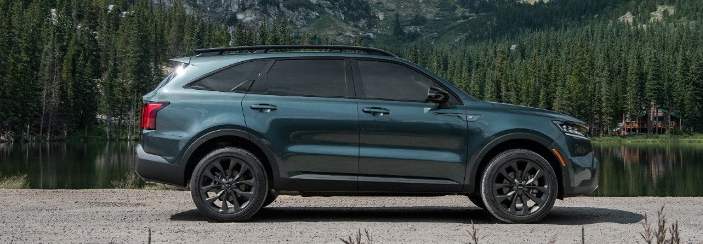

<!--  -->

[https://www.kiamedia.com/us/en/media/pressreleases/16872/all-new-sorento-wins-large-suv-of-the-year-at-2021-what-car-car-of-the-year-awards](https://www.kiamedia.com/us/en/media/pressreleases/16872/all-new-sorento-wins-large-suv-of-the-year-at-2021-what-car-car-of-the-year-awards)

2021 Sorento Line Up Hybrid, SX, X-Line

- All-new Kia Sorento takes home the ‘Large SUV of the Year’ award

- Sorento praised for its fuel economy, driving dynamics and well equipped interior

- Sorento highly praised since launch in 2020

**January 11, 2021** – Kia’s flagship SUV, the all-new Sorento, has made a strong start to the year, being named ‘Large SUV of the Year’ at the 2021 What Car? Car of the Year Awards.

Up against worthy competition in the Large SUV category, the What Car? judging panel chose the Sorento for its impressive fuel economy, driving dynamics, high levels of standard specification, and exceptional build quality.

The variant chosen by the judges at What Car? was the 1.6 T-GDi Hybrid in the UK’s ‘2’ specification, packed full of standard features such as a Reversing Camera System, Intelligent Speed Limit Assist, and Forward Collision Avoidance with pedestrian, cyclist and junction detection.

Commenting on the Sorento win, Steve Huntingford, Editor of What Car? magazine said: “The Sorento’s hybrid tech combines good real-world fuel economy with comparatively low CO2 emissions, while the ride is comfortable and the steering accurate. Throw in a nicely made and well-equipped interior, a driving position that’s lofty enough to make HGV drivers jealous and Kia’s unmatched seven-year warranty, and the Sorento is an outstanding all-rounder.”

Won-Jeong Jeong, President at Kia Motors Europe commented: “It is always a great honour to receive awards for the vehicles that we produce, and particularly from such well-known and highly regarded publications as What Car? magazine. The fourth-generation Sorento is a car we are very proud of, particularly as it represents the first application of electrified power in our flagship SUV.”

The all-new Sorento has only been on sale in Europe for a short time, yet has already cemented itself as an important halo product in the Kia line-up, having also won ‘Car of the Year’ in the UK’s Carbuyer 2021 awards.

The all-new Sorento range is available across Kia’s European dealer network, with powertrain options (depending on market) including hybrid, diesel and plug-in hybrid. All models are sold in Europe with Kia’s industry-leading seven-year, 150,000-kilometre warranty.

.

.

.

Book a test drive today at our Kia locations in Saskatoon or Prince Albert!

-FFUN Family
