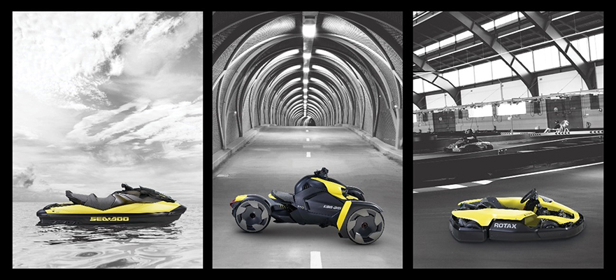

<!--  -->

http://news.brp.com/media/news-releases

- BRP to invest $300 million over the next five years to electrify its existing
  product lines by the end of 2026.

- The first product is expected to be introduced to the market within the next
  two years, followed by a rapid roll-out across all product lines.

- BRP is developing its Rotax modular electric powerpack technology in-house
  which will be leveraged across all product lines.

- BRP is creating an Electric Vehicle Development Centre in Canada, which will
  focus on the “energy side”: the charger and the battery pack, as well as the complete integration into the vehicle, and a second pole of development in Austria, which will focus on the “torque side”: the inverter and the high performance electric motor.

- BRP is actively recruiting to expand its EV team of experts.

**Valcourt, Quebec, March 25, 2021** – BRP (TSX: DOO; NASDAQ: DOOO) announced its five-year plan where it will offer electric models in each of its product lines by the end of 2026. To achieve this, BRP plans to invest $300M over five years in product development, specialized equipment, infrastructure, production tooling and facilities.

“We have always said electrification was not a question of ‘if’ but a question of ‘when’. Today, we’re very excited to unveil more details of our plan to deliver market-shaping products that will enhance the consumer experience by offering new electric options,” said José Boisjoli, President and CEO. “We are leveraging our engineering know-how and innovation capabilities to define the best strategy for developing electric-powered products,” he added.

After developing and evaluating several concepts, BRP has made the bold decision to develop its Rotax modular electric powerpack technology which will be leveraged across all product lines enhancing the consumer experience by offering new electric options. To achieve this, BRP is expanding its Rotax electric power unit development infrastructure in Gunskirchen, Austria, and is also creating the BRP Electric Vehicle Development Centre, located in its hometown of Valcourt, Quebec, Canada. This facility will feature state-of-the-art equipment, including several sophisticated test benches and dynamometers, plus an ultramodern robotized manufacturing cell for electric batteries.

“We are thrilled to create our EV expertise centre, taking steps into the world of electrification,’’ said Bernard Guy, Senior Vice-President, Global Product Strategy. “Experts on our EV team will feel the agility of a startup environment but will benefit from BRP’s financial resources and state-of-the-art equipment to design our in-house technology,” he added.

## BRP’s electric path

In early 2019, BRP acquired assets of Alta Motors, an electric motorcycle manufacturer, and commercialized the Rotax Sonic E-Kart, which is currently in operation at the Rotax MAX Dome in Linz, Austria. A few months later, it showcased e-concepts at Club BRP 2019 to give a glimpse of what the future could hold for both its current product lines and for other potential segments. BRP has produced several battery-electric, hybrid-electric and even fuel cell-electric vehicles over the years. Today’s announcement brings BRP’s electric journey further into focus, with a clear vision and firm plans to roll out its electric products.

## Expanding BRP’s electric vehicle development team##

The R&D team is expanding quickly, and BRP is recruiting for several positions as it moves to the next phase of its electric propulsion technology development. With involvement from Quebec, Austria, Finland and the United States, BRP’s top talent worldwide, including hundreds of engineers and specialized technicians, will work together to develop and produce electric vehicles at BRP.

.

.

.

For more information visit brp.com

Stop by our FFUN Motor Sports locations to check out your next toy! You can find us in Saskatoon or Yorkton, SK.
