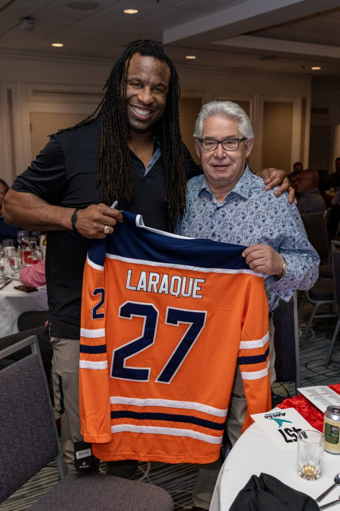

There’s no denying that inflation has been climbing around the world, and Saskatchewan is not exempt from it. However, the Government of Saskatchewan is providing some relief and for some, it’s bonus money.

<!--  -->

In line with our commitment to doing good for the communities they serve, our Championship Classic Golf Tournament 2022 continued to crush the bar in raising money for the Royal University Hospital Foundation. The event that took place on June 29th, has set an unbelievable example of what community support means. The energy and support were unlike anything we’ve ever seen, and we raised $212,000 to help RUH with Mission Possible: Operation New O.R.

RUH has spearheaded this cause to raise $20 million+ to build and equip new state-of-the-art operating rooms, reduce wait times and save and improve more lives at RUH now and in the future. To learn more about Mission Possible or to donate, check out what they are up to by visiting the site.

There is strength in numbers and through the alignment of community goals and unwavering commitment to do good, we turned this fundraising dream into reality. Without our amazing sponsors, including our presenting sponsors, Ledcor and BMA Benefits, none of this would have been possible. From the team at FFUN and RUH, thank you; your generosity will never be forgotten.

The Championship Classic 2022 wasn’t a one-day event, we kicked it off strong with an NHL autograph session where NHL fans and customers of FFUN had the chance to come down and meet some of their favourite NHL stars and get an autograph – thank you to the players who participated; you are a star on the ice and in the community’s hearts.

In addition to the incredible afternoon of NHL signing, we gathered sponsors and NHL celebrities for a night of entertainment with comedian, Kelly Taylor, and a live auction of the players. There are no words that can justify the gratitude to all who were involved.

FFUN Motor Group was proud to partner with RUH on such a successful event, as we both strive to make our community better and stronger through the shared passion for making the world a bit brighter every new day. FFUN Spirit will continue to be a Force in our community, a Force of nature, and a Force for good. <3
