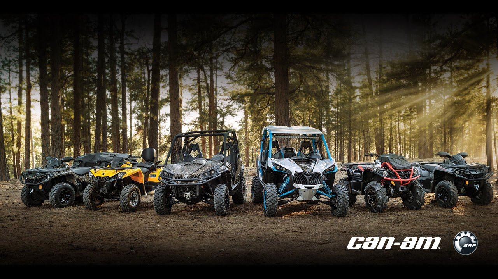
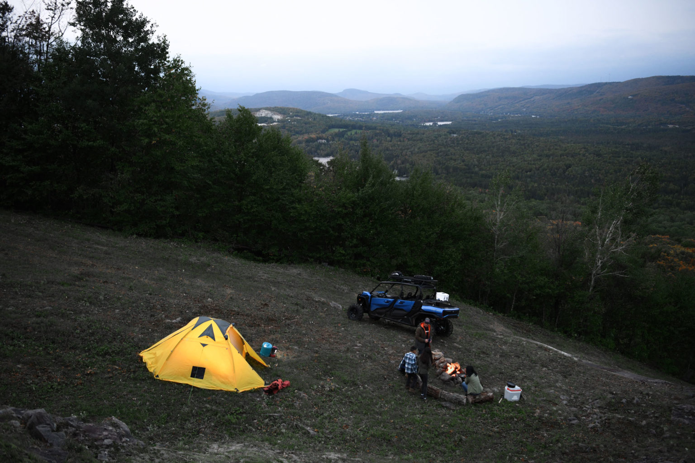
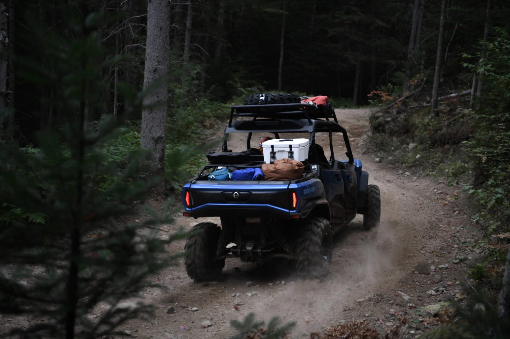
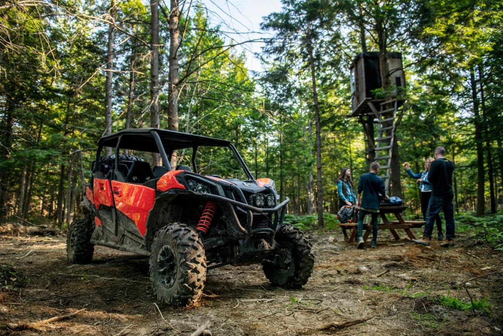
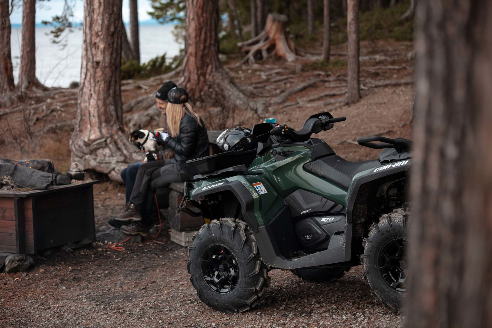
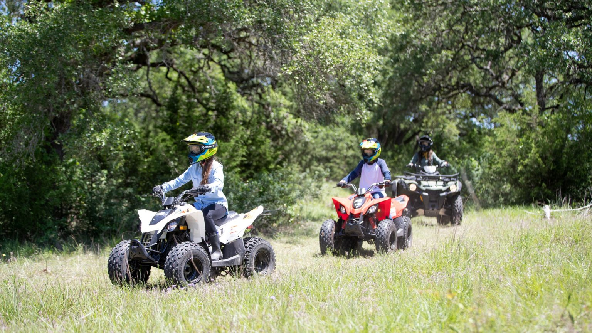
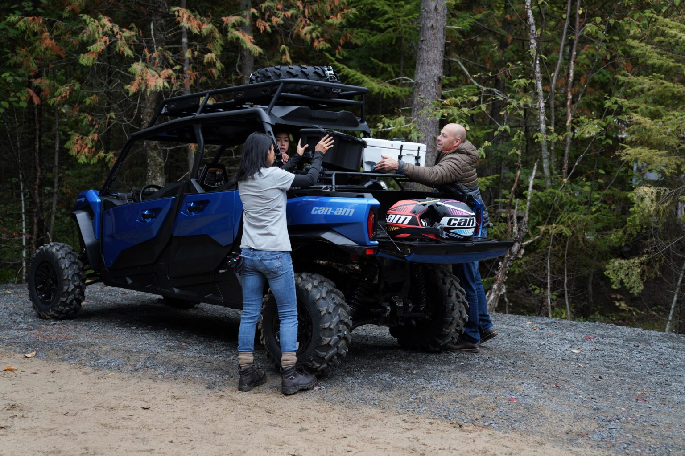
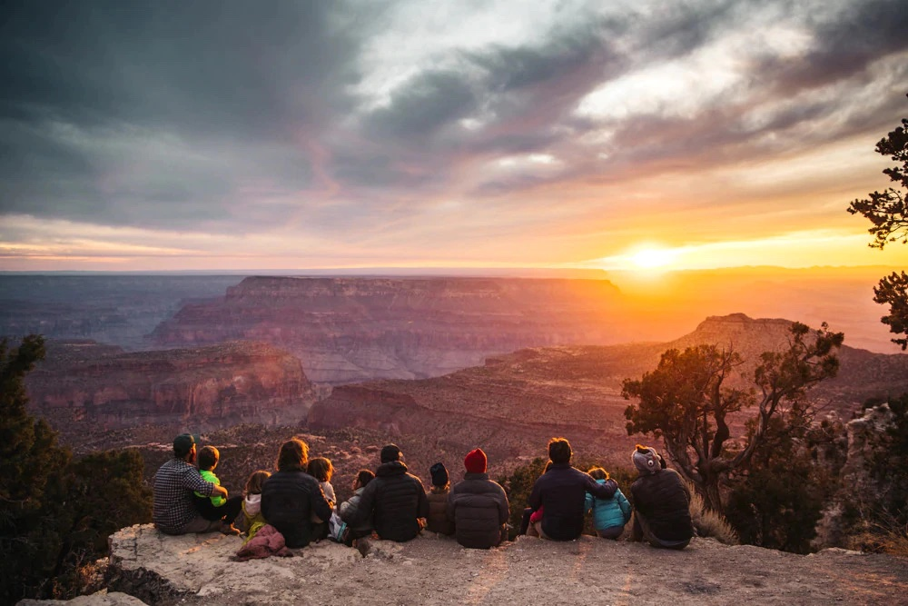

<!--  -->

[https://can-am.brp.com/off-road/ca/en/can-am-world/blog/best-atv-side-by-side-utv-for-families.html](https://can-am.brp.com/off-road/ca/en/can-am-world/blog/best-atv-side-by-side-utv-for-families.html)

## WE HELP YOU FIND THE BEST OFF-ROAD VEHICLE YOU CAN ENJOY WITH THE ENTIRE FAMILY.

Families stick together through thick and thin. Enjoying activities all together is just one of the ways that family members connect with one another and create lasting memories. We believe outdoor activities are a huge part of what makes a family bond, so we offer plenty of awesome ways to do so. [ATVs](https://can-am.brp.com/off-road/ca/en/models/all-terrain-vehicles.html) and [side-by-side vehicles (SxS)](https://can-am.brp.com/off-road/ca/en/models/side-by-side-vehicles.html) are the ultimate ways to experience adventure outdoors as a family—and those who have already tried it, know what we’re talking about. These days, off-road vehicles are designed to accommodate more than one person all while being safe, so riders of all ages can enjoy what the great outdoors has to offer!

In this article, you’ll find everything you need to know from the best ATVs and SxS for families and the accessories that take them up a notch, to thrilling off-road activities that’ll make your family want to go riding again and again.

## ATV OR SIDE-BY-SIDE/UTV: WHICH IS BEST FOR FAMILY RIDING?

When planning an off-road experience with family, the two things you want to look for are passenger capacity and vehicle security. First off, the ride you choose is completely dependent on the amount of family members you want to bring along as passengers. If you have a big family and expect to bring along 2-5 passengers, a SxS/UTV would be the best choice for you. They are designed to carry up to 6 people comfortably, with two rows of seating on some models. If you want to keep it to a minimum and only carry one family member at a time, you can easily go with an ATV vehicle.

Security is a big element to keep an eye out for, too. All off-road vehicles are made with the rider’s (and passenger’s) security in mind, but SxS/UTV vehicles are designed to be safer, as they have seat belts, side ebbing and roll cages on their basic models. This, however, doesn’t mean that ATVs are unsafe. In fact, being built as a secure vehicle is one of the [many advantages of ATVs](https://can-am.brp.com/off-road/ca/en/can-am-world/blog/atv-vs-sxs-utv.html) and there are tons of accessories available to increase the safety of your rides.

Let’s dig deeper into the different ATV and SxS/UTV models so we can find the best off-road ride for you and your family.

## MULTI-PASSENGER SXS/UTV OR 2 PASSENGER ATV FOR FAMILY RIDING?

Now that we know passenger capacity is a major element to look out for, the question is how many seats you’ll actually need. Will you want to tag along one person, or make it a party of 4? Here are the best vehicle options we have to offer according to the size of your family.

## A 4-SEATER OR 6-SEATER SIDE-BY-SIDE VEHICLE FOR A GROUP

If you feel like the 2-3 seats on a basic SxS/UTV is cramping your style, then you’ll want to opt for a vehicle with extra space. One of the best family riding options you have in the SxS category is the [ Can-Am Maverick Sport MAX DPS.](https://can-am.brp.com/off-road/ca/en/models/side-by-side-vehicles/maverick-sport.html#max-dps) It can seat up to 4 passengers comfortably, has a modern design and is very spacious for carrying around gear with you. It is also built secure with a profiled ROPS approved cage and exterior protection from terrain. Another family-friendly option is the famously versatile [Can-Am Commander.](https://can-am.brp.com/off-road/ca/en/models/side-by-side-vehicles/commander.html) If you want a vehicle that combines family fun and work tasks, the 4-seater Can-Am [Commander MAX XT](https://can-am.brp.com/off-road/ca/en/models/side-by-side-vehicles/commander.html#max-xt) is the one for you. They call the Commander a do-it-all machine for a reason! Finally, if you want to boost your number of passengers to 6, Can-Am also has some 6-seater vehicle options with more than enough cargo room to spare. [Find out more about Can-Am’s lineup of 4-seater and 6-seater side-by-side vehicles.](https://can-am.brp.com/off-road/ca/en/models/4-6-seater-side-by-side.html)

## A 2-UP ATV FOR YOU AND YOUR PLUS-ONE

A boxed-in SxS/UTV isn’t your only option for family riding. A 2-up ATV is a worthy alternative for sharing adventures on the off-road trails with one of your kids or a partner. It accommodates a second passenger comfortably, all while allowing them to enjoy the adrenaline rushes this ride is known for. One vehicle that offers this experience is the [Can-Am Outlander MAX DPS.](https://can-am.brp.com/off-road/ca/en/models/all-terrain-vehicles/outlander.html.html#max-dps) It has dynamic passenger comfort ergonomics and passenger handgrips with multiple positions, so your family member can be at ease and focus on the scenery. If you’re a big fan of the ATV, but want to enjoy it with multiple family members, one way you can do that is to purchase multiple vehicles. Each person can have their own machine to control and can follow along at their own pace! [Get more information about the Can-Am lineup of 2-seater ATVs.](https://can-am.brp.com/off-road/ca/en/models/2-seater-atv.html)

## INITIATE YOUR KIDS TO THE OFF-ROAD LIFE WITH YOUTH ATVS

If your family has kids aged 6 years old and up, you can get them a vehicle of their own and ride the trails together! The DS ATV lineup by Can-Am has a selection of youth ATV vehicles that introduces young riders to the off-road life. These Can-Am quality machines are designed with the safety of children in mind, complete with an electric starter, speed limiter options and confidence-inspiring handling. Kids can experience the independence of riding on their own and learn real trail riding, the right way. [Learn more about the Can-Am DS lineup of youth ATVs.](https://can-am.brp.com/off-road/ca/en/models/all-terrain-vehicles/DS.html)

## ATV AND SIDE-BY-SIDE VEHICLE ACCESSORIES FOR THE BEST FAMILY RIDE

ATV and SxS accessories like [those from Can-Am](https://can-am-shop.brp.com/off-road/us/en/) are designed to make every ride with your off-road vehicle better—even the rides with family. They offer added safety, comfort and pleasure to the entire experience. Here’s a list of must-have accessories for the best family experience on the trails.

## LOOKING FOR AN ADVENTUROUS OFF-ROAD FAMILY ACTIVITY?

Look no further! BRP’s project, Uncharted Society, is your key to an unforgettable off-road ride with your family. All you need to do is pick the location, and we’ll provide you with everything you need—a vehicle, points of interest, safety orientation, a map and operating instructions—to experience it to the fullest. Guide your family through the most thrilling corners of the world with an off-road machine of your choosing. Trust us, you won’t regret it. [Discover tons of off-road adventures in some of the most beautiful places on Earth now!](https://www.unchartedsociety.com/us/en/adventures.html)

## IT’S TIME TO HAVE FUN WITH THE FAM!

Once you decide which vehicle to use for your off-road family adventures, the fun will come naturally. An [ATV](https://can-am.brp.com/off-road/ca/en/models/all-terrain-vehicles.html) and a [side-by-side vehicle](https://can-am.brp.com/off-road/ca/en/models/side-by-side-vehicles.html) are both excellent vehicles that provide families with thrills, adventure and quality bonding time that they’ll remember for a long time to come.

.

.

.

Be sure to check out our FFUN Motor Sports stores in Saskatoon, SK and Yorkton, SK! Start your next adventure today!
