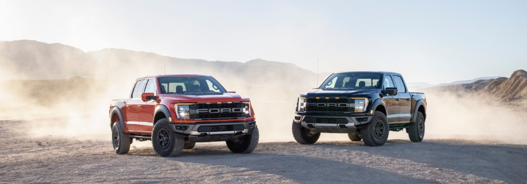

<!--  -->

- Tackle tougher terrain: Fully redesigned F-150 Raptor boosts its off-road capability with all-new five-link rear suspension featuring class-leading\* wheel travel, electronically controlled next-generation FOX™ shocks with Live Valve™ technology, plus first-in-class available 37-inch tires to tackle tougher terrain on high-speed desert runs
- Most connected: Every F-150 Raptor comes with standard over-the-air updates and a new connected experience that can deliver potential features like shareable digital trail maps or other off-road technologies in the future; plus, there’s SYNC® 4 with cloud-connected navigation and voice search and the FordPass mobile app to check on your truck remotely, control the truck’s lights from your hand and more
- Best-performing: High-output 3.5-litre EcoBoost® engine delivers better low-end torque, enables greater maximum towing and increased maximum payload capability, brings a projected 500-mile-plus (800 km) range, plus first-in-class active valve dual exhaust for throatier engine sound; Raptor R is coming next year

Ford, North America’s truck leader, created a segment-busting off-road icon in 2009 when it introduced the desert racing-inspired F-150 Raptor. It was designed to not only speed over rough terrain, but also to jump and catch air.

And today, it’s born again with an all-new, third-generation F-150 Raptor that takes the mechanical and technical brilliance and precision of Raptor and infuses it with enhanced connected technology that means the experience of owning an F-150 Raptor will only improve over time.

“Raptor is the original desert truck. We just took it to another level,” said Ali Jammoul, Ford Performance vehicle program director. “The all-new Raptor splices high-speed off-road performance muscle with advanced technology and connectivity that comes together in a unique Built Ford Tough way.”

#### High-performance hardware

A high-performance off-road pickup is defined by its suspension, and the all-new F-150 Raptor debuts with completely redesigned running gear. It is reengineered with an all-new five-link rear suspension developed specifically for Raptor, designed to deliver more control and power to the ground with greater confidence over rough terrain at high speeds.

“Raptor is rooted in Baja 1000 racing, and its suspension advances our capability and performance – a five-link rear setup with more wheel travel than any Raptor before it,” said Carl Widmann, Ford Performance chief engineer. “And like a trophy truck, every aspect of Raptor has been engineered to deliver precision capability when your foot is flat on the floor, way out in the middle of nowhere roaring across the desert.”

The five-link rear suspension features extra-long trailing arms to better maintain axle position on rough terrain, a Panhard rod and 24-inch coil springs – the longest in the class. The suspension design combined with more sophisticated engine management software means the truck can put more torque to the rear wheels for quicker starts off the line, faster acceleration and better throttle responsiveness while simultaneously delivering comfort, stability, handling, control and traction at speed.

Soaking up giant whoops and landings comes courtesy of next-generation FOX™ Live Valve™ internal bypass shocks with state-of-the-art electronic control technology offering position-sensitive damping adjustability. Raptor’s largest-ever shocks are designed to better resist heat buildup and to react even faster to terrain changes for greater confidence over extended desert running. The larger 3.1-inch-diameter anodized aluminum shock bodies are filled with all-new low-friction shock fluid specially designed to decrease frictional losses inside the damper for improved off and on-road comfort. New electronically controlled base valves are race-proven with an upgraded design enabling upward of 1,000 pounds of damping per corner at desert speeds.

Readings from suspension height sensors and other sensors around the truck change damping rates independently at each corner 500 times per second, with the shocks responding in 80 milliseconds, or the same speed the human brain processes visual information. The truck responds by the time the driver even registers a terrain change.

For the first time, Raptor is available with either 35-inch or 37-inch tires – the largest ever factory-fitted to a production light-duty full-size pickup. These specially designed BFGoodrich all-terrain T/A KO2 tires offer maximum traction and handling. Wearing 35-inch tires, Raptor clears 12-inch obstacles with an approach angle of 31 degrees, maximum departure angle of 23.9 degrees and breakover angle of 22.7 degrees. Raptor with 37-inch tires features 13.1 inches of running clearance, 33.1 degrees of approach angle, a maximum 24.9 degrees of departure angle and 24.4 degrees of breakover angle. Desert runners and rock crawlers alike will appreciate Raptor’s class-leading travel with 35-inch tires, reaching 14 inches at the front and 15 inches at the rear – 25 percent more travel than the first-generation Raptor.

Available in SuperCrew configuration on a 145-inch wheelbase, Raptor features a fully boxed high-strength steel frame with a high-strength, military-grade, aluminum alloy and composite body. The more capable suspension, stronger, taller shock towers and rear control arm mounting points serve to withstand punishing off-road use.

The all-new Raptor is equipped with a third-generation twin-turbo 3.5-litre EcoBoost® high-output engine delivering torque low in the rev range right where it counts. It features state-of-the-art turbos and 10.5:1 compression ratio as well as new high-power fans built in to the cooling system to ensure intense off-roading sessions never end too early. Raptor has a projected range of more than 500 miles on one tank of gasƗ.

Customers will appreciate the added productivity provided by Ford-exclusive Pro Power Onboard™, giving them the ability to use their truck as a mobile generator. Raptor can be ordered with an available 2.0 kilowatts of exportable output to run power tools, camp lights and other equipment, providing more exportable power than any light-duty full-size pickup.

A new three-inch equal-length exhaust system features a patent-pending built-in X-pipe, unique “trombone loop” and first-for-Raptor active valves. The system takes advantage of a true pass-through muffler design that improves sound quality. Customers can configure four sound level modes – Quiet, Normal, Sport and Baja.

The Ford-built 10-speed automatic transmission upgraded with next-generation controls is bolted to an innovative torque-on-demand transfer case. A standard electronic locking rear differential and available Torsen front limited-slip differential are fitted with 4:10 final drive ratios. Payload increases by 200 pounds, to 1,400 pounds, while towing also increases 200 pounds, to 8,200 pounds of conventional towing.

#### Tech for off-road or on

The all-new F-150 Raptor debuts a high-tech cockpit built for a commanding view in comfort and style. A new standard and customizable 12-inch digital gauge cluster features a large information-on-demand area with Raptor-specific graphics and animations, off-road data and turn-by-turn navigation. A customizable new 12-inch center screen is standard, allowing owners to split the screen and control multiple functions simultaneously, including navigation, music or truck features.

Over-the-air updates offer the potential for an even smarter Raptor with more capabilities in the future, with possible upgrades like trail maps plus Trail Turn Assist adding even more off-road capability. Customers can control their Raptor with FordPass – a mobile app that can lock or unlock their vehicle from almost anywhere, check tire pressure and fuel level, and allow control of new truck-focused features like Zone Lighting, Trailer Theft Alert, Trailer Light Check and available Pro Power Onboard. Over-the-air updates could evolve FordPass to include unique functionality for trips into the wild.

The Terrain Management System’s seven selectable drive modes allow customers to choose the setting best suited to driving conditions, including Slippery, Tow/Haul, Sport, Normal, Off-Road, Baja and Rock Crawl. Drive modes adjust steering feel, transfer case behavior, stability control, active valve exhaust, active damping system, throttle mapping and transmission shift points, as well as the display on the digital gauge cluster.

The available 360-degree camera package provides an in-cabin view of obstacles around the truck, with the front view offering a real-time tire track overlay to dynamically show the path of the wheels ahead to reduce the need to stop for spotter guidance. A convenient dash-mounted hard button calls up the 360-degree view and rearview cameras.

Standard Trail One-Pedal Drive\*\* helps make extreme off-road driving like rock crawling easier. In harsh trail situations, a driver typically must use both pedals, modulating throttle and brake simultaneously to advance the truck. Trail One-Pedal Drive simplifies all that, combining those operations into activating just the throttle – press to move forward, release to brake. The truck applies the brakes proportionally as the driver lifts from the accelerator.

F-150 Raptor also comes with standard Trail Control, which operates like cruise control for off-road use. Drivers simply select a set speed and the truck manages throttle and braking to allow them to focus on steering through challenging off-road conditions.

Standard SYNC® 4 includes more natural voice control as well as real-time mapping and customizable information on demand. Customers can wirelessly connect smartphones without a USB cord for seamless integration of Apple CarPlay™ or Android Auto™ compatibility. The soundtrack to every adventure is provided by an available 18-speaker B&O Unleashed sound system by Bang & Olufsen.

An all-new interior features enhanced materials, unique surface finishes and more storage. A new steering wheel features a laser-etched logo, top centering mark and aluminum paddle shifters. Seats with large bolsters keep occupants in place, while even more aggressive Recaro™ buckets are available. Standard aluminum or available carbon fiber interior packages trim the doors, instrument panel and center console. Lockable, fold-flat rear storage is available, adding a vault under the rear seats for stashing recovery ropes or high-lift jacks to aid in recoveries or repairs when others need help along the way.

#### Aggressiveness inspired by a fighter jet

A rugged, aggressive exterior advances the signature design of F-150 Raptor. Completely redesigned, the distinctive front emphasizes the truck’s width with a machine-tough look featuring a power dome hood with blacked-out grille and headlights that stretch fender to fender.

The hood has a new heat extractor and functional side vents at the top trailing edge of the fender, all inspired by the intakes of the F-22 Raptor fighter jet. Aggressive front fenders emulate the windswept look of dust billowing off the top of the tires at high speed. The same concept extends to the rear, with blacked-out taillights and tailgate appliqué creating visual fender-to-fender width.

A wider front skid plate offers greater coverage side-to-side and extends protection forward. Durable steel front and rear bumpers are built for the rigors of off-roading, with the rear bumper retaining the high-clearance design that tucks the dual exhaust tips high up against the truck.

Available Rigid™ off-road lighting mounted in the front bumper helps drivers illuminate even the darkest night. Three different 17-inch wheels are available, two with beadlock capability – all designed for maximum strength and great looks.

The 2021 F-150 Raptor will be assembled at Ford’s Dearborn Truck Plant in Dearborn, Michigan, and available in showrooms this summer. Raptor R is coming next year.

.

For more information visit

[https://media.ford.com/content/fordmedia/fna/ca/en/news.html](https://media.ford.com/content/fordmedia/fna/ca/en/news.html)

.

Come and say hi at our Ford Dealership in Wilkie, SK! We look forward to meeting you!
