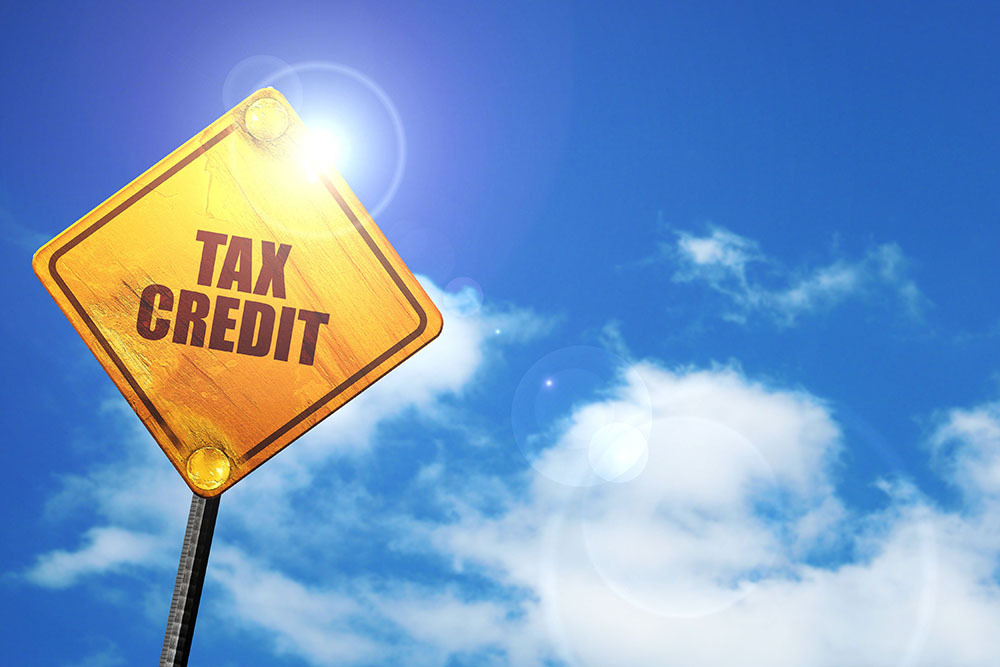

There’s no denying that inflation has been climbing around the world, and Saskatchewan is not exempt from it. However, the Government of Saskatchewan is providing some relief and for some, it’s bonus money.

According to the government, the province of Saskatchewan’s finances are improving, which is enough for them to warrant giving each resident of Saskatchewan a one-time payment of $500 through the Affordability Tax Credit.

This may not seem like a surprise that a governing body in Canada is lending a helping hand. The big difference is that the Affordability Tax Credit in Saskatchewan is not limited to low-income citizens; it’s for everyone. Well, almost everyone, as long as you reach the limited criteria that makes you eligible.

<!--  -->

tax credit, 3D rendering, traffic sign

#### **Eligibility**

You are entitled to receive this refundable non-taxable tax credit regardless of your income or if you receive any social assistance. You must have your 2021 tax return filed by October 31st, 2022, as a resident of Saskatchewan, and be 18 years of age or older as of December 31st, 2022.

#### **Double the Benefit**

What’s better than getting an extra $500? How about getting $1000? Now, we can’t take your $500 and give you $1000 back in cash; sorry! But we are offering to double the $500 tax credit when you buy a vehicle from us. What does that mean? Visit a FFUN Dealership, and if you purchase a vehicle, we’ll double the $500 when it’s used as a down payment on your new toy. We aren’t just talking about new cars, or even cars. This doubling your money thing is good on almost everything: new vehicles, used vehicles, RVs, boats, motorcycles, and the list goes on. Come see us for more details and let us help you have a little FFUN with your tax credit.
