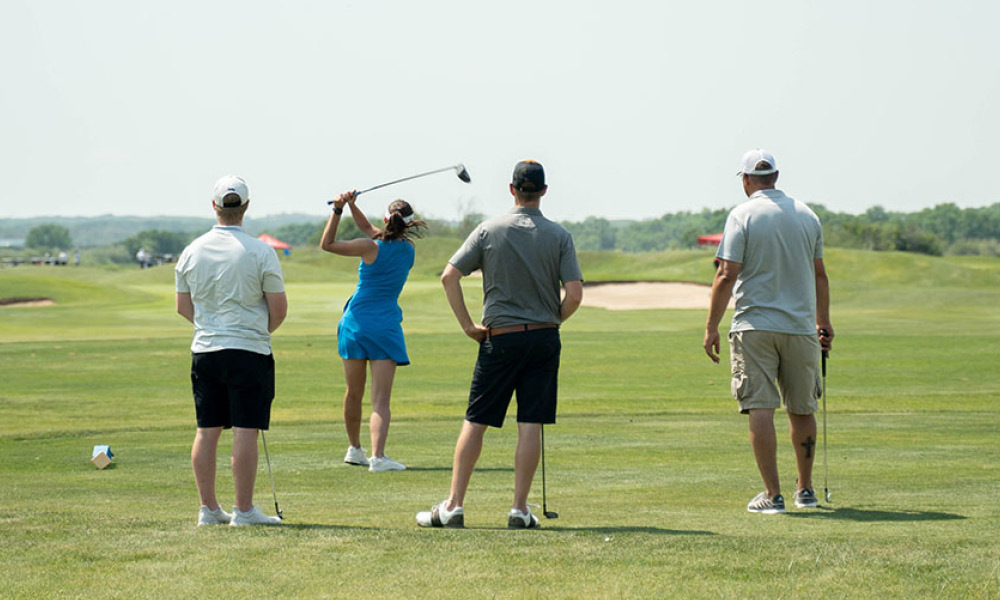
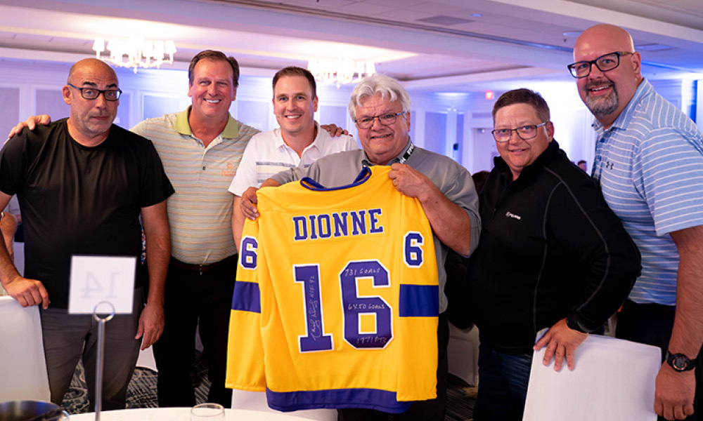
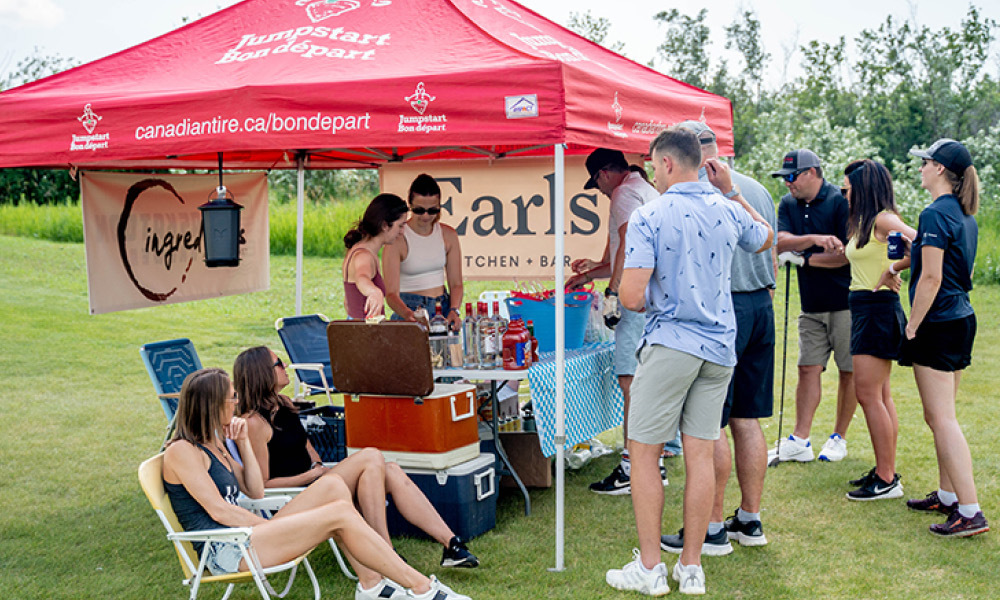
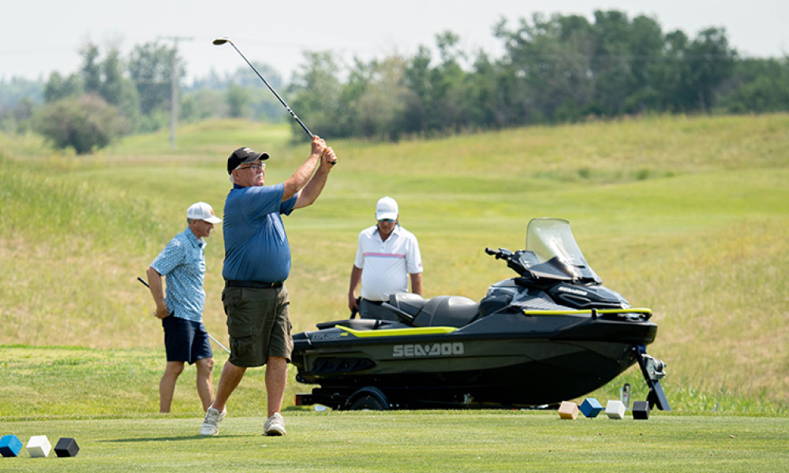
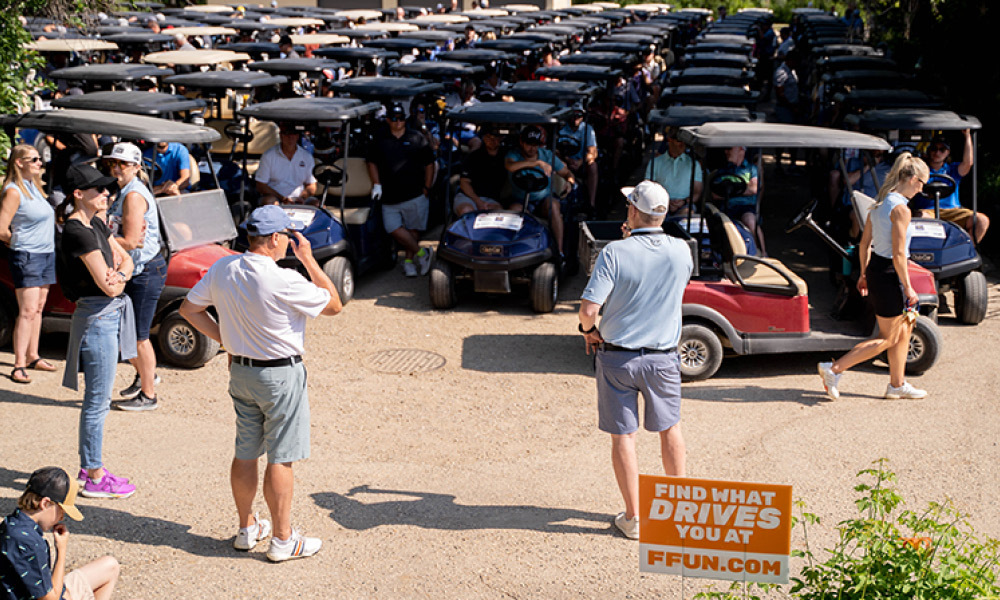
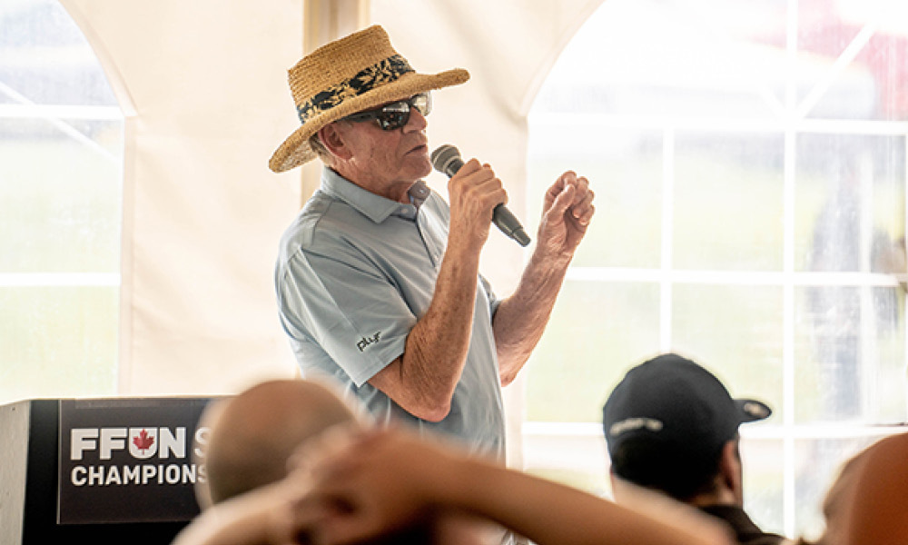

<!--  -->

The FFUN Championship Classic Golf Tournament, a two-day event, held just before the long weekend, was a swigging success. It not only brought together golf enthusiasts but also aimed to make a difference in the community by raising funds for the Royal University Hospital Foundation. With highlights such as a hilarious Draft Night, a fun-filled day of golf, and an outstanding steak dinner, the event left everyone with wonderful memories to cherish.

## A Night of Laughs and Heartfelt Memories

The excitement kicked off on Thursday night at the Draft Night, where guests were entertained by the charismatic comedian, Kelly Taylor. The evening was filled with laughter, touching speeches, and delicious food, setting the perfect tone for the upcoming golf tournament. As a special treat, some alumni hockey players took the stage during the hot stove session, sharing their favourite hockey memories, and adding an extra layer of fun to the night.

## The Big Day: Sun, DJs, and Golf Galore

The next day, with the sun shining brightly and DJs playing energizing tunes, the golfers were eager to hit the greens. More than 250 players took over the pristine Moon Lake golf course, and the atmosphere was charged with enthusiasm. Golfers of all skill levels had a great time, engaging in friendly competition and enjoying the breathtaking scenery.

Throughout the day, the spirit of fun was alive and well. Participants not only showcased their golfing prowess but also bonded over shared interests, making new friends and connections. The camaraderie between players, sponsors, and organizers was evident, and it truly felt like a close-knit community coming together for a great cause.

## An Evening to Remember: Steak Dinner and Prize Winners

After a fantastic day on the course, participants gathered for a well-deserved steak dinner. The evening was filled with excitement and anticipation as the organizers announced the prize winners. From cheers to applause, the sense of accomplishment and celebration was palpable in the air.

## A Heartfelt Thank You

The FFUN Championship Classic Golf Tournament was not just about golf; it was about making a positive impact on the community. And that’s exactly what happened. The event successfully raised an incredible $216,136.18 for the Royal University Hospital Foundation. The organizers and everyone involved couldn’t be prouder of the achievement, moving one step closer to their ultimate goal of reaching $1 million.

This tremendous success wouldn’t have been possible without the generous support of sponsors and all the participants who contributed their time and resources to this noble cause. The heartfelt thanks from the organizers go out to everyone who played a part in making the event a roaring success.

## Memories to Last a Lifetime

As the event concluded, everyone was left with cherished memories that will stay with them forever. The FFUN Championship Classic Golf Tournament not only raised money for a worthy cause but also brought people together in a joyous celebration of sportsmanship, community, and giving back.

## Looking Ahead: Save the Date for Next Year!

With the overwhelming success of this year’s tournament, the organizers are already looking forward to next year’s event, which is scheduled for June 12th and 13th. Mark your calendars and prepare for another unforgettable experience filled with golf, laughter, and the joy of contributing to a meaningful cause.

We want to extend a casual yet heartfelt thank you to the organizers and the NHL players who came out to support this event. Their dedication and hard work ensured that everyone had a fantastic time while supporting a fantastic cause.

The FFUN Championship Classic Golf Tournament proved to be a remarkable and unforgettable experience, uniting people through golf, laughter, and a shared commitment to giving back to the community. The camaraderie and joy that permeated the event were a testament to the power of sports in bringing people together for a greater purpose. As we eagerly await next year’s event, let’s remember that it’s the collective effort and support that make such endeavours a resounding success. Until then, let’s celebrate the achievements of this year’s tournament and hold on to the memories that will continue to inspire us.
