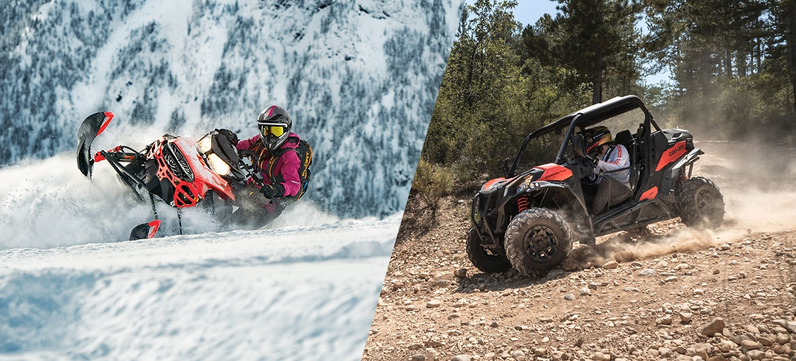

<!--  -->

https://www.ski-doo.com/ca/community/ontrack.html

You can’t help it: Adventure is in your nature. That longing for freedom, the thrill of the ride – it’s what drives you every time you hit the throttle. Whether it’s mud bogging, cruising the dunes, traversing wooded trails in the sun or snow, it’s always about the adventure.

Did we just say snow? We sure did. Within the BRP family we chase the same freedom, we live for the exhilaration around every turn and every rise in the trail. And we don’t believe in letting the changing of the seasons change your sense of adventure. It’s why we pour the same passion, ingenuity, and excitement into our Ski-Doo snowmobiles as we do Can-Am Off-Road vehicles.

Although the view from your kitchen window may look a little different come winter months, the desire to get out and explore and find your escape still burns – perhaps even brighter. Even with a blanket of white, there’s the same freedom to chase, and possibly even more.

## More Freedom Awaits##

Our states and provinces are full of paths leading to adventures throughout the year. In many cases the trails you know and love to explore in the summer are shared between the sun and snow lovers. In some cases, those paths to a winter escape outnumber their summer counterparts by tenfold or more.

Wisconsin alone boasts more than 1,800 miles of maintained ATV trails. Plenty for a summer of fun, but far short of the more than 25,000 miles of opportunity to explore across the snow. And the numbers of miles tell a similar story of endless adventure throughout the Midwest, Northeastern states, and provinces of Canada.

You see, you already know the way. In many instances, you already know the trails like the back of your hand. You probably even already own many of the necessities like helmets, trailers and more.

## Same World. New View.##

While the view out the kitchen window is clean and new with the fresh fallen snow, so are the views from the summer trails, overlooks and creek beds you’ve spent all summer exploring. It is the same world, but with a new set of adventures waiting for you to experience from a new seat – the seat of a Ski-Doo snowmobile.

So, when it seems like the season’s adventures have ended; stop and look around. There are new sights, moments, and memories to share and experience. An incredible new taste of the freedom you live to find just waiting for you to come looking. And all you have to do is ask someone who’s lived both flavors of the adventure and they’ll tell you, there’s no better way to explore than on a Ski-Doo.
Find more information at [https://www.ski-doo.com/ca/community/ontrack/find-your-freedom-in-every-season.html](https://www.ski-doo.com/ca/community/ontrack/find-your-freedom-in-every-season.html)

.

.

.

Come check us out at our FFUN Motor Sports locations in Saskatoon, SK and

Yorkton, SK! Your new adventure is waiting for you!
