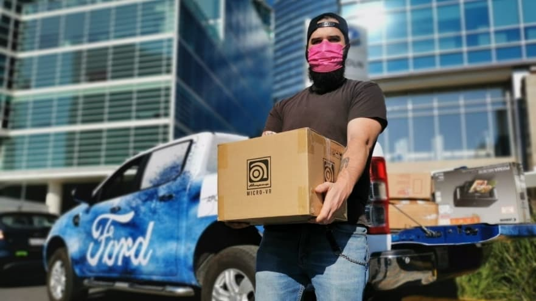

<!--  -->

- FORD EMPLOYEE DONATION MATCH PROGRAM CONTRIBUTES MORE THAN $1 MILLION TO
  COVID-19 RELIEF WORLDWIDE

- Ford Motor Company Fund’s COVID-19 Donation Match program helps 47 community
  organizations in 20 countries and 14 U.S. states

- Program surpassed its goal of $1 million, raising more than $633,000 in individual contributions that were matched by $500,000 from the Ford Fund – the philanthropic arm of Ford – and personal contributions from Executive Chairman Bill Ford

Donation match contributions prioritized hunger relief; Other areas of support included health, basic needs, education and virtual arts and culture initiatives

Ford Motor Company Fund today announced Ford employees, and others contributed $1,133,447 million to COVID-19 related relief efforts around the world, surpassing its goal.

The COVID-19 Donation Match Program was established in April to provide Ford employees, their families and friends a way to help fight the growing pandemic that kept them at home and unable to volunteer in traditional ways.

“Giving back is one of Ford’s key values and that is most exemplified in our employees,” said Bill Ford, executive chairman, Ford Motor Company. “We received so many requests from employees asking how they could help in the early days of the pandemic. The donation match program provided a meaningful way for employees to join the fight against COVID-19 – even at a time they could not physically be there to pitch in and help make a difference.”

Through the match program, 47 nonprofits and community groups in 20 countries and 14 U.S. states received funds donated by Ford employees and others that were then matched by $500,000 from the Ford Fund and personal contributions from Ford Motor Company Executive Chairman Bill Ford.

The donation match supported community projects in markets with significant coronavirus-related needs and a substantial number of Ford employees. Nearly one-third — 29% — of the funds went to hunger relief efforts. The next highest share, 24%, was earmarked for projects that met a blend of basic human needs – food, shelter and clothing. Educational efforts received 19% of the funds. Remaining donations supported health-related projects, along with efforts to keep arts programs alive virtually and preserve jobs at institutions that provide historical and cultural education.

“This pandemic has impacted every aspect of our daily life and put many nonprofit organizations at risk of being unable to serve their communities,” said Mary Culler, president, Ford Motor Company Fund. “Thanks to the generosity of our employees and others, we were able to support a wide range of projects around the world and continue the critically important work these nonprofits are doing.”

The program was administered by GlobalGiving, Ford’s longtime disaster relief and global grant-making partner.

Below is a sample of how nonprofits around the world used donations to make an impact in their own communities.

In Brazil, Obras Sociais Irmã Dulce fed nearly 1,200 families for a month and delivered nearly 20,000 lunches to homeless citizens.

In Ontario, Canada, the David McAntony Gibson Foundation distributed 35,000 hygiene kits; 150,000 kg (330,700 lbs) of dried food; as well as 26,000 “thank you” gifts to frontline workers who are caring for the most vulnerable in their communities.

In England, St. Mungo’s supported the transition of more than 2,700 homeless individuals off the streets or out of emergency shelters into individual hotel rooms. Their trained outreach teams also provided a full assessment of each individual, and delivered food and other essential supplies based on specific needs.

In Tamilnadu, India, the Indian Association for the Blind provided financial support to more than 250 families with visually challenged members to help pay for groceries, medications and rent.

In Italy, Mission Bambini helped more than 600 low-income families transition their young children to online learning during strict quarantine orders. The donations helped provide electronic devices, technological training and emotional support.

In Mexico City, Fondo Unido Mexico collaborated with multiple nonprofits on more than 33 community projects that delivered food, personal hygiene kits, medical supplies and emergency kits to people in need. Additional projects addressed education-related needs, mental health and emergency relief assistance.

In Craiova, Romania, Asociatia Club Rotary Craiova Probitas partnered with Ion Tiriac Foundation to purchase virus testing equipment and increase daily tests by 10-fold at the community hospital.

In Madrid, Spain, Apadrina La Ciencia provided financial support to laboratories making COVID-19 tests specifically for the elderly in nursing homes, resulting in the administration of more than 1,000 additional tests.

In South Africa, the Waqful Waqifin Foundation (Gift of the Givers) distributed food and cleaning supplies to low-income residents while testing people in triage tents erected at key hospitals. In total, more than 180 hospitals and clinics were served, and 120,000 food boxes were delivered to families across the country.

In Taiwan, Teach for Taiwan purchased electronic tablets for school children maintaining their classes online.

In Istanbul, Turkey, Cerrahpasa Medical Faculty Foundation provided masks, ventilators and lifesaving medical supplies for its COVID-19 intensive care units. They also provided essential supplies to healthcare workers in one of the country’s oldest and largest teaching hospitals supporting 3,500 medical students.

In Vietnam, Centre of Live and Learn for Environment and Community provided meals and face masks to 80 classrooms of visually impaired students in Ha Noi. In Hoan Kiem, 120 families in were given food baskets, face masks and supermarket gift cards. In addition, four tons of rice were donated to Ho Chi Minh residents, and 150 students of Ho Chi Minh University of Technology were given 2,250 meals and SIM cards.

Fourteen nonprofits across the United States also received donations. Among them:

The Detroit-based United Way for Southeastern Michigan awarded 580 grants to local nonprofit agencies, childcare facilities and community centers.
The Pope Francis Center, a Detroit homeless shelter, used its donations to continue providing meals, showers and clothing to homeless people.

In Ann Arbor, Mich., The Ark folk music club created “The Ark Family Room Series” – livestream programming that features four to five performances a week, provides income for musicians and a way for international audiences to participate in the experience. The Ark is also pursuing virtual youth and educational programs and expanded social media outreach, keeping people connected to music and each other.
The Greater Cleveland (Ohio) Food Bank delivered more than 20 million pounds of food to 800 community organizations that distribute meals to families.

In Olympia, Wash., the Boys & Girls Clubs of Washington received a grant to remain open under state COVID-19 restriction guidelines and provide essential childcare services. In San Clemente, Calif., the Boys & Girls Club of South Coast Area delivered nearly 25,000 meals and home activity kits to low-income families during stay-at-home restrictions.

In Northern California, Volunteers for Interamerican Development Assistance (VIDA) provided hospitals in California with medical equipment such as hospitals beds, gurneys, IV supplies and surgical gowns. They also provided assistance in Latin American countries and sent 74 pallets of personal protection equipment and medical supplies to countries throughout the Caribbean, Mexico and Central America, as well as 20 pallets to China. In addition, its U.S. arm outfitted 200 U.S. medical professionals traveling to the Philippines to address respiratory issues.

The COVID-19 Donation Match program is one example of how Ford Fund is providing critical assistance to local communities coping with pandemic-related issues. To date, Ford Fund has invested nearly $3 million to support nonprofits in their efforts to address hunger, shelter, mobility and other urgent needs throughout Southeast Michigan, across the United States and around the world. To learn more about Ford Fund’s response to COVID-19 and ways you can help, visit www.fordfund.org/covid19.

For more information go to https://media.ford.com/content/fordmedia/fna/us/en/news.html.

.

.

.

.

Ford continues to give back to communities all over the world during these uncertain times and we are proud to be a part of it at Country Ford in Wilkie, SK.

-FFUN Family
