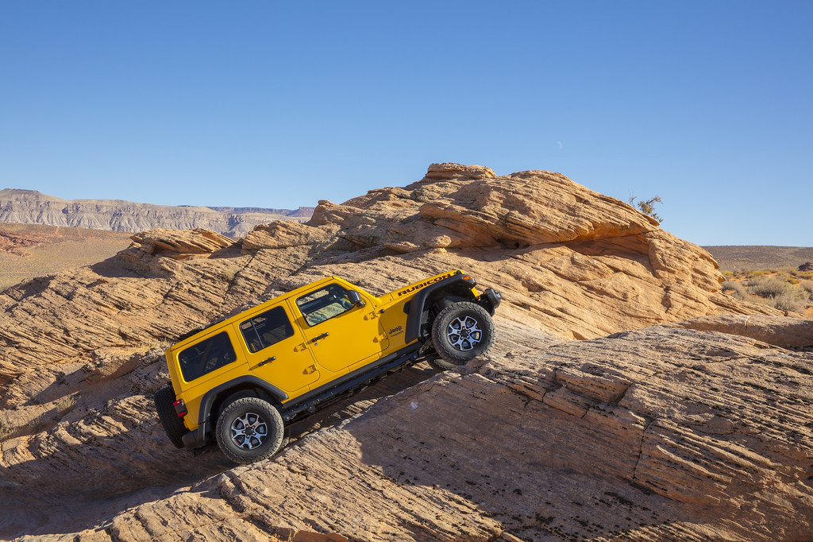
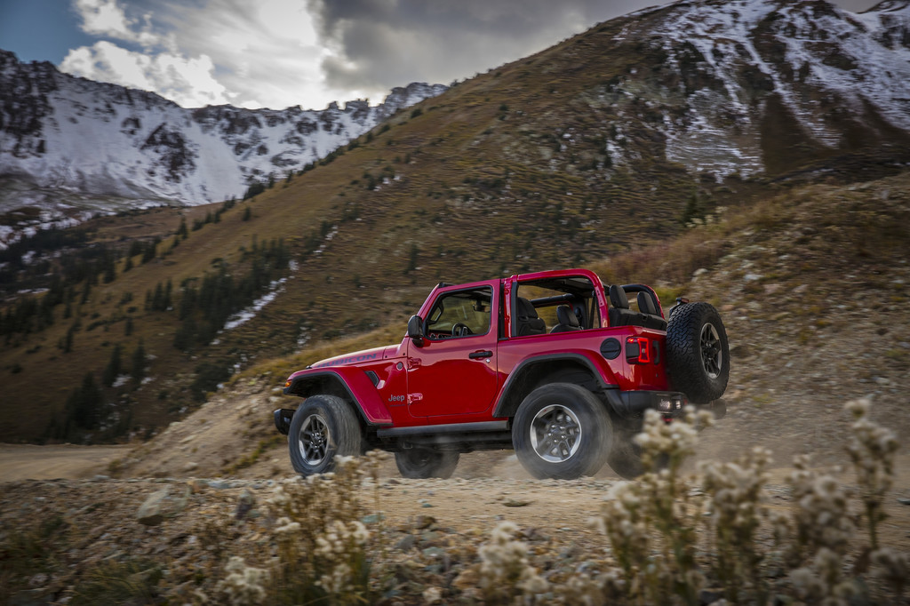
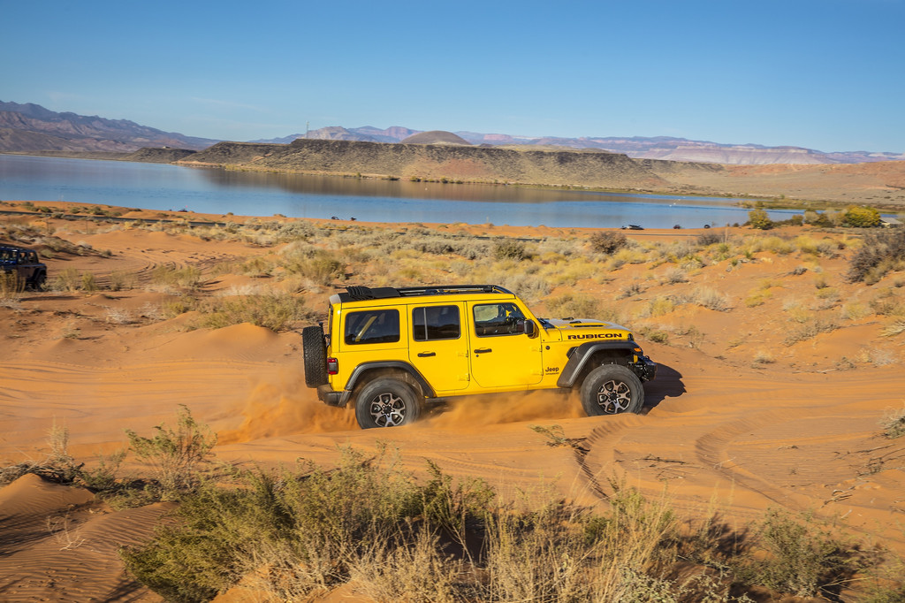

The [Jeep Wrangler](https://www.jeep.ca/en/articles/the-2021-jeep-wrangler-keeps-getting-better) comes standard with impressive off-road capability, but the 2021 Jeep Wrangler Rubicon pushes the envelope even further. Offered with exclusive technology and advanced systems, the Wrangler Rubicon is designed to tackle the most challenging environments.

<!--  -->

## Available Engines in the 2021 Jeep Wrangler##

The Rubicon can be powered by multiple engine options starting with a 3.6L Pentastar V-6 engine. It offers 285 horsepower and 260 lb.-ft. of torque. A six-speed manual transmission is mated to it, but you can choose the optional eight-speed TorqueFlite automatic transmission with its lightweight eTorque technology.An optional 2.0L 4-cylinder turbocharged engine is also available, a powertrain that offers 270 horsepower and an impressive 295 lb.-ft. of torque. The turbo is paired with an eight-speed automatic transmission.Finally, the 3.0L EcoDiesel V-6 is also available on Unlimited (4-door models), offering remarkable torque which can be very useful in off-road driving situations.

## Impressive Off-Road Capabilities##

The Wrangler Rubicon model inherits mechanical elements that allow it to go further. For example, it is equipped with stronger Dana 44 front and rear axles (the front is exclusive to the Rubicon version), and the optional Rock-Trac NV241 two-speed or full-time transfer case, with a 4:1 low-gear ratio. The Wrangler Rubicon also features front and rear differentials that can be locked, a front anti-roll bar that can be electronically disconnected for maximum articulation, and 33-inch BF Goodrich KM All-Terrain tires that allow it to go where others can only dream of going.

        2021 Jeep® Wrangler Rubicon

The Rubicon’s axle ratio is also unique at 4.10 compared to 3.45 with the other gasoline-powered models, and 3.71 with the Unlimited diesel variants. Another exclusive feature offered on the Rubicon as well as the Sahara is a 115 V outlet on the centre console, and you can also opt for the exclusive TrailCam forward-facing camera to get a better view of what is happening ahead of you.All in all, if you want to get your hands on the most capable 2021 [Jeep Wrangler in the lineup](https://www.jeep.ca/en/wrangler), your best option is the Rubicon.

Visit [https://www.jeep.ca/en/articles/go-anywhere-in-the-2021-jeep-wrangler-rubicon](https://www.jeep.ca/en/articles/go-anywhere-in-the-2021-jeep-wrangler-rubicon) to get more information!
