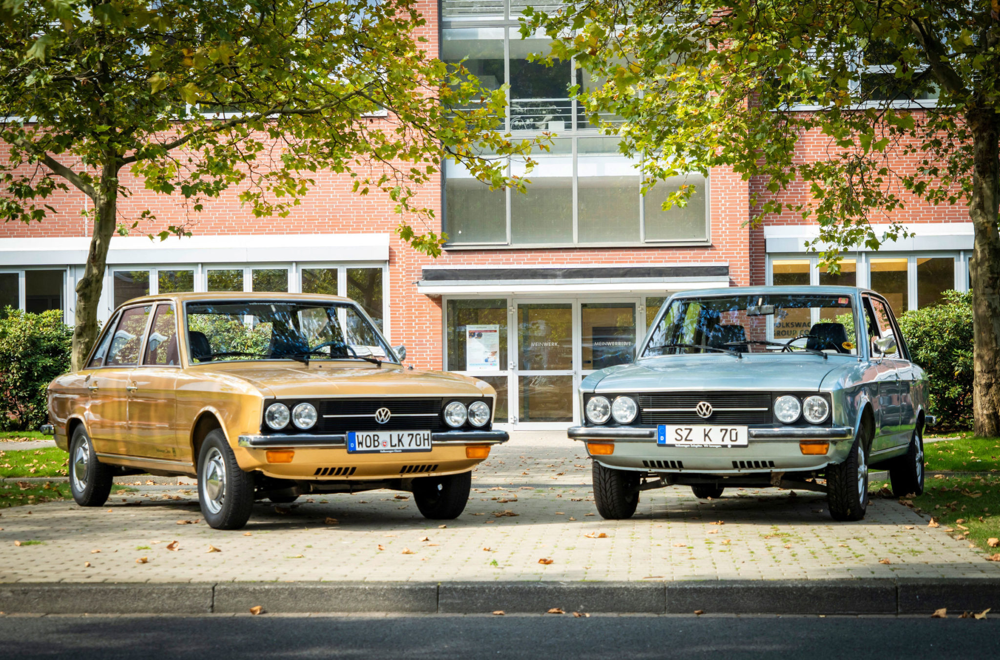
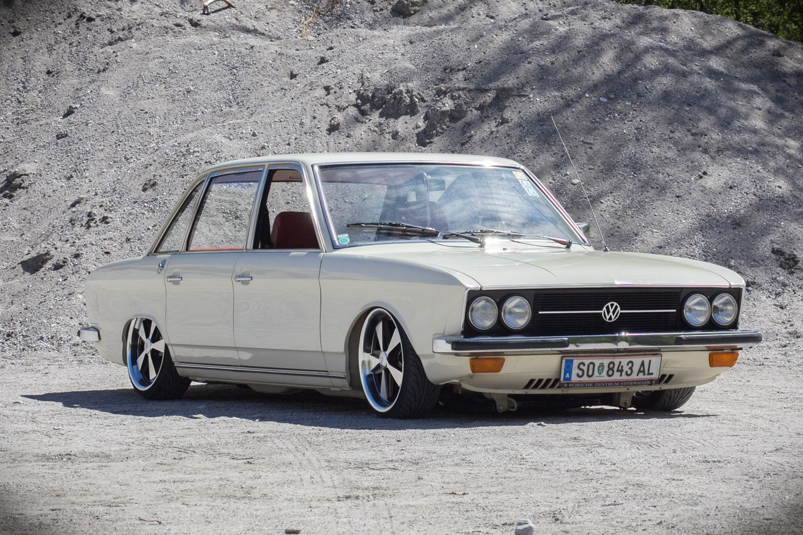

<!--  -->

[https://www.volkswagen-newsroom.com/en/press-releases](https://www.volkswagen-newsroom.com/en/press-releases)

First Volkswagen with water-cooled engine and front-wheel drive broke new ground for Volkswagen

“Love the VW K70 – because it opens up a new VW era”this was the advertising slogan used for the launch of the Volkswagen K 70 50 years ago. With a water-cooled front engine, front-wheel drive and modern styling, the mid-sized sedan actually did usher in a new era at Volkswagen.

At a press conference held in Salzgitter on October 20, 1970, Volkswagen presented the new K 70 and the plant built especially for the production of this model. “A new Volkswagen, different to all the others made to date – the VW K 70,” the press folder said. In fact, the notchback sedan broke new ground in many respects. With this new model, Volkswagen was on the threshold of a new, successful era.

**Technology**. With the water-cooled engine and front-wheel drive of the K70, Volkswagen accomplished a changeover to a drive concept that was entirely new for the brand and would later achieve success with the Passat and Golf. The K70 had a state-of-the-art chassis with independent suspension. The extraordinarily long wheelbase allowed an especially spacious interior and provided very good handling.

**Safety**. Despite all the comfort of the K70, one of the main emphases was on active and passive safety. Features such as a reinforced passenger compartment, crumple zones at front and rear, a fuel tank at the rear in the protected area and preparation for safety belts on all seats as a standard feature set new standards.

**Design**. The uncluttered design with its clear lines, which is still attractive today, proved to be ground-breaking. The notchback sedan was designed byClaus Luthe, one of the major automobile designers of his time. His design signature is also evident in later Volkswagen models such as the Golf and the Polo.

## Convinced from the start

Karl-Günter Queißer is an eyewitness who experienced the K70 and the upheaval at Volkswagen right from the start. The 79-year-old started his career with Volkswagen in 1970 as a vehicle painter at the new plant in Salzgitter. He still remembers the first few years very well, a time of upheaval and transformation. “That was really something quite special,” he says, remembering the era of the K70.

He was soon convinced by the car with its water-cooled front-mounted engine, four doors and its sensationally spacious interior and trunk. He already bought his first K70 in 1971. Until then, he had driven a Beetle and the changeover was a quantum leap. After he had driven three K70, a Golf appeared in his garage. “Things keep moving,” says the man who generally welcomes change and enjoys the experience.

## From K70 to ID.301

Nowadays, he drives a K70 LS and a Golf 8. By purchasing the K 70, he has fulfilled a dream and he regularly takes part in rallies and organized trips with his classic. In September, an excursion took him to his old place of work in Salzgitter. With his fan club, he had really wanted to celebrate the anniversary of the K70 with a special organized tour and event. Unfortunately this was not possible in view of the situation this year. He therefore celebrated with a small group of people in Salzgitter and remembered a very special era. More and more employees stopped by the unusual vehicle and their former colleague Queißer answered all their questions enthusiastically.

He is very proud of the fact that he has driven every generation of the Golf to date. With the new Golf 8, the digital Golf, he is once again welcoming change and challenges with open arms. After all, things keep moving. He is also sure that an ID.3 will also take its place in his garage.

.

.

.

.

For more information visit [https://www.volkswagen-newsroom.com/en/press-releases](https://www.volkswagen-newsroom.com/en/press-releases)
