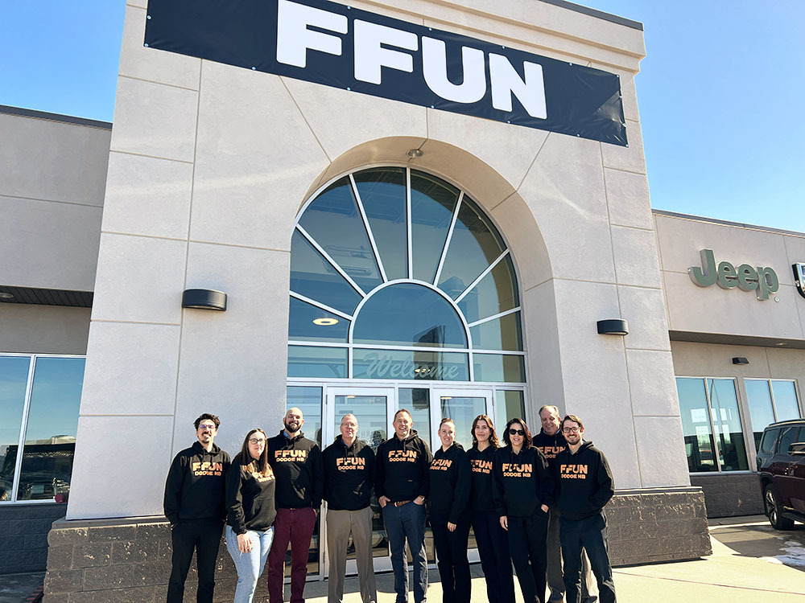

FFUN Group, one of Canada’s fastest-growing motor groups is expanding its roots to North
Battleford as they announce the newest acquisition of Scott Campbell Dodge.

<!--  -->

**THURSDAY, APRIL 6, 2023 – SASKATOON, SK —** he FFUN Group is living up to their
plans for growth with the recent acquisition of Scott Campbell Dodge in North Battleford,
Saskatchewan. Effective April 5, 2023, Scott Campbell Dodge will begin operating under its new name, FFUN Dodge North Battleford, joining an impressive list of over 30 FFUN locations in Saskatchewan, Alberta, and Ontario across their diversified divisions of automotive, recreational, financial and developments. With the automotive industry continuously evolving, FFUN Group saw an opportunity to expand within Saskatchewan and given their successful ties to other rural locations, they are thrilled to work with an established dealership with a loyal customer base.

Scott Campbell Dodge has been a fixture for decades in North Battleford, serving the automotive needs of the area. From outfitting local farmers with dependable trucks to sponsoring dozens of facilities and events, they have lived up their tag, ‘where friends send their friends.’

President and CEO, Mark Loeppky, says they plan to continue those expectations, but also take the opportunity to show other parts of Saskatchewan what the FFUN Group has to offer. “Whether it’s a big or small town, we at the FFUN Group want to be part of a community, and
provide incredible service, products, and a car-buying experience that is memorable and in-line with what we do at all our dealerships,” says Loeppky.

Already having experience operating Chrysler, Dodge, Jeep, Ram dealerships, the group anticipates a seamless transition where Scott Campbell Dodge customers will continue to receive the same level of service they are accustomed to, while having access to the other divisions and expertise of the FFUN Group.

As part of the acquisition, we are excited to announce that Neil Georget, a veteran of the FFUN Group and North Battleford resident will be continuing in the industry as the new General Manager and Dealer Partner. Having recently led Country Ford in Wilkie, Neil brings a ton of
local experience, and a community mindset through his involvement in numerous charities and associations in the area. “Being part of the FFUN Group has been an incredible experience, both personally and professionally. I look forward to continuing to work with the team here and stay involved in growing this incredible community,” says Georget. Established in Saskatoon, Saskatchewan in 2003, the growth of FFUN has been anything but slow. Setting out with a goal to being one of the most recognized companies in Canada, they haven’t taken their foot off the gas pedal. With a promise of serving their customers with well-known brands, such as Dodge, Jeep, Ram, Chrysler, Kia, Acura, Volkswagen, Hyundai, Ford, Lincoln, Harley Davidson, BRP and many more, the FFUN Group is more than just a motor group; they act as stewards of their communities while maintaining an enjoyable purchase and post-purchase experience. Mark Loeppky noted that when he met with Scott Campbell, the first thing that stood out was how the values of both organizations aligned so tightly. Along with the acquisition of an already successful dealership, comes a team dedicated to providing a car-buying experience unlike any other.

“It’s bittersweet. Coming to this community and building Scott Campbell Dodge into what it is today has been an absolute joy. But I am happy to have such an incredible, reputable brand like FFUN to continue the mission of this dealership. I am excited for its future and have every
confidence that the customers will continue to experience that same level of passion for cars, community and customer service,” says, Scott Campbell.

**About the FFUN Group**

Since its inception in 2003, the FFUN Group has established itself as one of Canada’s leading privately-owned businesses. Built on a customer-centric, no-nonsense platform, it has since expanded to encompass a blend of these traditional community-focused values with an
innovative, entrepreneurial spirit. Within a short timeframe, the FFUN Group has grown to operate five separate divisions representing nearly 30 businesses across Saskatchewan, Alberta and Ontario. The FFUN Group is committed to bringing fun to life for employees and customers alike, that’s why their product lines have been strategically sought out to grow alongside their customers. From their first dirt bike to a spacious RV for the family, all the way to a luxury automobile. FFUN is more than a name; it’s an outlook, a way of living and doing business. It is a group of companies unified by a culture of quality, passion, empowerment, innovation, optimism, and growth; each working to Bring FFUN To Life!

For more information, visit www.ffun.com or the dealership website, [www.ffundodgenorthbattleford.com](https://ffundodgenorthbattleford.com)

Media Contacts

#### Neil Georget

General Manager/Dealer Partner

FFUN Dodge North Battleford

306-445-6640

Neil.Georget@ffundodgenb.com

#### Kyle Senger

Vice-President of Marketing

FFUN Group

306-649-6753

kyle.senger@ffun.com
