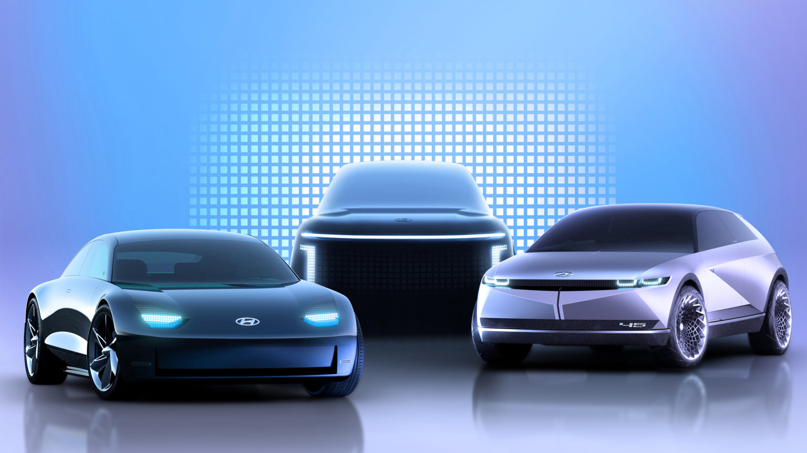

<!--  -->

[https://www.hyundaicanada.com/en/newsroom](https://www.hyundaicanada.com/en/newsroom)

Hyundai Motor Company today announced the launch of its new IONIQ brand dedicated to battery electric vehicles, opening a new chapter as a leader in the era of electrified mobility. Under the IONIQ brand, Hyundai will offer customer centric EV experiences centered on connected lifestyle solutions in line with Hyundai’s vision of ‘Progress for Humanity’.

- Hyundai’s dedicated EV brand IONIQ embodies company’s smart mobility vision

- Company aims to offer connected lifestyle experience to customers with IONIQ brand models

- Hyundai will introduce three innovative IONIQ EV models over the next four

years, starting early 2021 with IONIQ 5, a midsize EV CUV based on the

concept ‘45’

- IONIQ EV models will be built on the E-GMP platform

- IONIQ brand embodies Hyundai’s commitment to provide connected lifestyle solutions

- Hyundai celebrated the brand launch by turning the London Eye into a giant

letter ‘Q’ with electric lights

Hyundai Motor Company today announced the launch of its new IONIQ brand dedicated to battery electric vehicles, opening a new chapter as a leader in the era of electrified mobility. Under the IONIQ brand, Hyundai will offer customer centric EV experiences centered on connected lifestyle solutions in line with Hyundai’s vision of ‘Progress for Humanity’.

Under the IONIQ brand, Hyundai Motor will leverage its industry-leading manufacturing know-how in EVs to introduce three new dedicated models over the next four years with more innovative models to follow. The creation of IONIQ brand is in response to fast-growing market demand and accelerates Hyundai’s plan to lead the global EV market.

To fulfill IONIQ’s brand mission, Hyundai will combine its current EV capabilities – such as ultra-fast charging, spacious interior, and battery-supplied power – with future innovations that combine design, technologies and services to integrate in-car and out-of-car experiences for a seamless journey.

“The IONIQ brand will change the paradigm of EV customer experience,” said Wonhong Cho, Executive Vice President and Global Chief Marketing Officer at Hyundai Motor Company. “With a new emphasis on connected living, we will offer electrified experiences integral to an eco-friendly lifestyle.”

## Rebirth of IONIQ##

Hyundai first introduced the term IONIQ, which fuses “ion” and “unique”, when it announced Project IONIQ, a long-term research and development project focused on eco-friendly mobility. Based on the project, Hyundai in 2016 introduced a vehicle named IONIQ, the world’s first and only model to offer a choice of three electrified powertrain options – hybrid electric, plug-in hybrid and battery electric – within a single body type. Now, IONIQ represents Hyundai’s growing commitment to sustainability and innovation and will be instrumental in achieving the company’s clean mobility goals.

IONIQ brand was conceived to fuse life changing mobility with environmental performance and has so far been in instrumental in delivering progress electrified. IONIQ will continue to create a new balance in clean mobility synchronizing eco-products within an eco-system of lifestyle solutions bringing connected living to a new generation.

The existing IONIQ vehicles – hybrid, PHEV, EV – will not be housed under the new IONIQ brand.

## IONIQ 5 / IONIQ 6 / IONIQ 7##

Hyundai will be launching a range of numerically named EVs under the new brand, with the even numbers used for sedans and the odd numbers for SUVs.

The first model under the IONIQ brand will be the IONIQ 5 midsize CUV that will launch in early 2021. IONIQ 5 is based on the concept EV ‘45’, which Hyundai unveiled at the International Motor Show (IAA) 2019 in Frankfurt as a homage to its very first concept car. IONIQ 5’s designers took inspiration from the past and integrated it with cutting-edge parametric pixels, a unique design element that Hyundai designers will continue to incorporate into future IONIQ models.

In 2022, Hyundai will introduce IONIQ 6 sedan, which is based on the company’s latest concept EV ‘Prophecy’, unveiled in March; followed by IONIQ 7, a large SUV in early 2024. Prophecy’s iconic exterior design is characterized by its aerodynamic silhouette of perfect proportions.

Likewise, IONIQ vehicles’ designs will have a common theme of ‘Timeless Value’. The vehicles will be inspired by past models, but they will be a bridge to the future.

## E-GMP platform##

IONIQ brand models will sit on an Electric Global Modular Platform, known as E-GMP, that will enable fast charging capability and plentiful driving range.

The EV-dedicated platform will allow Hyundai to reimagine the vehicle interior as “smart living space” with highly adjustable seats, wireless connectivity and unique features such as a glove box designed as drawers. The platform paradigm shift will extend into the user interfaces that will be simple, intuitive and ergonomically designed to help occupants feel at ease.

## Strategy 2025##

Hyundai Motor Group recently announced that the group aims to sell 1 million units of battery electric vehicles and take 10 percent share to become a leader in the global EV field by 2025.

Under Strategy 2025, Hyundai Motor Company itself aims to become the world’s third-largest automaker of eco-friendly vehicles by 2025, with 560,000 BEV sales in addition to FCEV sales.

The launch of the IONIQ brand dedicated to EV models reinforces the company’s commitment to clean mobility and reflects its ongoing transformation as a Smart Mobility Solution Provider with zero-emissions solutions.

## London Eye Event: IONIQ Campaign

Hyundai has celebrated the launch of IONIQ by turning the London Eye into a giant letter “Q” using electric lights just before the official reopening of the famous attraction.

This marks the first event of the ‘I’m in Charge’ brand campaign, which promotes empowerment of the environment and diverse lifestyles through IONIQ.

With the otherwise bustling city of London having come to a halt during the COVID-19 pandemic, Hyundai is bringing new energy into the city by lighting up and turning one of its most iconic sights once again.

By announcing the arrival of IONIQ, Hyundai’s light installation heralds a new era of electrified mobility that puts customers at the centre.

A video of Hyundai turning the globally famous London Eye into a huge ‘Q’ can

be viewed here: [https://youtu.be/PL1scZfgrDA.](https://youtu.bePL1scZfgrDA.)

Information about IONIQ Brand can be found
at: [www.hyundai.com/worldwide/en/brand/ioniq-launch](https://www.hyundai.com/worldwide/en/brand-journal/ioniq/ioniq-launch)

## About Hyundai Motor Company##

Established in 1967, Hyundai Motor Company offers a range of world-class vehicles and mobility services in more than 200 countries. Hyundai Motor sold more than 4.4 million vehicles globally in 2019, and currently employs some 120,000 personnel worldwide. The company is enhancing its product lineup with vehicles designed to help usher in a more sustainable future, while offering innovative solutions to real-world mobility challenges. Through the process Hyundai aims to facilitate ‘Progress for Humanity’ with smart mobility solutions that vitalize connections between people and provide quality time to its customers.
