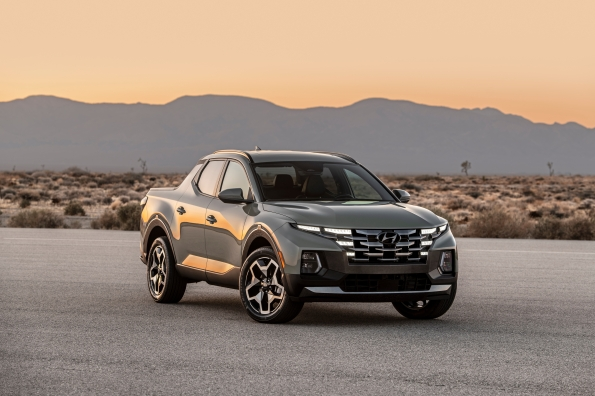
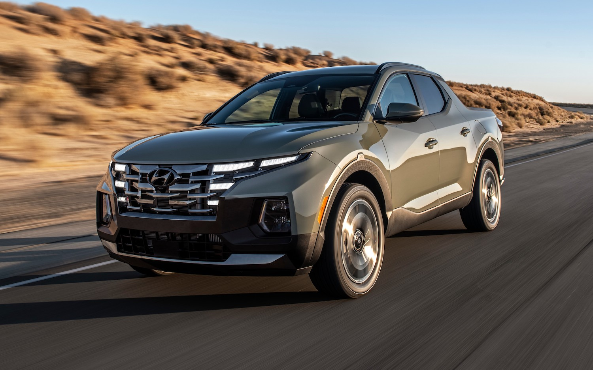

<!--  -->

[https://www.hyundainews.com/en-us/releases/3301](https://www.hyundainews.com/en-us/releases/3301)

- Highlight Video Captures Top Differentiators of this Entirely New Vehicle Category
- Hyundai Executives Provide Key Insights for the Santa Cruz Vehicle Concept
- Dynamic Footage Demonstrates Full Spectrum of Santa Cruz Lifestyle Environments
- Highlight Video YouTube Link: [https://youtu.be/qY8Qxy_Nfv8](https://youtu.be/qY8Qxy_Nfv8)

**FOUNTAIN VALLEY, Calif., Apr. 20, 2021** - Hyundai today released the highlight video of its Santa Cruz Sport Adventure Vehicle world premiere. The 2022 Santa Cruz breaks new ground within the SUV, Truck and Crossover segments by offering a true Sport Adventure Vehicle unlike anything else in the U.S. market. Santa Cruz boasts bold yet sophisticated design, powerful and efficient powertrain options, a flexible open bed for gear, cutting-edge connectivity and a highly maneuverable all-wheel drive platform that is equally at home in urban and adventure-focused environments. The Santa Cruz Sport Adventure Vehicle begins production in Montgomery, Alabama in June and will be available for sale in summer. Hyundai has created an early reservation system for the U.S.-market Santa Cruz at [https://www.hyundaiusa.com/.](https://www.hyundaiusa.com/.)

“Santa Cruz, with its bold styling, breaks open all new segment territory, both for Hyundai and the industry as a whole. Open-bed flexibility coupled with closed-cabin security meets the changing everyday needs of its adventure-oriented buyers, while powerful and efficient engines and superb maneuverability ensure it is a pleasure to drive in urban or off-road environments. Our customers will wonder just how they managed before owning one,” said Jose Munoz, president and CEO, Hyundai Motor North America.

For more information visit [https://www.hyundainews.com/en-us/releases/3301](https://www.hyundainews.com/en-us/releases/3301)
