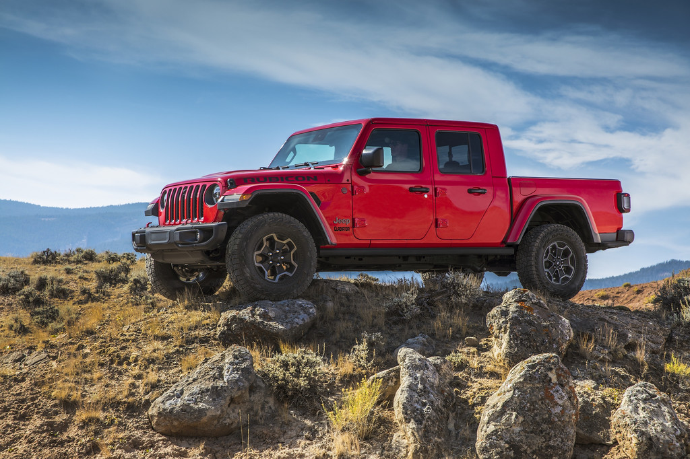
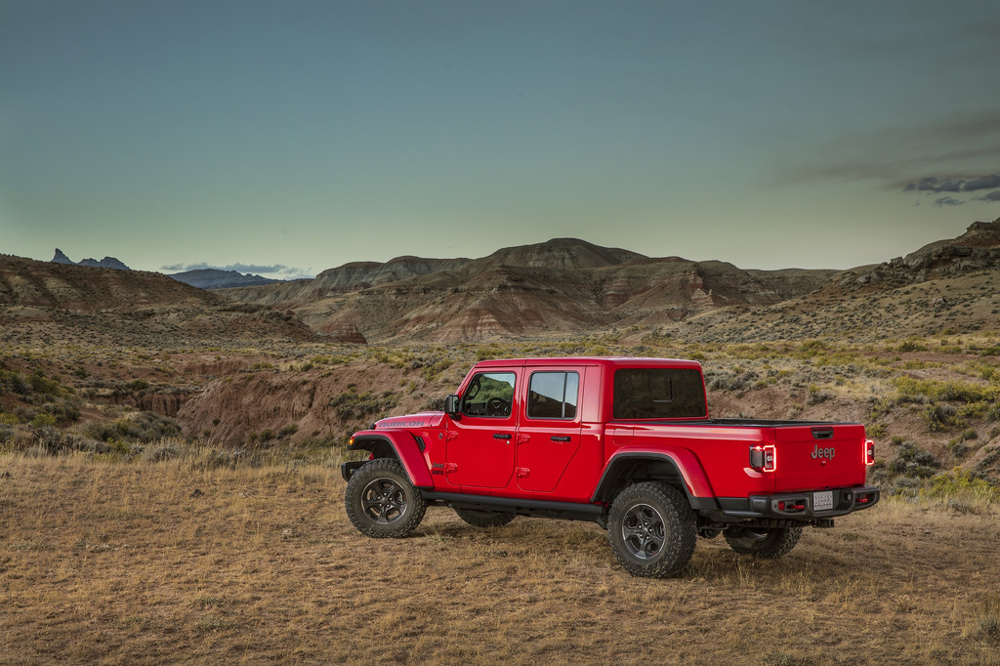

<!--  -->

[https://www.jeep.ca/en/articles/jeep-gladiator-named-2021-truck-of-the-year-by-doubleclutch](https://www.jeep.ca/en/articles/jeep-gladiator-named-2021-truck-of-the-year-by-doubleclutch)

The Jeep Gladiator has been named 2021 Truck of the Year by DoubleClutch.ca, the second year in a row the Gladiator pickup has received the prestigious award.This year, it’s the Gladiator Mojave that took home the hardware, impressing DoubleClutch.ca panelists with its rugged design, impressive off-road technology, and first-ever Desert Rated badge.”The DoubleClutch.ca Annual Awards are a result of a stringent voting process and careful consideration of all aspects of the vehicle,” said Adi Desai, editor-in-chief, DoubleClutch.ca. “Throughout the road test, eligible vehicles are evaluated on a number of factors, including powertrain, efficiency, NVH, practicality, features, value and overall context to the consumer. Eligibility requires the vehicle to be tested between January 1 and December 31 of the year considered. The Gladiator Mojave was one of the most significant new trucks this year and ended up being the unanimous heartthrob throughout the editorial team.”This is the eight year for the DoubleClutch.ca Annual Awards which seek the best vehicles by ranking over 220 vehicles across more than 50 criteria. The Jeep Gladiator took home the Truck of the Year Award last year, its first full year on the market.

## 2021 Jeep Gladiator Mojave

Among the many changes to the 2021 Gladiator lineup this year, the introduction of the [Gladiator Mojave](https://www.jeep.ca/en/articles/the-2021-jeep-gladiator-mojave-takes-the-desert-by-storm) certainly stood out. The Mojave is the first-ever Jeep to receive a Desert Rated badge, a testament to its ability to handle the harsh environment of the desert. Unique features such as high-performance FOX 2.5-inch internal bypass shocks with reservoirs, rear locking differential, and 33-inch tires give the Gladiator Mojave the necessary tools for high-speed off-road crossings. The Gladiator Mojave is also equipped with industry-first FOX front hydraulic jounce bumpers that provide optimal handling on difficult terrain.The [2021 Jeep Gladiator](https://www.jeep.ca/en/gladiator) also receives the 3.0L EcoDiesel V-6 with Engine Start-Stop (ESS) as an available option across the lineup. The lineup has expanded in 2021 as well with the addition of the 80th Anniversary Edition and Willys models.

        2021 Jeep® Gladiator Rubicon

Learn more at [https://www.jeep.ca/en/articles](https://www.jeep.ca/en/articles)
