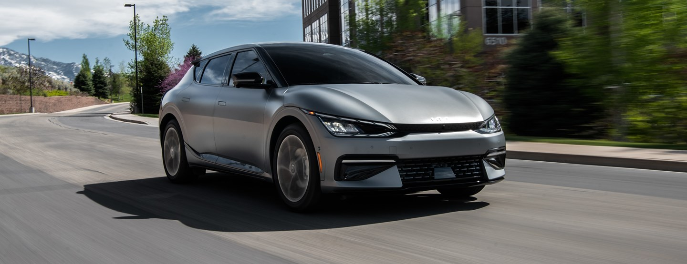

<!--  -->

[https://www.kiamedia.com/us/en/media/pressreleases/17552/kia-america-first-edition-ev6-all-electric-vehicle-program-fully-reserved](https://www.kiamedia.com/us/en/media/pressreleases/17552/kia-america-first-edition-ev6-all-electric-vehicle-program-fully-reserved)

#### Advanced Reservations at Kia.com Overwhelmed by “Charged up” Demand for 1,500

#### All-New EV6s

**IRVINE, Calif., June 8, 2021**- The limited run of 1,500 First Edition EV6s have been fully reserved the day the offer became available on Kia.com. Delivery to local dealers is expected in Q1 2022.

The First Edition was offered with a choice of three gifts – an at-home vehicle charger, a 1000 kWh credit within a national charging network, or an Apple Watch for connecting to the EV6’s suite of Kia Connect services. Over 81% of pre-order registrants chose the at-home charger.

The First Edition was made available in three color combinations – Urban Yellow with black seats, Glacier (white) with dark green seats, and Steel Gray Matte with black seats, with the Urban Yellow exterior color and dark green seats on the Glacier variant being exclusive to the First Edition. On the inside, the special edition features Illuminated door sills with “First Edition” designation, a numbered interior badge highlighting the limited production volume, Augmented Reality Head-Up Display1, Remote Smart Parking Assist2, sunroof, 20-inch wheels, premium 14-speaker Meridian audio system, dual-motor AWD3 power delivery and a 77.4 kWh battery.

“Kia welcomes the first EV6 buyers who join us in this historic movement.” said Sean Yoon, president and CEO of Kia North America and Kia America. “Kia’s ‘electric lifestyle’ delivers a unique combination of luxury, performance and technology and the First Edition EV6 will provide owners with an experience all of their own.”

.

.

.

Come for a visit at one of our Kia locations in Saskatoon or Prince Albert, Saskatchewan!
