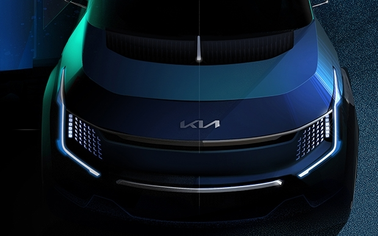

<!--  -->

[https://press.kia.com/eu/en/home/media-resouces/press-releases/2021/Kia-teases-Concept-EV9.html](https://press.kia.com/eu/en/home/media-resouces/press-releases/2021/Kia-teases-Concept-EV9.html)

**Kia Concept EV9 hints at an exciting ideation for its next all-electric SUV**

**Bold exterior highlights Kia’s pioneering electric vehicle design language**

**Interior images show state-of-the-art tech, including an adaptive and smart lounge space**

**Kia Concept EV9 set for global debut at AutoMobility LA on November 17**

**(Seoul) November 11, 2021 –** Kia today revealed the first official images of the Kia Concept EV9, an all-electric SUV concept that embodies the company’s commitment to become a sustainable mobility solutions provider.

Following the launch of EV6, the Kia Concept EV9 is an intriguing glimpse into the future direction of the all-electric SUV, combining progressive design, state-of-the-art tech, and an advanced all-electric powertrain in one pioneering package.

The first visuals of the concept SUV show an ultramodern exterior design, the schematics of which hint at a contemporary recreational treatment that’s brought to the fore by an upright and capable stylistic stance.

The renderings illustrate a highly conceptual cabin that has been honed to give the driver and passengers a light, flexible and adaptive interior space as the experience of the journey evolves. A stunning interactive ultra-wide display and a radical new take on the traditional steering wheel are just two of the standout interior features.

The Kia Concept EV9 preview images have been revealed ahead of AutoMobility LA, which starts next week. Kia will unveil its all-new electrifying take on the SUV form at 11:15 a.m. (PST) on November 17 at the LA Convention Center.

