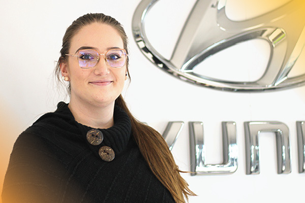

It’s time to spotlight another one of our incredible employees who live and breathe the FFUN Core Values, and this month, we’d like to introduce you to Amy Lung, Dealership Accountant at South Hyundai.

In Amy’s words, her job is to be the glue for all the departments in the dealership. She takes care of all the backend items, deal postings, and makes sure every department is fulfilled so everyone can do their jobs accordingly.

Amy came to FFUN with a Driven to Grow mindset. In 2019 she started with Saskatoon North Hyundai as a receptionist, and not long after that she moved into the role of inventory controller at South Hyundai, but that wasn’t where she stopped. Since then Amy has taken the role of Accounting Clerk at KIA Saskatoon and most recently has re-joined South Hyundai as a Dealership Accountant.

It’s Amy’s willingness to always help and her Down to Earth attitude that’s earned her a place in our FFUN Spotlight.

<!--  -->

#### **1. WHERE ARE YOU ORIGINALLY FROM?**

Amy is originally from Warman, Saskatchewan which is 15 minutes north of Saskatoon. She lived there for over 20 years and has lived in Saskatoon for just over a year.

#### **2. WHAT ARE YOU KNOWN FOR?**

According to Amy, she is known for having a positive attitude. She loves spreading positivity and tries to never have a negative attitude because she believes the glass is always half full.

#### **3. WHAT ARE YOUR TOP TWO BUCKET LIST ITEMS?**

With a slight giggle, Amy said she would like to own a house and have a mortgage. In addition to having her own place, she would also like to travel to Europe

#### **4. WHAT DO YOU THINK OF GARDEN GNOMES?**

Taken back a little by this question, Amy admits that she is creeped out by garden gnomes in the summer; however, she is growing a liking for Christmas gnomes and is building a collection of them.

#### **5. WHAT WAS THE LAST GIFT YOU GAVE SOMEONE?**

Conveniently enough, on the day we sat down with Amy it was also her mother’s birthday and since we are showing this after, we aren’t spilling the beans when we say that her gift was two Christmas ornaments.

#### **6. DO YOU HAVE A SPIRIT ANIMAL? IF SO, WHICH ONE?**

We like to throw in some random questions and Amy says if she could pick her spirit animal, she would pick a Koala as they keep to themselves, just chilling in trees minding their own business.

#### **7. DO YOU HAVE A FAVOURITE VACATION SPOT?**

Amy admits that she doesn’t take a lot of vacation (not until she hits up her bucket list of going to Europe) but she does take the odd weekend to go to her family’s place at Besnard Lake.

#### **8. DESCRIBE YOURSELF IN ONE WORD.**

Tall. Yes, we feel that is fitting; Amy is very tall.

#### **9. IF YOU COULD HAVE DINNER WITH ANYONE – DEAD OR ALIVE, WHO WOULD IT BE**

When asked this question, Amy perked up (not that she wasn’t already perked up) and very quickly responded with Gordon Ramsay. She shared with us that her love of cooking has grown recently, and she would pay money for him to call her a panini head in person.

#### **10. DO YOU HAVE ANY BAD HABITS?**

We always appreciate when people own their bad habits and Amy didn’t disappoint. She fully admits that she has a bad habit of getting lost scrolling TikTok on her phone.

#### **11. DO YOU HAVE ANY PET PEEVES?**

We fully admit that we had a good laugh about Amy’s biggest pet peeve, which is when she bites into a sandwich or burger and all of the insides come spilling out.

#### **12. IS THERE SOMETHING YOU ALWAYS FIND YOURSELF SAYING?**

Going back to what Amy is known for, what she always finds herself saying aligns with that. She says she always tells herself that the pile of papers may be thick but you can only ever handle anything one page at a time.

#### **13. WHAT IS YOUR FAVOURITE FOOD?**

With Amy’s new love for cooking, her go-to is a quinoa chicken Mediterranean bowl, which she says she eats for lunch at least twice a week. YUM!

#### **14. NAME THREE SONGS ON YOUR PLAYLIST**

- In da Club by 50 Cent

- Woman by Doja Cat

- Imma Be by the Black Eyed Peas
