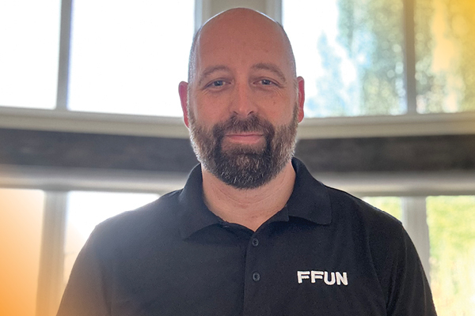

It’s time to meet a longstanding member of the Financial Services team at Country Ford, Curtis Irwin, who has been with them for almost two decades. It’s employees like Curtis that contribute to making FFUN such a great place and it’s time that we sat down with him to get to know him beyond his time spent at the dealership.

Curtis’s journey began before the FFUN group took over and his tenure at Country Ford started in sales, mastering the art of helping customers find their dream vehicle. But as they say, change is the only constant, and in 2012, FFUN rolled into town. It was then that Curtis decided to switch gears and transitioned into the world of finance.

Join us as we get to know Curtis Irwin, the man who’s seen Country Ford evolve and grow, and who’s been a crucial part of its story for nearly two decades. So grab a seat, get cozy, and let’s dive into Curtis’s journey at Country Ford.

<!--  -->

## 1. Where are you originally from?

Curtis, born and raised in Wilkie, SK, has deep roots in the area. His wife’s family also calls Wilkie home, and they have two wonderful children – a 14-year-old son and an 11-year-old girl.

## Buy Anywhere and Get It Delivered to Your Place

We don’t just finance your purchase. Our group works around the clock to deliver anywhere in Canada. We can help you purchase new vehicles, finance private sales, and build your credit in a way that works for you. FFUN doesn’t limit your options.

You can buy from the Kijiji marketplace or any dealership of your choice. Our new purchase financing allows you to find your dream car, truck, or power sports vehicle with just a few clicks.

Whether you want the latest model of a certain vehicle, fancy a used truck, or want a new snowmobile, FFUN Financials can help you find what you need. We have a massive inventory offering great deals on new and pre-owned vehicles. Our low-rate financing also makes the purchase budget-friendly and manageable.

## Top-Class Financing Services with The Best Options

FFUN makes finding your next car or truck a walk in the park. We have many options, including new purchase financing for buyers, private sale financing for sellers, and auto refinancing if you hate those huge payments.

- **Buyers:** Looking to own a new or pre-owned car but lack the finances to make such purchases? Search no further than FFUN. We can finance your dream car and deliver it to a location of your choice.

- **Sellers:** Automotive sellers can leverage our infrastructure to find buyers. We will finance your potential buyer at no extra cost, allowing you to sell more vehicles and expand your dealership.

- **Borrowers:** If you need a fast, secured loan, we accept your vehicle as collateral, allowing you to borrow as much as you need. Buyers who can’t make timely payments can refinance with us at lower monthly installments and interest rates.

FFUN Financial has something for everyone! We offer same-day approvals through our in-house lending, so you don’t need to visit the bank. Our system is also 100% secure. We’ll protect your information at all costs.

What more are you waiting for? Contact FFUN Financial by phone (866-336-9427) or [Email](mailto:info@ffun.com) to get all the information you need! We’re open Monday through Saturday and also available via socials.
