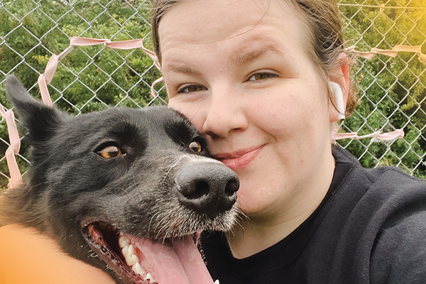

Meet Dayna Lloyd, who joined the FFUN Group nine months ago as a receptionist with Volkswagen Saskatoon. She is known by her peers for her positivity, for representing our core values, and for being part of FFUN Spirit.

Since joining us, Dayna has evolved with the company. She quickly moved from the receptionist role to the Inventory Controller at VW, where she worked with service, sales, and the public. She got very comfortable there and found it to be a great way to get to know everyone. From her early days, she joined the Spirit Committee, wanting to make a difference.

Inventory Controller isn’t where she stopped. Dayna switched positions to work in accounts payable where she handles all incoming invoices for DriveNation, FFUN Cars, and VW. She laughs and says that she makes sure everyone gets paid.

Outside of the incredible work Dayna does, let’s get to know her a bit more.

<!--  -->

#### 1. **WHERE ARE YOU ORIGINALLY FROM?**

When we ask this question, it’s usually a simple answer, but for Dayna, it was more complex. In the end, she settled with her answer being that she is originally from Calgary but spent her childhood between Alberta and Saskatchewan. For the past five years, she has called Saskatoon home.

#### 2. **WHAT ARE YOU KNOWN FOR?**

When it comes to our team, we can’t ask for a lot more than being known for always being kind, which is the case with Dayna. She believes in always paying it forward and admits that she is happy to help anytime someone needs it.

#### 3. **IF YOU COULD TRAVEL ANYWHERE IN THE WORLD, WHERE WOULD YOU GO?**

The tone of Dayna’s voice changed (slightly) when asked and out of her mouth came Ireland. She has a dream of seeing the beauty of it in real life and not just in pictures.

#### 4. **WHAT IS SOMETHING YOU ARE PASSIONATE ABOUT YOU?**

With a very excited expression, Dayna says she is absolutely animal obsessed. Whether it is dogs, cats, or any wildlife, she gets incredibly giggly when she sees them. In fact, her dog, Jessie, is her best friend.

#### 5. **DO YOU COLLECT ANYTHING?**

Well, it’s very fitting, based on the industry Dayna is in, that she collects Hot Wheels with her husband. She has over 70 and keeps her VW ones on display at her VW office.

### 6. **IF YOU STARTED A CLUB FOR SOMETHING, WHAT WOULD IT BE?**

When asked this question, Dayna didn’t want to overthink it, so she asked if we could come back to it. When we did, she realized that the club she would start would be for people who overthink.

#### 7. **IF YOU WON THE LOTTO, WHAT’S THE FIRST THING YOU WOULD DO?**

Dayna’s family is very important to her, therefore after she bought herself a 1969 Chevelle, she would move her family all to the same city.

#### 8. **WHAT’S YOUR FAVOURITE ICE CREAM FLAVOUR?**

They say you can tell a lot about a person by their favourite ice cream flavour…nah, we don’t actually know if that’s true. Nonetheless, Dayna’s favourite flavour is Mint Chocolate Chip.

#### 9. **WHAT’S YOUR FAVOURITE SMELL?**

You never know what type of answer you will get, but Dayna loves the smell of a campfire and a mechanic shop.

#### 10. **HOW LONG DO YOU THINK YOU WOULD SURVIVE A ZOMBIE APOCALYPSE?**

Dayna admits that she would (maybe) last two weeks. She says she is too sensitive and would be trying to save all the animals and not worrying about herself.

## 11. **DO YOU HAVE A FAVOURITE VACATION SPOT?**

Dayna loves staycations where she doesn’t have to go far but can get away and not be responsible for anything.

## 12. **DESCRIBE YOURSELF IN ONE WORD.**

Honest

#### 13. **DO YOU HAVE ANY BAD HABITS?**

As much as we love caring people, Dayna admits that she cares too much. She finds fault in herself, and as a result, is hard on herself. Dayna, we think you’re perfect just the way you are.

#### 14. **WHAT ARE TWO PET PEEVES OF YOURS?**

1. When people don’t take responsibility
2. When people drag their feet walking.

#### 15. **IS THERE SOMETHING YOU ALWAYS FIND YOURSELF SAYING?**

We gotta love the quirky side of our team, and this is one of those moments. Dayna always finds herself saying, okey dokey artichokey or Okie

#### 16. **WHAT IS YOUR FAVOURITE FOOD?**

For Dayna it’s not just about the food, it’s the entire experience. Her sister and her will often eat at Edo where she has the Beef Yakisoba and they always have a good visit.

#### 17. **NAME THREE SONGS ON YOUR PLAYLIST**

1. The Distance by Cake
2. Numb Little Bug by Em Beihold
3. Little Darlin by Redlight King

#### 18. **WHAT DO YOU LIKE TO DO IN YOUR FREE TIME?**

In Dayna’s free time, she enjoys gaming with her husband. She has also recently learned to knit and is currently working on a blanket.

#### 19. **WHAT DO YOU LOVE ABOUT WORKING AT FFUN?**

Dayna loves that there’s always something new. She appreciates how closely everyone works and enjoys dealing with a lot of people. As someone who likes being busy, it’s the perfect company, as there’s always something to do. She commends FFUN for being informative with the staff and constantly in communication.

#### 20. **WHAT DOES RELENTLESS EXECUTION MEAN TO YOU?**

For Dayna, RELENTLESS EXECUTION means that at the end of the day, you should have the feeling that you’ve done your job and gone the extra mile. She also believes that you should do what makes you happy and help others. She says, “it’s about knowing you’ve done everything you can.”
