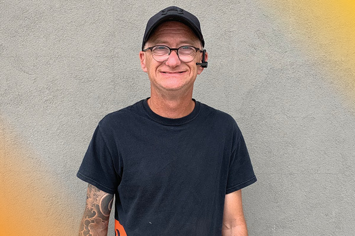

At the FFUN Group amazing Team Players like Dwayne are the heartbeat of what we do. He is the definition of having a FFUN Attitude, always remaining positive, and is extremely Down to Earth. Managing three different lots, our longest serving Lot Technician works with everyone, from the Chairman to GMs, business managers to salespeople, and even the team at CreditMaxx. He is known for his dedication, Driven to Grow mindset, and always taking on new challenges. We had a chance to sit down and learn a little more about Dwayne.r.

<!--  -->

#### **1. WHERE ARE YOU ORIGINALLY FROM?**

Dwayne is proud to be born and raised in Saskatoon, Saskatchewan.

#### **2. WHAT ARE YOU KNOWN FOR?**

When asked this question, Dwayne chuckled and said he is known for being “all-business.”

#### **3. WHAT ARE YOUR TOP TWO BUCKET LIST ITEMS?**

Dwayne’s number one bucket list item is to travel to Beijing as he is a huge fan of Chinese culture. He has taken an interest in tattoos that are designed around the culture.

#### **4. DO YOU HAVE A FAVOURITE VACATION SPOT?**

Dwayne admits that he isn’t one for big elaborate vacations, other than going to Beijing of course. He finds pleasure relaxing in the city, going to movies, playing pool and attending the folk fest, which is his absolute favourite thing to do.

#### **5. DESCRIBE YOURSELF IN ONE WORD**

Dependable. We’re pretty sure Jenn (who nominated him to be in the spotlight) would agree with that.

#### **6. IF YOU COULD HAVE DINNER WITH ANYONE – DEAD OR ALIVE, WHO WOULD IT BE?**

Dwayne has a huge passion for cooking and the culinary world. He enjoys learning about new recipes and watching cooking shows. Naturally, this would make Gordon Ramsay his top choice for a dinner-mate. He appreciated his business style, approach to cooking, and how he explains the process of every dish he makes.

#### **7. IS THERE SOMETHING YOU ALWAYS FIND YOURSELF SAYING?**

Dwayne bashfully admitted that he may not always say a specific phrase or word all the time, but he does repeat himself often.

#### **8. WHAT IS YOUR FAVOURITE FOOD?**

We could’ve guessed this answer based on his bucket list item of visiting Beijing. He loves Chinese food, especially dim sum.

#### **9. IF YOU COULD HAVE ONE SUPERPOWER, WHAT WOULD IT BE?**

Without hesitation, Dwayne says invisibility so he could get into anywhere unseen.

#### **10. IF A MOVIE WAS MADE AFTER YOU, WHO WOULD YOU WANT TO PLAY YOU?**

If Dwayne were to be represented in a movie, he would want to be played by someone who does their own stunts, and for him, that would be Tom Cruise. He also thinks he’s had an incredible career and is in amazing shape for his age.
