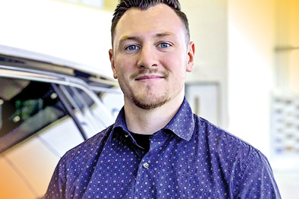

Meet Dylan Chappell, Product Specialist with North Hyundai Saskatoon. When Dylan first joined the group in October 2020, he was new to sales, as he came from a trades background. Having always been interested in getting into sales, he joined the sales team as a Product Specialist and has never looked back.

Dylan admits that it took him a little time to get comfortable in the role, but now feels like a big part of the entire team and has (really) hit the ground running. His role includes handling internet leads and helping phone and walk-in customers to find the right vehicles, but he thinks one of the most important parts of what he does is interacting with customers. He believes that everyone deserves to be acknowledged.

Dylan is always willing to step outside what his job duties consist of which is why he was nominated to be featured in our spotlight. Let’s get to know Dylan a bit more.

<!--  -->

#### 1. **Where are you originally from?**

Dylan is born and raised in Saskatoon, SK; however, he laughed and said he didn’t want to sound boring and wanted to add that he spent a lot of his childhood in Spiritwood, SK.

#### 2. **WHAT ARE YOU KNOWN FOR?**

There’s nothing better than when an employee is known for one of our core values. Dylan feels he is known for having a Driven to Grow mindset, both in his personal and professional life. In addition to being Driven to Grow, he is also known for being extremely caring.

#### 3. **IF YOU COULD TRAVEL ANYWHERE IN THE WORLD, WHERE WOULD YOU GO?**

Admittedly, Dylan hasn’t travelled much, which makes his list of desired travel destinations long. With that being said, at the top of that list is Australia. Dylan is drawn to Australia for its apparent adventure and would prefer to travel through the coastal areas so he can be near the ocean.

Second on his list is Mexico – again, near the ocean, as he has always wanted to visit a tropical destination.

#### 4. **DO YOU COLLECT ANYTHING?**

Just like last month’s spotlight, Dylan collects Hot Wheels, which his son, Abel likes to play with. He also says he enjoys collecting old coins and bills

#### 5. **IF YOU STARTED A CLUB FOR SOMETHING, WHAT WOULD IT BE?**

Having a passion for food, Dylan would start a “Food Club” where they could learn about different foods, share recipes, and taste foods from around the world. Kind of like a book club for foodies.

#### 6. **IF YOU WON THE LOTTO, WHAT’S THE FIRST THING YOU WOULD DO?**

Nothing gets us (emotionally) more than someone who wants to take care of their mom, which is exactly what Dylan would do if he won the lottery. He feels like he owes his mom the world and he would repay her by buying her a big house. Oh, he would also buy himself a supercar.

#### 7. **WHAT’S YOUR FAVOURITE SMELL?**

Asking Dylan what his favourite smell was, was not hard for him to answer. He immediately answered, the smell of coffee; freshly brewed, that is.

#### 8. **HOW LONG DO YOU THINK YOU WOULD SURVIVE A ZOMBIE APOCALYPSE?**

Dylan is confident that he would last a long time. If he had to put a timeframe on it, he figures a year. It all comes down to when he would run out of materials, food, and hope. We both laughed at the hope part.

#### 9. **DESCRIBE YOURSELF IN ONE WORD.**

Motivated.

#### 10. **DO YOU HAVE ANY BAD HABITS?**

This seems to be a common “bad habit” amongst the FFUN team. Dylan has a bad habit of overthinking simple things. He even admitted that he was overthinking this interview leading up to it.

#### 11. **WHAT IS YOUR FAVOURITE FOOD?**

Well, we now know that Dylan loves food and therefore would to start a club for food lovers, making this a more difficult question for him. After thinking it through (without overthinking it, lol), he landed on Italian food. Pizza and pasta are his absolute favourite, and not any specific dish or toppings, all of it.

#### 12. **PINEAPPLE ON PIZZA, YES, OR NO?**

Inspired by Dylan’s love for Italian food, we asked this question, knowing it may start some controversy amongst the group. But Dylan is a big fan of pineapple on pizza.

#### 13. **WHAT DO YOU LOVE ABOUT WORKING AT FFUN?**

At this point (after a couple of years) feels like he’s part of the FFUN Family. It’s a fun place where everyone is respectful to each other. For Dylan, it is his second home.

#### 14. **WHAT DOES RELENTLESS EXECUTION MEAN TO YOU?**

For Dylan, Relentless Execution means being consistent with what you’re chasing. For him, it’s about setting a goal, formulating steps, and then doing whatever you have to to reach that goal. It’s a matter of not giving up even when obstacles present themselves. In summary, Dylan believes that you must be relentless in the pursuit of your goals.
