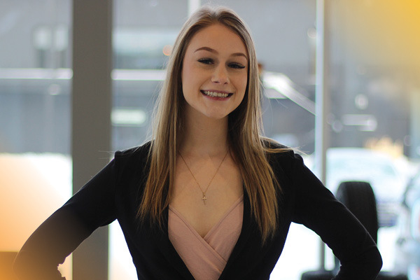

At FFUN we always love when we have a chance to sit down with some of our incredible team members to learn more about who they are. This month, we’re getting to know about Emily Arnold, a BDC Service Representative.

In Emily’s words, as a BDC Service Rep, she assists customers with maintaining their vehicle investments and makes sure we (the FFUN team) are providing safe and reliable vehicles in a top-notch customer service way.

Emily wasn’t always a BDC Service Rep; she started with the FFUN Group just over two years ago as a receptionist with South Hyundai and since then has moved into her role where she primarily works as a representative for Volkswagen Saskatoon. Although they all help each other out, Emily loves that her main store is VW as she knows her customers and is happy to stay working with them.

<!--  -->

#### **1. WHERE ARE YOU ORIGINALLY FROM?**

Emily grew up on an acreage just outside Saskatoon in Grandora but has called Saskatoon home for 13 years.

#### **2. WHAT ARE YOU KNOWN FOR?**

Emily says she is known for being outgoing, bubbly, happy, excited and that she makes the best of every day – which is exactly the kind of people we want at FFUN.

#### **3. WHAT ARE YOUR TOP TWO BUCKET LIST ITEMS?**

Although Emily did not struggle to come up with Bucket List items, she did struggle to determine what her top two are. After careful thought, she narrowed it down to her number one being to see all the man-made wonders of the world, which aligns with her dream of travelling in general. Her second Bucket List item is to move to the mountain regions of Canada

#### **4. DO YOU HAVE A FAVOURITE VACATION SPOT?**

Fitting with her dream of travelling, Emily’s dream vacation spots are Venice, Italy to see the canals and Sydney, Australia.

#### **5. DESCRIBE YOURSELF IN ONE WORD**

Eccentric. To which we laughed and said, lovingly eccentric.

#### **6. IF YOU COULD HAVE DINNER WITH ANYONE – DEAD OR ALIVE, WHO WOULD IT BE?**

If Emily could sit down with anyone for a meal, it would be Mac Miller; a rapper who has passed away. Since his music was such a big part of her growing up and the fact that he isn’t around anymore, she would love the opportunity to chat with someone who had an influence in her younger years.

#### **7. IS THERE SOMETHING YOU ALWAYS FIND YOURSELF SAYING?**

Emily (nervously) chuckled when asked this and said, “not sure if I should say this on a work interview,” but she always finds herself saying, “Oh well, what can you do?”

#### **8. WHAT IS YOUR FAVOURITE FOOD?**

With an affinity for Mexican food, Emily’s specific favourite dish is tacos.

#### **9. NAME THREE SONGS ON YOUR PLAYLIST**

Tequila Little Time by John Pardi

The Spins by Mac Miller (of course he would be on her list)

Vienna by Billy Joel (she went classic)

#### **10. WHAT DO YOU LOVE ABOUT WORKING AT FFUN?**

For Emily working at FFUN is fun, but what she really loves is the team atmosphere, especially within the BDC team. She has made connections and friends who she genuinely cares about and loves how friendly and welcoming everyone is. She also appreciates how intertwined her department is with all the dealerships.

#### **11. WHAT DOES RELENTLESS EXECUTION MEAN TO YOU?**

Emily defined relentless execution as a full dedication to providing each customer with an amazing experience while still following the process. For Emily, it’s about treating every customer the same way, no matter what the situation is. She believes that a part of being relentless in execution is making sure you get all tasks always completed to the best of your ability; she laughed and said, “relentlessly.”
