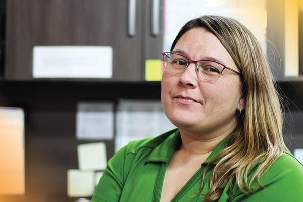

It’s time to meet Katryna Reimer, Production Manager & Estimator with FFUN Collision. Since joining us over four years ago her role has evolved from Receptionist to accounts payables, onto a Parts Advisor role, and then into her current position.

As a Production Manager & Estimator, Katryna works with a team from the “back,” writes up call-backs, acts as the “middleman” between Technicians and SGI, and writes estimates. In addition, she is responsible for tearing down vehicles, taking pictures, and again writing estimates and sending them in for SGI approval.

It is because of dedicated employees like Katryna that make FFUN one of the best places to work in Canada.

<!--  -->

## 1. Where are you originally from?

Katryna is proud to be born and raised in Saskatoon.r.

#### 2. **WHAT ARE YOU KNOWN FOR?**

In line with what Katryna loves, she is known for being a family person and always wanting to help people. Oh yeah, she said she is also known for being short; under 5 feet, and we say, “good things come in small packages.”

#### 3. **WHAT ARE YOUR TOP TWO BUCKET LIST ITEMS?**

When asked if Katryna had any bucket list items, two came to mind instantly. It has always been a dream of hers to go to Hawaii and her other bucket list item is to see the mountains – which she plans to do this summer.

#### 4. **WHAT IS SOMETHING QUIRKY ABOUT YOU?**

We love quirky things about our employees, especially when they are around being happy. Katryna admits that she does a little dance when she’s happy as a result of something going right.

#### 5. **DO YOU HAVE A SPIRIT ANIMAL? IF SO, WHICH ONE?**

Without hesitation, Katryna said, a frog. She absolutely loves them and has them everywhere in her house.

#### 6. **DO YOU HAVE A FAVOURITE VACATION SPOT?**

When Katryna has some time to get away, she enjoys spending time at her family cabin in Mont Nebo.

#### 7. **DESCRIBE YOURSELF IN ONE WORD.**

Quiet

#### 8. **IF YOU COULD HAVE DINNER WITH ANYONE – DEAD OR ALIVE, WHO WOULD IT BE?**

If given the opportunity, Katryna would sit down with her Godmother, Sally. She said she’d love to share her accomplishments with her and tell her about her children.

#### 9. **DO YOU HAVE ANY PET PEEVES?**

Admittedly, Katryna is not a huge fan of animals and therefore animal hair on clothing is a pet peeve. In addition to that, it drives her crazy when people don’t follow procedures and rules.

#### 10. **IS THERE SOMETHING YOU ALWAYS FIND YOURSELF SAYING?**

Katryna laughed when asked this and responded with, “yes, I will have another coffee.”

#### 11.**WHAT IS YOUR FAVOURITE FOOD?**

Katryna’s absolute favourite dish is her husband’s chicken, shrimp, and mushroom alfredo.

#### 12. **NAME THREE SONGS ON YOUR PLAYLIST**

1. Song #3 by Stone Sour
2. Seize the day by Avenged Sevenfold
3. Anything country

#### 13. **WHAT DO YOU DO IN YOUR FREE TIME?**

Going back to her love for family, Katryna’s favourite thing to do in her free time (other than visit Mont Nebo) is spending time with her kids playing games on the XBOX.

#### 14.**WHAT DO YOU LOVE ABOUT WORKING AT FFUN?**

Katryna loves that she gets to communicate/work with staff from multiple locations and divisions. She says regardless of which division anyone works in, she feels like FFUN is an incredible community.

#### 15. **WHAT DOES RELENTLESS EXECUTION MEAN TO YOU?**

For Nicole, RELENTLESS EXECUTION is setting consistent goals and then coming in every day and formulating a plan on how you are going to achieve that goal. For her, RELENTLESS EXECUTION doesn’t stop there; it’s important, once you reach a goal, to set another one and to always look at ways to improve yourself.
