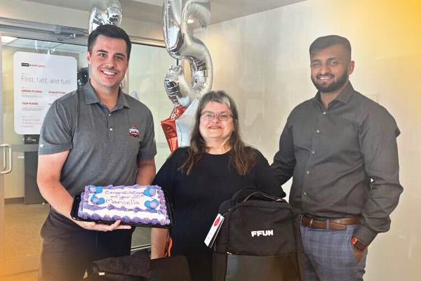

If there is a team member who exemplifies the FFUN Core Values, it’s Marcella. She just celebrated 25 years with Acura Centre and is the model for Team Player and Down to Earth. Marcella works as a detailer with FFUN and is known as the “mom” of the group who takes extreme pride in her work and her workplace. She is described as being a task-focused person who takes initiative and is constantly busy. We’ve sat down with her to ask some FFUN questions for all of us to get to know her better.

<!--  -->

#### **1. WHERE ARE YOU ORIGINALLY FROM?**

Marcella is proud to be born and raised in Saskatchewan. She grew up in the “country” outside Saskatoon but considers Saskatoon home.

#### **2. WHAT ARE YOU KNOWN FOR?**

Marcella says her coworkers know her for always smiling and saying hi to everyone.

#### **3. WHAT ARE YOUR TOP TWO BUCKET LIST ITEMS?**

Although it took a little for Marcella to narrow it down, she did come up with her top two.

#### **4. DO YOU HAVE A FAVOURITE VACATION SPOT?**

Marcella finds the greatest beauty in where she is from and she likes using her vacation time to enjoy what Saskatoon has to offer.

#### **5. DESCRIBE YOURSELF IN ONE WORD**

Hardworking

#### **6. IF YOU COULD HAVE DINNER WITH ANYONE – DEAD OR ALIVE, WHO WOULD IT BE?**

For Marcella, it’s all about family and she would love to have dinner again with her niece and her husband, William. They always have a great time, filled with interesting conversation

#### **7. WHAT IS YOUR FAVOURITE FOOD?**

WAn easy response for Marcella. She loves stir-fry, especially if it’s made with pork tenderloin.

#### **8. IF A MOVIE WAS MADE AFTER YOU, WHO WOULD YOU WANT TO PLAY YOU?**

Marcella admits that she doesn’t watch many movies, but has a love for cartoons, so naturally, she would prefer her character to be animated.

#### **10. IF YOU COULD HAVE ONE SUPERPOWER, WHAT WOULD IT BE?**

For Marcella, the idea of not being seen is the ultimate superpower. The power of invisibility. Though most of her work is done behind scenes, we definitely notice all you do!
