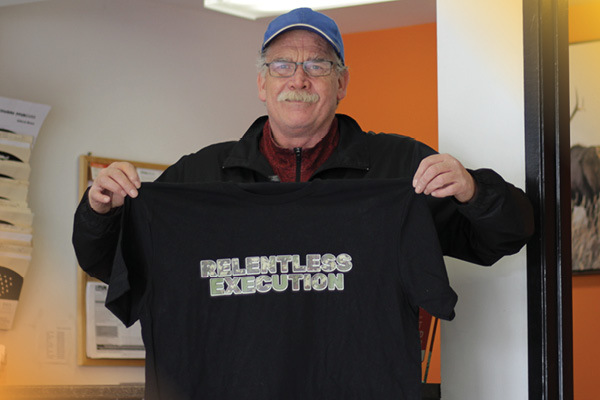

FFUN Dealerships are located throughout Saskatchewan, Alberta, and Ontario, and many of them serve small rural communities. Working at a dealership in one of these small communities often means a smaller team that helps each other out to serve customers better and grow the business. We took a trip to Prince Albert, Saskatchewan and sat down with each member of the DriveNation team to get to know a little more about them.

<!--  -->

#### **Meet Terry Gerlach**

Terry Gerlach started with DriveNation around eight years ago as the Store Manager and when COVID hit, he moved over to Kia PA as General Manager. Last August Terry moved back over to DriveNation to be General Manager and help get the store start “rockin’ and rollin’!”

#### **1. Where are you originally from?**

Terry is born and raised in Prince Albert, although, he did share that he moved around a bit as a kid but has been calling PA home for the last 20 years.

#### **2. Is there somthing you are passionate about?**

Without hesitation, Terry said he is passionate about fishing. In his free time, he heads out to the lake to try and catch “those monster jackfish.”

#### **3. If you won the lottery, what's the first thing you could do?**

Since FFUN is all about community involvement, we were bursting with happiness to learn that the first thing Terry would do if he won the lottery was, he would build a shelter for the homeless.

#### **4. What is one word to describe you?**

Passionate

#### **5. What is your favourite food?**

Terry says that from childhood until now, spaghetti with meat sauce is his favourite meal.

#### **6. We undrestand that you are very involved with the community, could you please share a bit more about that?**

Terry’s wife is very involved with PA Grand Counsel where she manages the daytime warming shelter, and in Terry’s free time he goes and helps by making food and he also volunteered to be a driver for the evening warming bus.

#### **7. What do you love about working with FFUN and DriveNation?**

We couldn’t have an interview without asking this question, and for Terry, he loves the people and the process. He feels we have both in place to make for a successful environment.

#### **8. What does Relentless Execution mean to you?**

For Terry, it’s about going above and beyond what your expected job role is. Whether that’s putting in a little extra time working on a sale or helping a customer at the end of the day to give them exceptional customer service.

#### **Meet Robert Stewart**

Robert Stewart is the Sales and Finance Manager who has been with the group (off and on) for four years but has been in the automotive industry for 14 years. He started as a service writer, then moved to a sales position, and eventually into the finance side.

#### **1. Where are you originally from?**

Terry is born and raised in Prince Albert, although, he did share that he moved around a bit as a kid but has been calling PA home for the last 20 years.

#### **2. Is there anything you are known for?**

Robert’s immediate response was, “Those curves.” A while back there was a DriveNation commercial and Robert’s line was “those curves,” so now in public people will point him out as the guy with “those curves.”

#### **3. What's somthing you are passionate about?**

Not many people say this when asked about their passions, but Robert is passionate about his job. As someone who has always worked in hospitality, serving people comes easy to him. He loves his work so much that he admits he wishes he went into automotive sales from the beginning.

#### **4. If you won the lottery, what would you do?**

The first thing Robert would do is pay off his mortgage. He has always wanted a log cabin so after paying off his mortgage, he would design his own and build one (preferably) in BC.

#### **5. What's one word to describe you?**

Passionate

#### **6. Do you have any favourate food?**

In all honesty, most people we interview have pizza or pasta as their favourite food but not Robert. His favourite food is Vietnamese spring rolls.

#### **7. What do you like to do in your free time?**

Out of the mouth of Robert, “If I’m not at work, I’m either sledding or quadding.”

#### **8. Do you have big summer plans?**

Robert started by saying he and his wife might make a trip to BC but quickly remembered they might pick the other coast and choose to visit some friends in Nova Scotia. Either way, he’s visiting one of the coasts of Canada.

#### **9. What do you love about working at FFUN?**

For Robert, it's simple. The best part about working at DriveNation is seeing the smiles on customers when he's able to get them approved and driving ways. For him, it's about seeing people smile and creating a culture of royal customers.

#### **10. What does Relentless Execution mean to you?**

Relentless Execution for Robert means, going that extra mile and being driven to do so. Being passionate about what he does makes being relentless an easy task. Robert provided a perfect example. He and a driver got up at 6am, drove to Regina, picked up a truck, drove to Saskatoon where they picked up another vehicle then drove both back to Prince Albert and delivered the SUV, then went to La Ronge and delivered the truck. They finally arrived back in PA at midnight. I think we can all agree that is Relentless Execution.

#### **Meet Steven Reynish**

Steven Reynish is the Lot Attendant at DriveNation Prince Albert and (with all smiles) he says it’s a great job and he loves everything about the work. Let’s learn a little more about Steven.

#### **1. Where are you orginally from?**

Steven is born and raised in Prince Albert and to him, it’s home and always will be. PA.

#### **2. Is there anything you are known for?**

According to Steven, many people know him from the time he spent working at McDonald’s taking care of all of the equipment.

#### **3. What are you passionate about?**

Without hesitation, Steven responded with, “Love of life!” There aren’t many things that are better to be passionate about than that.

#### **4. Is there anything you collect?**

When asked this, Steven laughed and admitted that he is a pack rat. He also admits that his wife hates it, but she puts up with it. He collects anything that other people deem as garbage. He will then get it working and give it away or store it until he can give it away.

#### **5. What would you do if you won the lottery?**

Since family is part of what FFUN is all about, we love that Steven would first and foremost take care of his family. Once that is done, he and his wife would disappear. We asked where to and he said it wouldn’t be disappearing if anyone knew.

#### **6. What is one word to describe you?**

Cordial

#### **7. Do you have any secret talents?**

Steven is a fun guy, so when asked this, he smiled and said he does but can’t tell because they wouldn’t be a secret anymore. Steven, we’ll keep trying to figure them out.

#### **8. Do you have any pet peeves?**

Out of all the questions we asked, this response came the quickest. Steven’s biggest pet peeve is bad drivers, especially ones that don’t shoulder check.

#### **9. Do you have a favourite food?**

Well, Steven really pulled on our heartstrings with how much love he has for his wife. His favourite food is anything his wife cooks. He says he loves all of it but especially roast beef, mashed potatoes, and a side of homemade apple pie.

#### **10. What are your thoughts about pineapple on pizza? Yes, or no?**

Steven says he likes Hawaiian Pizza, so yes, he likes pineapple on pizza.

#### **11. What do you like to do in your free time?**

When Steven has free time, he enjoys spending time with his grandsons and great-granddaughter.

#### **12. What do you love about working at FFUN?**

Steven being the cordial and happy person he is, it’s no surprise that what he loves most is the people. He says he loves the customers and the people he works with. He likes getting to meet people who come from all over and likes to treat them the way they deserve.

#### **13. What does Relentless Execution mean to you?**

Never stop. When you think you got it done, walk around it again and you’ll find something you missed.
