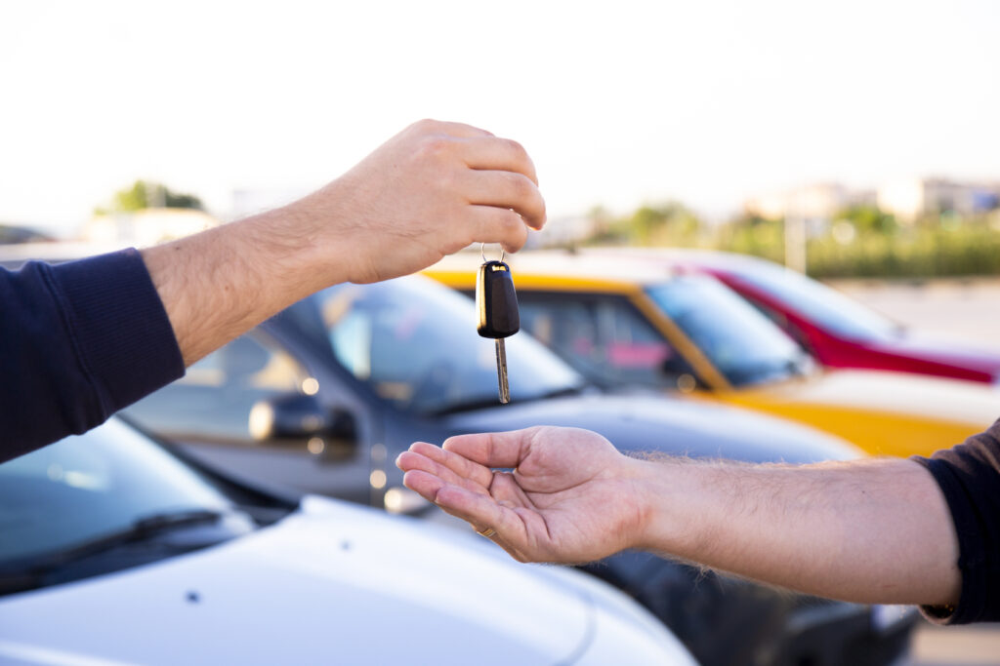
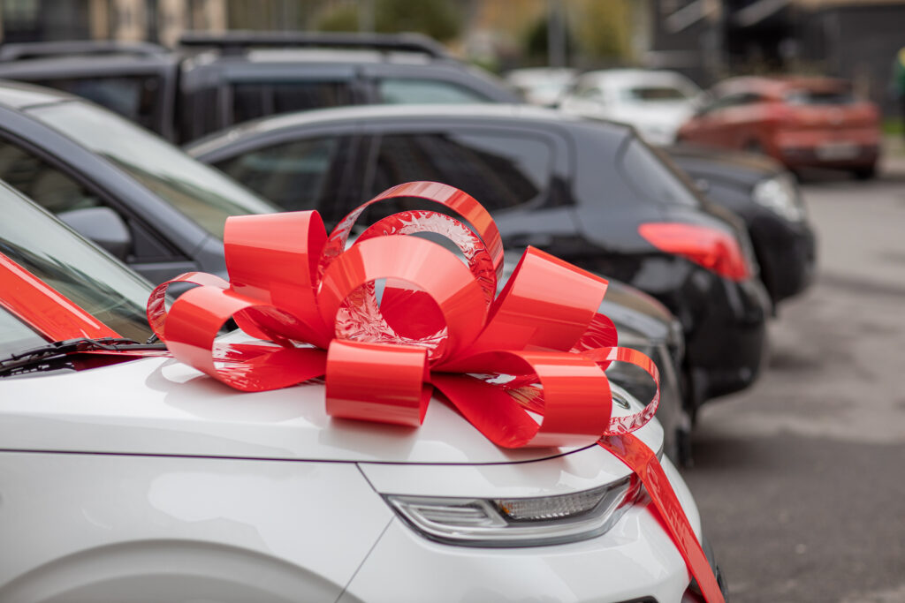

When it comes to getting your next vehicle, the question is, do you buy a new car or a used car? You don’t have to be in the auto industry to know there is a shortage of new car inventory; just drive by any dealership and notice how empty the lot is, compared to pre-pandemic. Keep in mind there are pros and cons of both new and used vehicles and currently, there is a large selection of certified pre-owned vehicles to choose from.

## **Consider Cost**

<!--  -->

One of the major factors to [consider when purchasing a vehicle is the cost.](consider when purchasing a vehicle is the cost.) Typically (not always), new cars have a higher price tag when comparing the same make and model. If you compare a luxury car such as a BMW or a Mercedes to a more standard automaker like Mazda or Kia, the used luxury brand may cost more than a brand-new standard one, mainly because of the brand and the luxuries that come with it.

Remember that they depreciate relatively quickly when deciding to buy a new car. That’s not a reason not to buy new; it’s just something you have to be okay with. Many people don’t care about this because the other benefits of buying a new car outweigh the initial depreciation cost. On the other hand, used cars have had the depreciation paid, which automatically lowers the price.

## **Used Cars**

There are pros and cons of buying a used car, and you have to decide what works best for you and your needs. There will always be some compromise when going with a used car. Since you can’t factory order, you have to pick from what is available within the used car world. The good news is there is an [abundance of used vehicles to choose from.](abundance of used vehicles to choose from.)

The unfortunate side of buying used is that you don’t know how the vehicle was treated, so always ask for the vehicles’ history and maintenance records whenever you buy used. To make the used car shopping experience more enjoyable, accept that there will be slight imperfections on the vehicle and remember, used cars are holding their value these days and with the expansive inventory there is right now, often come with all the bells and whistles that a new car does.

## **New Cars**

Everyone wants a [brand-new car](brand-new car), but not everyone likes the price that comes along with having one. If you can accept the cost and the idea of paying for the depreciation, buying a new car has its benefits. It will be in perfect condition for starters, and you can also factory order with customizable options. If you are going the brand-new car route, remember there isn’t much available. There is still the option to pre-order, but you need to be patient as some models are taking up to a year to arrive. On the plus side, there are some pre-orders available that are arriving in as little as 60 days, such as the new [Kia Forte](Kia Forte).

Unlike buying a used car, new ones come with a warranty, so if you need peace of mind, buying new is your best option. Many dealerships that sell pre-owned vehicles offer an extended warranty, which is important to consider.

## **Financing Your Car**

It’s no secret there are better financing options when you buy a brand-new vehicle. You will often see interest rates at .99% or even 0% interest on new vehicles, which makes a massive difference in the total price you pay for the vehicle. That’s not to say there aren’t decent rates available on used cars if you are buying from a dealership; it’s just saying they won’t be as good as when you buy new ones.

Deciding whether you buy a used car or a new car is up to you, your budget, what you want in your vehicle, and your lifestyle. There are great options in both categories, and one could argue that one isn’t better than the other; it’s all personal preference. If you have questions about current inventory, timelines, and prices, [contact someone from our team and we will be happy to help.](https://events.ffun.com/contact-us/?_ga=2.268638897.1971410955.1646756012-532668179.1643043539)
