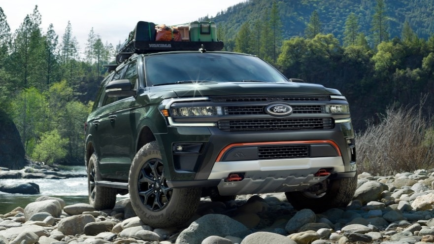

<!--  -->

[https://media.ford.com/content/fordmedia/fna/ca/en/news/2021/09/21/new-ford-expedition-raises-bar.html](https://media.ford.com/content/fordmedia/fna/ca/en/news/2021/09/21/new-ford-expedition-raises-bar.html)

- New Timberline Edition is the most off-road-capable Expedition ever with higher ground clearance to help clear obstacles, Trail Turn Assist for making tight turns, plus an F-150 Raptor heavy-duty underbody skid plate for more rugged off-road ability

- Powerful Expedition Stealth Edition Performance Package combines unique athletic styling appointments with best-in-class1 power from a high-output twin-turbo 3.5-litre V6 EcoBoost® engine2, while a sport-tuned suspension adds maximum on-road fun and driving confidence

- New Expedition has the most available Driver-Assist Technology features in its class, including Ford BlueCruise3 hands-free highway driving system; available theater-quality audio comes courtesy of a Bang & Olufsen® Unleashed Sound System option with 22 Speakers including Subwoofer4 – the most available Speakers in its class

**DEARBORN, Mich., Sept. 21, 2021 –** Ford today reveals the new 2022 Expedition, its flagship SUV, for families seeking epic adventures and memory-making road trips. With an expanded lineup of models to choose from, new driver-assist and connected technologies, the most off-road-capable the most in its class2 and a new Platinum series, this is the smartest Expedition ever.5

The new Expedition elevates itself above competitors with new class-exclusive features, plus new capabilities and technologies, including:

- First Timberline series elevates the Expedition above the Jeep® Wagoneer with best available ground clearance in its class of 10.6 inches6 (versus a maximum 10 inches for Jeep Wagoneer), F-150 Raptor underbody protection and best available power in its class1

- Expedition Timberline SUV model weighs 4% less than Jeep Wagoneer SUV and boasts a better power-to-weight ratio, as Ford’s high-output 3.5-litre EcoBoost engine tops the Jeep Wagoneer SUV5.7-litre V8 engine with 48 additional horsepower and 106 more lb.-ft. of torque5

- Stealth Edition Performance Package delivers 85 more horsepower and 127 lb.-ft. more torque5 than Chevrolet Tahoe® RST SUV with its 5.3-litre V8 engine

With these expanded offerings, the new Ford Expedition SUV is poised to attract new customers who are more culturally diverse than the full-size SUV category has seen in past years, including more women seeking family adventures to balance the stress of their overprogrammed lives.

This expanded lineup brings more personality and design distinction for each series – from the premium Expedition Platinum, as well as the new Stealth Edition Performance Package and Timberline model – including bolder styling with standard LED headlamps, updated taillamps and new wheel choices. Also, a new twin-spar mesh grille and fog lamps with chrome accents have been added to the Platinum.

## Timberline: Highest ground clearance and Goodyear Wrangler AT tires

Ford once again delivers on its promise to offer more rugged SUVs and trucks with the new Expedition Timberline model – the most off-road-capable Expedition ever, which is set apart in the series with a unique grille and Active Orange exterior accents.

“Timberline sets a new standard with full-size SUV customers who need more passenger space, great off-road capability and a basecamp for life’s journeys,” said Mike Kipley, Ford Expedition chief engineer.

Timberline boosts Expedition trail capability, starting with standard 10.6-inch best ground clearance in its class and a wider track, while improved approach and departure angles enable deeper travel into the backcountry on tougher trails. Timberline is powered by Ford’s high-output 3.5-litre EcoBoost V6 engine producing 440 horsepower and 510 lb.-ft. of torque.2

More functional upgrades include Trail Turn Assist – the same system as on Bronco™ SUV – that can tighten the turning radius on hairpin trails to take customers further off-road8, rugged 33-inch Goodyear Wrangler™ AT tires, two-speed transfer case and tough F-150 Raptor underbody shielding.

## Stealth Edition Performance Package: Style and performance meets capabilit##

With athletic styling and a sport-tuned suspension, the new 2022 Expedition Stealth Edition Performance Package elevates on-road fun and driving confidence with best-in-class power from Ford’s high-output 3.5-litre EcoBoost engine producing 440 horsepower and 510 lb.-ft. of torque.2

Available on Expedition Limited and Limited MAX, Stealth Edition Performance Package sports modern, stylish gloss-black features including grille, mirror caps, roof rails, running boards, tailgate appliqué, rear bumper skid plate, fog lamp bezels, plus headlamp and taillamp housing. Unique red brake calipers sit behind larger 22-inch premium black aluminum wheels, while “Expedition” and “Limited” badging in black are featured front and back, plus new black Ford oval emblems.

## Flagship-level technology including Ford BlueCruise, new SYNC® connectivity, Ford Power-Up

The Expedition Platinum debuts Ford BlueCruise3 hands-free highway Driver-Assist Technology. The available new feature builds upon Intelligent Adaptive Cruise Control with Stop-and-Go, Lane Centering and Speed Sign Recognition. It allows owners to operate their vehicle hands-free on the highway while being monitored by a driver-facing camera to ensure they keep their eyes on the road. It is compatible on prequalified sections of divided highways called Hands-Free Blue Zones.

Elevating the new instrument panel and craftsmanship further is an available 12.4-inch high-definition digital gauge cluster that features a large information on-demand area, along with Expedition-specific graphics and animations that respond to the flagship’s selectable drive modes and can display off-roading data and turn-by-turn navigation.

The new Expedition comes with standard SYNC® 4 or an optional SYNC 4A system with 15.5-inch high-definition touch display – the largest available screen in its class1. SYNC 4A provides a modern interface using machine learning to learn and present preferred driver choices.

SYNC 4 with a standard 12-inch center screen with information on-demand panel allows customers to split the screen and control multiple functions simultaneously, including navigation, music and other features, such as towing information.

Available SYNC 4A with the 15.5-inch portrait-oriented display includes adaptive dash card technology that uses the touch screen for interactive individual digital cards, instead of traditional menus, to organize and optimize the experience.

Expedition elevates its audio experience with available Bang & Olufsen® Unleashed Sound System featuring 22 Speakers, including Subwoofer. No other SUV offers more available speakers in its class4, along with 360-degree surround sound, which is available on Expedition Platinum, Stealth Performance Edition Package and Timberline models.

The rear-seat experience has been enhanced to include a Rear Seat Entertainment System that lets passengers enjoy a wide variety of content from popular apps, stream videos, play games, listen to music, get information and watch downloaded programs – all through high-definition touch screens now with 16 gigabytes of storage.

Expedition comes equipped with Ford Power-Up software, which delivers regular vehicle enhancements to Ford owners, turning connected vehicle learnings into continuous quality improvements, new features and capabilities. These updates can improve the ownership experience and may help reduce the need for repair trips.

## 2022 Expedition brings the most available Driver-Assist Technology features in its class1##

Every 2022 Ford Expedition comes with standard and available driver-assist features. These include:

- Road Edge Detection: This feature engages the steering system to help you maintain your position in the lane on roads with a visible line or a clear edge8

- Intersection Assist: It’s not easy to traverse a busy intersection, especially when you need to consider other vehicles around you. Available Intersection Assist can help. Intersection Assist uses the front camera and radar sensors to detect oncoming traffic while you are attempting to turn left. If there’s a risk of a potential collision with an oncoming vehicle, your vehicle can alert you and apply the brakes. This just might give you more confidence when attempting to make a left turn at an intersection8

- Reverse Brake Assist: Backing out of parking spaces often puts drivers in situations with limited visibility, so this feature senses oncoming pedestrians and vehicles, alerts the driver, and automatically brakes if the vehicle is at risk of a collision8

- Evasive Steering Assist: It happens. Traffic is rolling along smoothly when suddenly there’s a slow or stopped vehicle in your path. This available feature can help make it easier to potentially avoid a collision. It doesn’t steer for you, but it can provide extra steering support if the system’s warning goes off and you need to maneuver around the vehicle ahead8

- Active Air Dam: This available new feature improves aerodynamics, deploying at speeds above 40 mph then automatically retracting at lower speeds for city driving and parking8

## Smarter, simpler, greater towing##

As customers seek out more adventures with their outdoor lifestyle toys, the 2022 Expedition SUV features available easier ways to hitch and manage a trailer – turning any driver looking to back into a campsite or down a boat ramp into a seasoned pro.7

Pro Trailer Backup Assist™ 2.0 uses the rear camera and park aid sensors to detect a trailer, with the user directing it through a control knob and backup camera screen. Version 2.0 improves on the previous system that required the driver to put a “target” on the trailer and to in-put trailer dimensions – automating all of that for a more seamless user experience.8

Expedition tows up to 4,173 kg (9,200 lbs) when equipped with the Heavy-Duty Trailer Tow Package.7

.

.

.

Find your next Expedition at our Ford Dealer in Wilkie, Sk.

[https://www.countryford.ca/](https://www.countryford.ca/)
