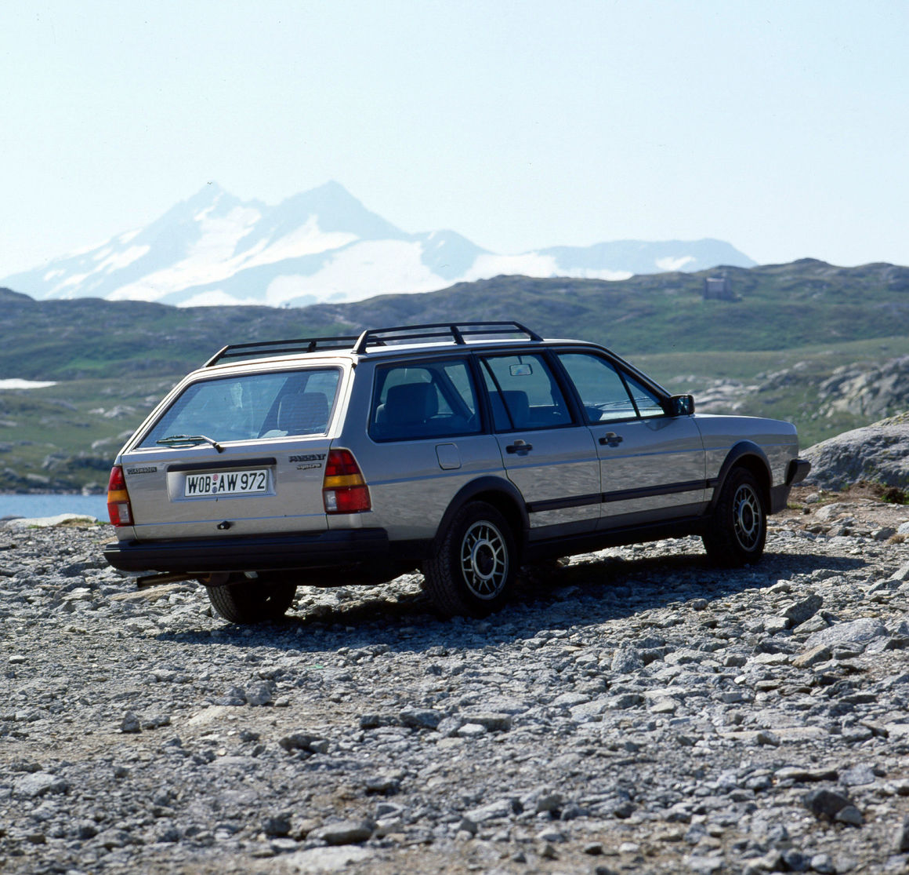
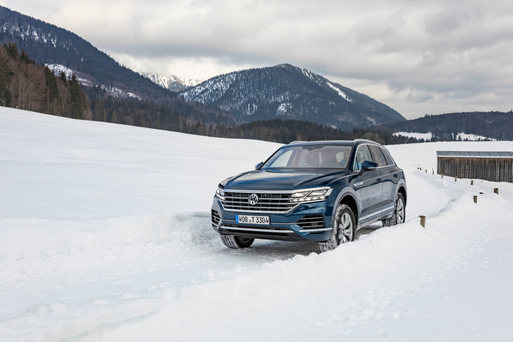
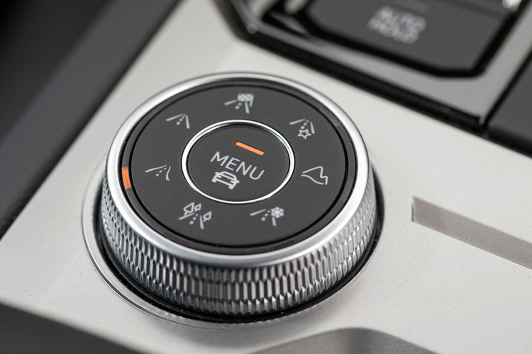

<!--  -->

[https://www.volkswagen-newsroom.com/en/stories/perfectly-equipped-for-the-winter-with-4motion-all-wheel-drive-6807](https://www.volkswagen-newsroom.com/en/stories/perfectly-equipped-for-the-winter-with-4motion-all-wheel-drive-6807)

Fantastic snow landscapes all over Germany, temperatures well below the zero-degree mark – a winter fairytale. On the roads, however, this poses a very special challenge for drivers and vehicles. For decades, all-wheel drive has been helping here, preventing the wheels from spinning and improving traction.

In 1984, Volkswagen launched a brand new product onto the market in the form of the Passat Estate GT syncro equipped with all-wheel drive. Ever since then, Volkswagens with four powered wheels have been the cornerstones of the brand’s model range. And Volkswagen has never stopped enhancing the technology in its all-wheel drive systems. From 1996 onwards, the name “syncro” was replaced by “4MOTION”. Nowadays, the all-wheel drive system is connected to the cutting-edge assist systems and offers better performance than ever before. So, models with all-wheel drive are not just in high demand among winter sports fans.

## “We have been building cars with all-wheel drives for almost 40 years”##

says Thomas Ulbrich, member of the Volkswagen Passenger Cars Board of Management responsible for Technical Development. “Thanks to our systematic development process, we are able to offer this technology at an attractive price. As a result, huge numbers of customers can experience the benefits of all-wheel drive – this is an advantage when it comes to driving safety and enjoyment.”

Models with all-wheel drive are available in almost all Volkswagen product lines. Even though 4MOTION improves traction and performance in all weather conditions, in the winter months, you will find lots of Volkswagens equipped with 4MOTION in locations that are particularly susceptible to icy and snowy conditions. However, all-wheel drive not only makes sense in snowy mountainous regions or on extreme off-road terrain. This technology improves traction and driving dynamics on almost any terrain and therefore creates the ideal bond between the vehicle and the road. What is more, all Volkswagens equipped with all-wheel drive are powerful towing vehicles, making them ideal companions for use with horse boxes or boat trailers.

Volkswagen offers various versions of the 4MOTION all-wheel drive system. The most common version is the system with an electronically controlled multiplate clutch; it is used in models with transverse engines (e.g. T-Roc, Tiguan, Passat01, Arteon, etc.). This version mainly powers the front wheels. If the electronics system notices a loss of traction, it immediately activates the rear wheels as well. This happens so quickly and smoothly that you tend not to notice how the all-wheel drive is improving the driving experience. Because only the front wheels are powered when conditions are good, these vehicles are also very economical.

The third generation of the Touareg is also equipped with permanent all-wheel drive (4MOTION) as standard. The all-wheel drive is coupled with an 8-gear automatic gearbox (gear shift by “Shift by Wire”, gear display in the handle and on the instruments). A centre differential lock with asymmetric dynamic torque distribution acts as a transfer box for the flow of forces between the front and rear axle. A maximum of 70 per cent of the drive force reaches the front axle and up to 80 per cent reaches the rear axle.

## 4MOTION Active Control – individual driving profiles for every type of terrain##

The Touareg and the all-wheel drive versions of the T-Roc, Tiguan and Tiguan Allspace also offer drivers the chance to activate individual driving profiles – depending on the terrain. They can do so with ease using the rotary and pressure switch for the 4MOTION Active Control located behind the gear knob. This multifunctional and intuitive switch controls the all-wheel drive functions and, with them, the respective driving profiles. The driver uses it to activate four higher-level profiles and different pop-up menus. If drivers turn the round switch to the left, they access two road profiles in the form of Street and Snow. If the switch is turned to the right, two off-road profiles open: Offroad (automatic setting of off-road parameters) and Offroad Individual (variable settings).

4MOTION Active Control can be used to adapt all relevant assist systems to the drive situation in a matter of seconds. The Comfort, Normal, Sport, Eco and Individual driving profiles, also selected via 4MOTION Active Control, are also integrated. These profiles are used to customize parameters such as the engine, automatic gearbox, climate control and electromechanical steering.

.

Find more information at [volkswagen.com]('https://volkswagen.com')

.

Book your test drive today at our Saskatoon location!
