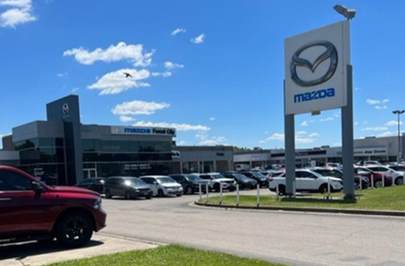

FFUN Group announces newest acquisition of Forest City Mazda in London, Ontario.

<!--  -->

#### **LONDON, Ontario – June 21, 2022**

The FFUN Group (“FFUN”) is growing, continuing with its national expansion through its recent acquisition of Forest City Mazda from the Palladino Auto Group. Based out of London, Ontario, this Mazda dealership serves Strathroy, Dorchester, Port Stanley, St. Thomas, and the surrounding areas.

With a history planted in the auto industry dating back to 1974, the FFUN Group, based in Saskatoon, Saskatchewan, Canada, was established in 2003. In that short timeframe, it has become one of Canada’s largest and fastest-growing automotive groups, with operating divisions representing the automotive, recreational, financial and real estate sectors.

“One of our core values is to be driven to grow. We are excited about continuing our expansion into the Ontario automotive market and the opportunities it provides for our entire group,” says President & CEO Mark Loeppky. “This is a well-run dealership with strong management. With the integration of our FFUN initiatives, we feel we can deliver a truly incredible and differentiated customer experience in this market.”

The FFUN Group was founded with the goal of breaking the mould of a conventional automotive dealership group. This acquisition, effective June 16, 2022, will add the first Mazda store to an already impressive line-up of OEM offerings in Western Canada. This includes Hyundai, Kia, Acura, Volkswagen, Ford, Chrysler, Dodge, Jeep, Ram and Genesis locations. But what makes FFUN truly differentiated is its multitude of divisions, including a financial, insurance and warranty arm that will provide Forest City Mazda with expanded alternatives for their customers. This divisional crossover provides a holistic buying experience, regardless of the motorized vehicle they are searching for.

FFUN owns and operates numerous independent, used retail stores across Canada, a collision centre, and an entire recreation division. Offering BRP (Ski-Doo, Sea-Doo, Can-Am), Lynx, Alumacraft, Manitou, Yamaha, Lund, RVs, and Harley Davidson products. This isn’t the first endeavour for FFUN in the Ontario market. Already having a successful Harley Davidson store in Sudbury, Ontario (The Rock) made the opportunity to acquire Forest City Mazda that much more appealing. Bringing the group to a total of 29 rooftops stretching from British Columbia to Ontario.

While FFUN operates multiple highly successful dealerships, the company is a proud supporter of each community they live and work in through the FFUN Spirit division. Aiding youth, local sports and health initiatives with financial assistance and volunteer opportunities within each community they serve. As an employer of 575 team members (and counting) across Canada, the company will continue on its growth path while serving the communities they operate in. “FFUN is a value-based organization,” adds Loeppky. “Getting to know Jay (Maroney), the General Manager and his staff here, we have been blown away by the positivity and desire to scale this business. We look forward to not only providing a better product offering for the London area but participating and growing this community as well.”

#### **About Forest City Mazda**

Forest City Mazda was the original Mazda dealership in southwest Ontario and has been operating for over 40 years. Originally named Probart Mazda, the location is situated on what was once known as the Golden Mile, London’s dealership strip. The dealership rebranded with the name Forest City Mazda in 2017, the affectionate moniker of London, Ontario. The Mazda brand celebrated its 100th year in business in 2020. Its Canadian subsidiary was established in 1968. Today, there are over 160 independently owned Mazda dealerships across Canada. The brand has a tradition of believing in human potential, with every detail designed to make you feel alive.

For more info, visit [www.mazda.ca](https://mazda.ca)

#### **FFUN Group**

Since its inception in 2003, the FFUN Group has established itself as one of Canada’s leading privately-owned businesses and as one of the country’s best managed companies. Their vision is to sell the coolest products by the best people backed by an inside-out, top-to-bottom business plan underpinned by core values and culture that inspires employees to not just navigate through the company, but to burn rubber while doing so. Today, the FFUN Group operates five separate divisions representing 29 businesses and counting. The FFUN Group is committed to bringing fun to life for employees and customers, delivering the best employee and customer experience possible. For more info, visit [www.events.ffun.com](https://events.ffun.com)

## Media Contacts

Kyle Senger

Vice-President of Marketing

FFUN Group

306-664-680

kyle.senger@ffun.com
