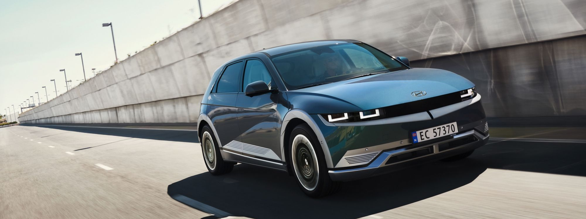
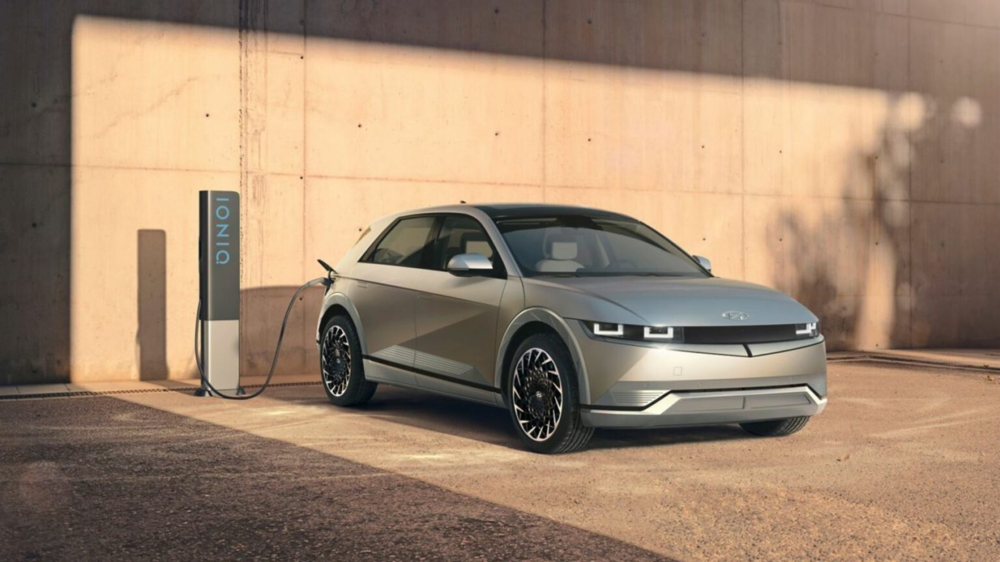
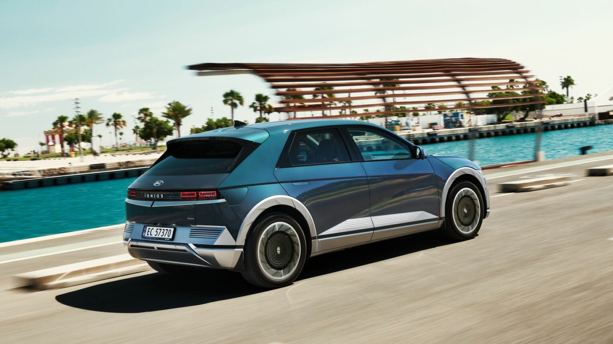
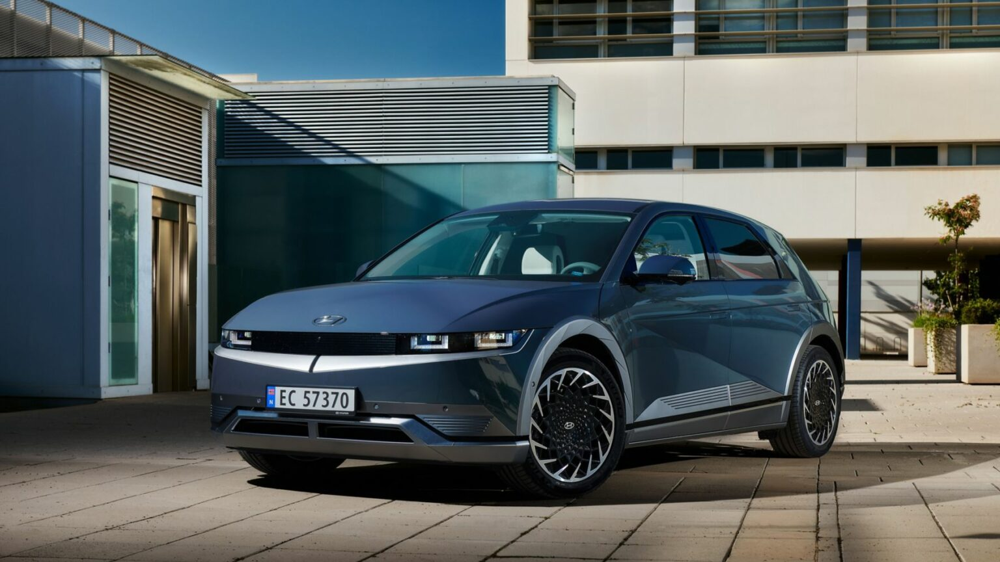

<!--  -->

- First media reviews of IONIQ 5 start with pan-European test drive in Valencia

- Fully-electric CUV praised for its bold design, comfortable interior and user-friendly tech

- Particular attention paid to its customer focused driving experience at all speeds

## Press reactions to IONIQ 5##

This is what the press had to say about IONIQ 5:

Spanish newspaper ABC, was impressed with the exterior design. “IONIQ 5 is based on striking straight lines and rather flat sides to become a car of impeccable appearance and high interior quality,” they wrote. “Overall, it is avant-garde and striking. So is the interior, perhaps because we have become accustomed to very austere interiors in electric cars.”

The journalists at France’s Automobile Propre were also full of praise for the midsize CUV’s unique design: “In addition to the original lines and proportions, the lighting is especially striking. The pixelated signature lights look like something straight out of an old video game.”

Golem.de took note of its dimensions, pointing out how the long wheelbase enables space for “a separate compartment under the front bonnet” (known as the “frunk”) and that “the space gained due to the wheelbase benefits the passengers. The two front seats can be moved almost completely into reclining positions.”

OP-Online was particularly impressed with IONIQ 5’s V2L bi-directional charging capability. “IONIQ 5 is one of the first cars that can use its battery to charge an e-bike, or help another electric vehicle with an empty battery out of trouble.”

German newspaper Welt compared it favourably to its competitors, writing: “The new electric Hyundai IONIQ 5 is almost a sensation. Super-fast charging technology, solar cells on the roof, a range of 400 kilometres and more, and its wheelbase even surpasses the Mercedes E Class.”

French publication Turbo had warm words for the Hyundai model’s ultra-high fast charging, writing: “the Hyundai IONIQ 5 can collect up to 350 kW in ultra-fast charging, thus making it possible to recover 80% of the battery capacity in just 18 minutes.”

Auto Hebdo, a French newspaper, highlighted IONIQ 5’s driving comfort, pointing out its “excellent comfort and consistent combination of suspension and damping.” It continued: “In the countryside, when the pace of the car is faster than the speed of the traffic, the car is more likely to be driven with a high level of comfort.”

The journalists at French Automobile Propre pointed out its driving comfort at low speeds, as well: “The steering is smooth and the roughness of the road well filtered, despite the absence of controlled shock absorbers.”

French auto journal Caradisiac also praised the battery-electric highly, naming it “the new EV benchmark.” With regards to exterior design, the publication described IONIQ 5 “a concept car that seems to have escaped from a living room!” The publication called it “fun to drive,” writing: “the steering is precise and communicative, and – rare for an electric vehicle – the brakes offer an excellent feeling despite the regeneration, and the balance is perfect.”

Meanwhile, German publication Autoscout24 made note of IONIQ 5’s exceptional driving performance. “The direct, but overall very smooth steering, also fits into the picture of the comfy IONIQ 5, which, including double glazed side windows, rolls up with a very low interior noise level.”

Perhaps Quattroruote summed it up best: the Italian journalists described it as “one of the most interesting cars of 2021.” They were particularly impressed by its “technological load,” naming the 800V ultra-fast charging technology and solar panels as examples of its high-tech features. The vehicle’s ease of use also stood out, with Quattroruote journalists describing it as “comfortable,” “extremely versatile and child- (or elderly-) proof in the simplicity of its easy-to-use menus and the large, intuitive icons of its Augmented Reality Head-up Display.”

## Disclaimer: CO2 and emissions data##

- Electricity consumption combined for Hyundai IONIQ 5 58 kWh with 2WD in

  kWh/100 km: 16.7; CO2 emissions combined in g/km: 0 (WLTP)

- Electricity consumption combined for Hyundai IONIQ 5 58 kWh with 4WD in

  kWh/100 km: 18.1; CO2 emissions combined in g/km: 0 (WLTP)

- Electricity consumption combined for Hyundai IONIQ 5 72.6 kWh (19” alloy rims)

  with 2WD in kWh/100 km: 16.8; CO2 emissions combined in g/km: 0 (WLTP)

- Electricity consumption combined for Hyundai IONIQ 5 72.6 kWh (20” alloy rims)

  with 2WD in kWh/100 km: 17.9; CO2 emissions combined in g/km: 0 (WLTP)

- Electricity consumption combined for Hyundai IONIQ 5 72.6 kWh (19” alloy rims)

  with 4WD in kWh/100 km: 17.7; CO2 emissions combined in g/km: 0 (WLTP)

- Electricity consumption combined for Hyundai IONIQ 5 72.6 kWh (20” alloy rims)

  with 4WD in kWh/100 km: 19.0; CO2 emissions combined in g/km: 0 (WLTP)
