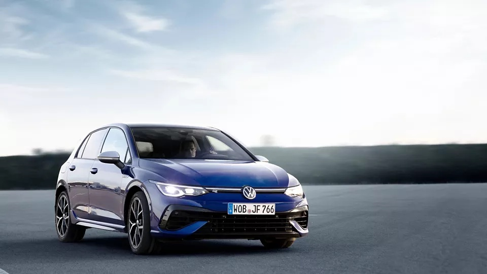

<!--  -->

https://www.volkswagen-newsroom.com/en/press-releases/the-new-golf-r-estate-more-power-more-driving-dynamics-more-emotions-more-space-7301

With 235 kW (320 PS)01, the new Golf R Estate is the most powerful and dynamic Golf Estate to date. More power and driving dynamics, numerous innovations, more space and strong emotions: this is what makes the new Golf R Estate better than ever before. The standard 4MOTION all-wheel drive with R Performance Torque Vectoring is powered by a 2.0 TSI engine with a maximum torque of 420 Nm.

Power is transmitted via an R-specific 7-speed dual clutch gearbox. It sprints from 0 to 100 km/h in just 4.9 seconds. The top speed is electronically limited to 250 km/h. With the optional R Performance package, a top speed of 270 km/h is possible. The package also includes 19-inch wheels and the additional driving modes Special (Nürburgring mode) and Drift (for power slides). A host of assist systems and the latest-generation Infotainment system guarantee even more safety, comfort and convenience.

The Golf R Estate may be exceptionally sporty, but it also retains all the characteristics you’d expect from a Golf estate: this is a versatile all-rounder, a comfortable leisure-oriented and family-friendly estate car for all walks of life. Its suitability for everyday use is in no way compromised by the R-specific sports running gear (lower by 20 mm) and the fact that it is designed with motor racing in mind. “The Golf R Estate is the perfect combination of a compact Golf R03and an estate. Sportiness, performance and emotions meet space, versatility and innovation,” says Sven Smeets, Head of R Business Unit. The interior of the R Estate fully benefits from the 66 mm longer wheelbase of the Golf Estate compared with the Golf. Especially passengers in the back profit from the generous proportions: The maximum legroom expands from 903 mm to 941 mm. The vehicle has a luggage compartment volume of 611 litres, which increases to a maximum of 1,642 litres if loaded up to the roof and with the second row of seats folded down. For the first time, the Golf R Estate is available with an optional ball coupling with a permitted maximum trailer weight (braked) of up to 1.9 tonnes and a drawbar load of 80 kilograms.

## Sportiest Golf Estate ever with a number of R-specific elements##

The R-typical insignia such as the front bumper with splitter and side wings as air deflectors dominate the powerful exterior of the new Golf R Estate. From the side, the striking wider side members in the body colour catch the eye. Completely new are the R-specific rear bumper with the diffuser painted in high gloss black as well as the sports exhaust system built according to Volkswagen R specifications and boasting two chrome-plated twin tailpipes. There are three colours to choose from: the R-typical Lapiz Blue Metallic, Pure White and Deep Black Pearl Effect.

And the Golf R Estate, just like the compact Golf R, features the newly developed 4MOTION all-wheel drive with R Performance Torque Vectoring with selective wheel torque control on the rear axle. Here, a new rear final drive distributes the drive power not just between the front and rear axles as needed, but also between the rear wheels. This innovative drive significantly increases the agility of the new Golf R Estate, particularly when cornering. The all-wheel drive is also networked via the Vehicle Dynamics Manager with other running gear systems such as the electronic differential locks (XDS) and adaptive chassis control DCC. The result: very precise and neutral handling, optimum traction characteristics and exceptional agility. In other words: maximum driving pleasure. The Golf R Estate was fine-tuned on the Nordschleife of the Nürburgring.

## Two new driving profiles increase the fun factor and enhance safety aspects##

In the optional R Performance package, the powerful estate car has two additional driving profiles. In the Special profile, all key drive system parameters have been configured for demanding race tracks such as the Nordschleife. Away from public roads, the driving profile Drift opens up a whole new level of driving dynamics and makes drifting much safer and more fun.

The four driving profiles Comfort, Sport, Race and Individual come as standard. Drivers can use a button to adjust the ESC to their requirements by selecting one of two settings. ESC can also be switched off completely for all driving situations (ESC off mode), however, the Autonomous Emergency Braking and the Swerve Support reactivate the full ESC system in an emergency.

The 1,984 cc four-cylinder turbocharged engine of the EA888 product line now develops an output of 235 kW (320 PS) in its fourth development stage. That’s 14 kW (20 PS) more than its predecessor. The maximum torque has increased from 400 Nm to 420 Nm. This is available even at low engine speeds of just 2,100 rpm and remains constant at this high level up to speeds of 5,350 rpm. Of course, the new engine fulfils the current EU6 AP emission standard. A new brake system with 18-inch brake discs is fitted on the front axle. This means they are one inch (25.4 millimetres) larger than the predecessor’s. The new brake is built with pin discs and a brake pot made of aluminium, which reduces the weight by 600 grams on each side. A speed-dependent map in the electromechanical brake servo ensures precise brake control. The visible components of the brake system are in striking blue with the R logo on top as a kind of optical exclamation mark.

## The Golf R Estate is a true R model inside too##

Fitted as standard in the new Golf R Estate are the new multifunction sports leather steering wheel and premium sports seats at the front, among other things. These have integrated head restraints sporting blue R logos. The seat centre panels are covered with the fabric seat covers “R” in black-blue. The inner side of the seat cushion bolsters is made of ArtVelours microfleece in Flint Grey. The optional Nappa leather package can also be ordered. It includes active climate control for the front seats and, on the insides of the doors, carbon-look elements with blue applications.

Compared to those in its predecessor, the driver’s controls have been almost completely redesigned. Touch buttons, touch sliders and touch screens substitute the functions of classic controls and analogue displays. The R-specific Digital Cockpit Pro offers exclusive features such as a new, horizontal engine speed display at the upper edge of the fully digital display as well as a lap timer for keeping time on the race track. And you can operate the vehicle with the new, natural, learning voice control, if you wish.

As with all Volkswagens, the new Infotainment system MIB3 provides modern connectivity. It is networked with the various online services of the brand’s own Volkswagen We ecosystem and enables Cloud-based personalisation by means of the Volkswagen ID. The Digital Cockpit Pro and the Infotainment system are arranged in the driver’s line of sight and easy to see and operate at all times.

Video of the new Golf R Estate: [https://youtu.be/zqwWCS0Gwm4](https://youtu.be/zqwWCS0Gwm4)

.

.

.

For more information, call us at our Volkswagen Dealership in Saskatoon, SK!

1-306-955-8877

181 Motor Way

Saskatoon, SK
