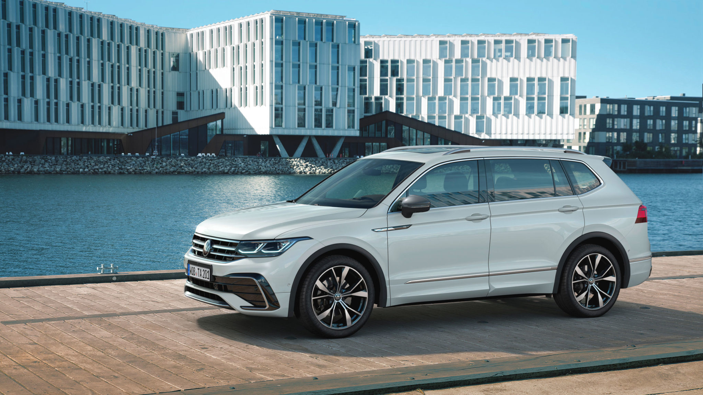
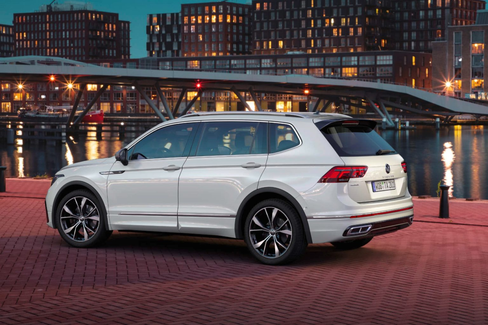

<!--  -->

[https://www.volkswagen-newsroom.com/en/press-releases](https://www.volkswagen-newsroom.com/en/press-releases)

- Comprehensive technology update for the long version of the TiguanTravel Assist supports the driver when steering, braking and accelerating.
- New equipment matrix, new touch controls and optional Harman Kardon premium sound system.Variable interior with a third row of seats (optional) and space for up to seven passengers.
- Successful long-wheelbase version: 1.5 million vehicles sold globally since launch in 2017
- Travel Assist supports the driver when steering, braking and accelerating.
- Variable interior with a third row of seats (optional) and space for up to seven passengers.

The Tiguan was given an update back in autumn 2020 and now it is the turn of the long-wheelbase version: revised design, new control and assist systems, new premium features such as interactive IQ.LIGHT LED matrix headlights and touch panels to control the standard automatic air conditioner take the Tiguan Allspace to the next level. Currently, more than every second Tiguan (55 percent) that rolls off the production line worldwide has a long wheelbase. The XL version of the Tiguan Allspace can, upon request, be fitted to become an SUV with seven seats or boast 1,920 litres of storage space. Pre-sales start in the next few weeks. In Germany, it is available in the new specification packages Life, Elegance and R-Line.

Since the start of production of the long version in 2017, around 1.5 million units of the long-wheelbase version (LWB) have been sold worldwide. The long version offered in Europe as the Tiguan Allspace is optionally available with a third row of seats – a rare specification option in this segment. This feature makes it a perfect partner for families and people with an active lifestyle.

After the major visual and technological update of the Tiguan, the Tiguan Allspace is now next in line – with a sharper look, digital cockpit, new technologies, new equipment matrix and comprehensive connectivity. Its virtues as a spacious SUV remain unchanged: with a five-seat configuration, it offers a luggage compartment volume of 760 to 1,920 litres, with the seven-seater offering 700 to 1,755 litres. The optional seats in the third row can be folded like the rear bench seat and backrest in the second row. They can be dropped to fit flush into the luggage compartment floor thus creating an even loading area. There are three TSIs and two TDIs engines available. Upon request or depending on the equipment, a 7-speed dual clutch gearbox ensures fast, efficient gear changes and the optional 4MOTION all-wheel drive offers optimum traction.

Due to its redesigned front, the Tiguan Allspace has now grown to a length of 4,723 mm (22 mm longer); all the generous interior measurements are unchanged. With its newly designed front featuring an independent radiator grille and elegant signature light, the vehicle exudes premium quality. For the first time, the Tiguan Allspace can now be ordered with IQ.LIGHT LED matrix headlights. A further new feature is the “sweeping” indicator function of the LED turn signals. On either side of the redesigned Volkswagen logo, an illuminated strip in the radiator grille adds a striking visual note.

## Three equipment options available

Volkswagen has reconfigured and optimised the equipment matrix of the Tiguan Allspace. In future, it will be available in the versions Life, Elegance and R-Line in Germany. The Elegance equipment elegantly showcases the new Tiguan Allspace with numerous chrome-plated elements in the interior and on the exterior as well as 19-inch alloy wheels. Sporty drivers can order the Tiguan Allspace in the R-Line version. A multifunction leather sports steering wheel with touch operation and R-Line logo, decorative trims in Carbon Grey, Digital Cockpit Pro and 19- or 20-inch wheels are just some of the distinctive features. When it comes to comfort, the front seats can be ordered in the ergoActive version with electric 4-way lumbar support adjustment and massage function.

All air conditioning, heating and ventilation functions of the standard three-zone automatic air conditioner are operated via a new digitalised module in the centre console. Touch panels and sliders take the place of rotary knobs and buttons. The driver can now also choose to receive information via the full-colour head-up display. It projects driving-related information such as speed, directions and warnings in
the driver’s field of vision. The already proven optional Trailer Assist system supports the driver when manoeuvring a trailer. The maximum trailer weight is up to 2.5 tonnes with the 4MOTION all-wheel drive.

Partly automated driving is made possible by IQ.DRIVE Travel Assist that is used for the first time in the Tiguan Allspace. Depending on the gearbox type, the system can take over steering, braking and acceleration at speeds starting from 0 km/h (with dual clutch gearbox) or 30 km/h (manual gearbox) up to 210 km/h. To do this, Travel Assist relies on familiar systems including Adaptive Cruise Control (ACC) for longitudinal guidance, and Lane Assist (fitted as standard) for lateral guidance.

## Digitalisation in the Tiguan Allspace is progressing

For smart connectivity, the Tiguan Allspace boasts a number of new infotainment systems (new-generation MIB3) that are linked up to a wide range of online services. An Online Connectivity Unit (OCU) with integrated eSIM allows users to benefit from the online services of We Connect (set up for an unlimited usage period) and We Connect Plus (set up for free use for one or three years in Europe). Depending on the equipment level, the range of MIB3 systems is supplemented with features such as natural voice control, access to streaming services and cloud-based personalisation via Volkswagen ID. Additionally, apps can now be integrated wirelessly via App-Connect Wireless for Apple CarPlay™ and Android Auto™.

The optional premium sound system that Volkswagen has developed together with Harman Kardon ensures fascinating acoustic experiences. A subwoofer, a digital 16-channel amplifier, 8 plus 1 high-performance loudspeakers and an amplifier with a 480-watt total output provide crystal clear treble and deep, rich bass sounds. Four sound scenarios, surround mode and razor-sharp speech reproduction guarantee high-end sound at all seats.

[https://www.volkswagen-newsroom.com/en/live-stream-5455](https://www.volkswagen-newsroom.com/en/live-stream-5455)
