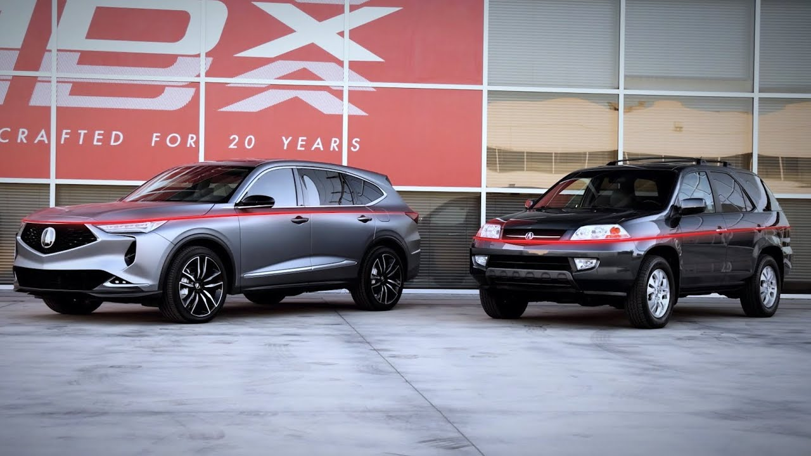

<!--  -->

[https://acuranews.com/en-US/releases/release-ada28d9a2a2602e13a2004f53d001492-twenty-years-of-design-innovation-acura-mdx](https://acuranews.com/en-US/releases/release-ada28d9a2a2602e13a2004f53d001492-twenty-years-of-design-innovation-acura-mdx)

After more than two decades and one million units sold since the debut of the first-generation MDX in 2000, the new MDX Prototype previews the nameplate’s most ambitious redesign yet. Utilizing a clean sheet design and clear focus on delivering Precision Crafted Performance, the fourth-generation MDX reimagines the three-row SUV’s proven formula with a more emotional, exciting and premium design.

The clean sheet approach harkens back to the pioneering 2001 MDX, the first SUV designed by Acura in California, and the industry’s first three-row SUV to be based on a unibody platform. Both challenging designs were undertaken by the same person – exterior design leader Catalin Matei.

In a new video released today, Matei reflects on the disparate design intentions between the first and fourth-generation MDXs, while also highlighting similarities such as a distinct character line which runs the perimeter of both models, below the headlight on the original, and higher on the all-new MDX to communicate strength and performance.

## MDX Design Reimagined

[Previewed in Prototype form](https://acuranews.com/en-US/releases/release-6863b02537c7e48379ea3d103c07b43a-new-flagship-mdx-prototype-makes-global-debut), the fourth-generation MDX makes a bold statement with its more dynamic and muscular design. A more upright front fascia and long, sculpted hood convey power and presence along with an impressive six-inch increase in dash-to-axle dimension versus the outgoing MDX. Inspired by the wind-shaped rocks of the Antelope Canyons, the new MDX’s alluring and sculpted body sides give the vehicle a constant impression of movement.

Elegantly crafted details include multi-faceted diamond surfaces on the grille creating dynamic reflections and light play while moving around the vehicle. The new MDX’s headlight and taillights, “the jewelry of the vehicle” as described by Matei, deploy Acura’s unique Chicane light signature at both the front and rear.

The new MDX’s performance intent is underscored by its broad shoulders and tapered cabin, drawn rearward on the lower and wider body. Larger and wider wheels are pushed to the corners, anchoring the MDX to the ground and further communicating performance.

## The Original MDX: First-Generation Changes the SUV Game

The original 2001 MDX redefined the luxury SUV segment as the industry’s first three-row SUV to be based on a unibody platform, offering superior comfort, space and driving performance than existing truck-based SUVs. From a design perspective, the first-generation MDX artfully balanced between muscularity and elegance, while communicating strength and stability with its clean look, sharply chiseled front fascia and wide stance. The first gen MDX earned critical praise, including 2001 North American Truck of the Year and 2001 Motor TrendSUV of the Year awards.

## Designer Bio: Catalin Matei

Catalin Matei is a principal designer and exterior design technical expert at Honda R&D Americas (HRA). After graduating from Art Center College of Design in Pasadena, Matei joined HRA in Torrance, California in 1988. His passion for finding creative solutions to technical problems, combined with his love of cars and drawing, are what led him to vehicle design.

Matei’s first role as a designer was on the 1993 Honda Civic Coupe. Following that, Matei designed both the 2000 Acura MD-X Concept and the 2001 Acura MDX production vehicle. He also led the exterior designs of the 2006 Honda Pilot, 2007 Honda Element SC, and two generations of Honda Odyssey (2011 and 2018).

Matei’s responsibilities for the 2022 MDX ranged from the overall exterior design all the way down to details such as the textures used inside the headlights and taillights. In addition to achieving a highly emotional appearance for the MDX, Matei had to consider the vehicle’s engineering layout and overall packaging.
