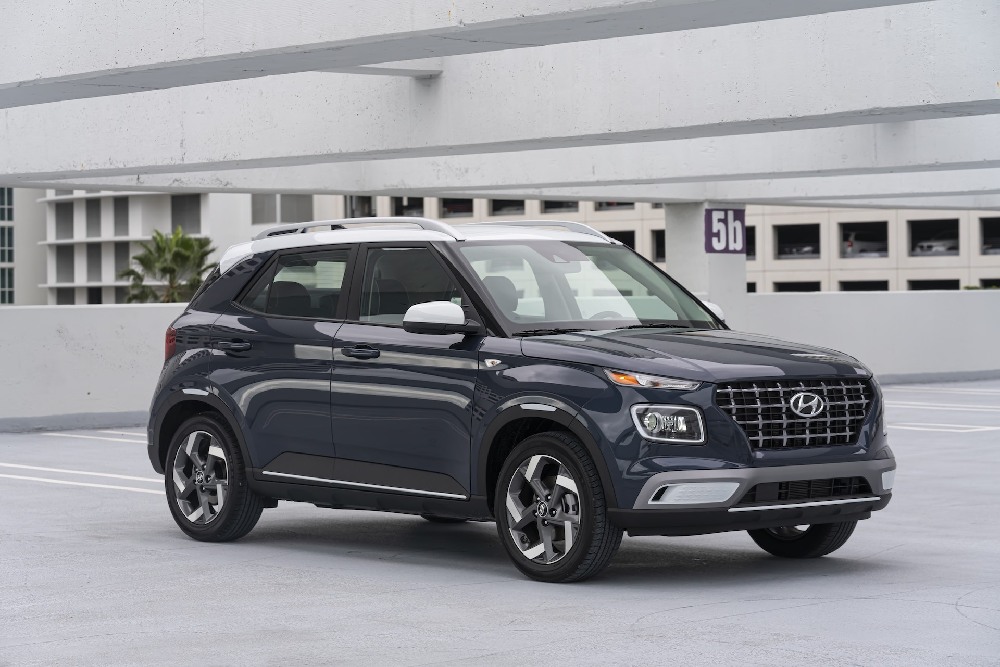

<!--  -->

Now celebrating its 20th anniversary, the Santa Fe has become an icon for the brand, and Hyundai is taking a look back at how its first SUV has evolved over the years.

Unveiled in 2000, the Hyundai Santa Fe is celebrating its 20th anniversary this year
In Canada since October 2000, the Santa Fe launch marked a milestone in the history of Hyundai – now in its fourth generation
As of April 2020, Hyundai Canada has sold 356,226 Santa Fes
Significant enhancements to this iconic model are coming soon, including new electrified powertrain variants
In the year 2000 Hyundai Motor introduced its first-generation Santa Fe, making the company one of the pioneers in the SUV market. Now celebrating its 20th anniversary, the Santa Fe has become an icon for the brand, and Hyundai is taking a look back at how its first SUV has evolved over the years.

Having entered dealerships in 2000, Santa Fe is Hyundai’s longest-running SUV in Canada. Now in its fourth generation, the Santa Fe has undergone significant evolution in its design, safety and technology over the years, often leading the way as a flagship for new features. This fall, Hyundai will launch a much-improved version of the current generation with new electrified powertrains and major design updates.

Following its launch two decades ago, Santa Fe quickly became one of Hyundai’s most popular models. Named after a city in the South western U.S., it was the company’s first SUV, and played an important role in establishing Hyundai in the SUV segment. From that point on, SUV’s would go on to dominate the market, with purchase reasons mirroring the Santa Fe’s offerings of improved safety, increased roominess and comfort. Over the past 20 years, Hyundai has sold more than 5,260,000 units of Santa Fe globally.

“The Santa Fe was Hyundai’s first SUV, and it is one of our longest-running model lines, making it a key model not only globally but especially in Canada,” says Don Romano, President and CEO of Hyundai Auto Canada. “For Hyundai, it is an icon which continues to evolve in terms of design, safety, technology, roominess and comfort. With this latest evolution, Santa Fe maintains its status as the safest SUV in its segment while also moving the needle forward with new electrification.”

First-generation Santa Fe (2000-2006): The original best-seller

Hyundai introduced the Santa Fe to the Canadian market for the first time in October 2000. While subsequent generations became progressively premium over time, the very first Santa Fe was practical and appreciated for its functionality and reliability. In 2001, not long after the first model was produced, Hyundai had to ramp up production due to the overwhelming demand in North America.

The first generation Santa Fe featured a rugged, yet refined look and was substantially longer and wider than many of its rivals in the segment, emphasising its practicality for off-road driving. The spacious interior offered enough room for up to five passengers, as well as ample cargo space. Meanwhile, its convenience features, which included air conditioning, a CD player, as well as electric windows, mirrors and a sunroof, were comprehensive for the time.

Second-generation Santa Fe (2006-2012): More power, more space and upgraded safety

The second-generation Santa Fe was launched at the North American International Motor Show in January 2006. It featured an updated 2.7-liter gasoline-powered V6 while offering significantly improved handling and sportier engines to equip customers for a range of driving and weather conditions.

By the middle of the 2000s, design was becoming increasingly important to customers. Therefore, this Santa Fe featured significant changes inside and out. Its exterior offered an assertive front grille, confident sculpted lines and finely detailed headlights. This contemporary look showcased how the brand’s design direction was evolving.

The interior utilised a range of soft-touch, high-quality materials and low-gloss surfaces to provide customers with a touch of luxury. This premium feeling was further emphasised by the blue backlighting which surrounded the model’s controls and switches, in combination with leather upholstery. Meanwhile, it offered more space than before, as for the first time, the option of adding a third row was available, extending the five-seater to a seven-seater.

With customers of the time demanding increased safety features, the second-generation Santa Fe offered a series of extensive safety upgrades, which continued Hyundai’s leadership in standardising the industry’s most advanced technologies. Electronic Stability Control (ESC), an anti-lock braking system (ABS), side-curtain airbags for all seating rows, a tyre pressure monitor, and active front head restraints now came as standard. Later, a premium version was added, which included a built-in navigation system, rear-view camera, cruise control and a light sensor.

Third-generation Santa Fe (2012-2018): Enhanced safety and improved connectivity

The third-generation Santa Fe was a big step forward for Hyundai, as it offered even greater comfort and quality, re-tuned engines and improved efficiency. In addition, it featured a new design which consisted of refined lines as well as bold and voluminous surfaces. By adding a more emotional, muscular look and a wealth of premium features, the company demonstrated it was moving away from offering a purely functional SUV, and instead a sophisticated lifestyle vehicle.

Available as both a sporty five-seater and a version with a long wheelbase offering three rows for six or seven passengers, the third-generation Santa Fe also boasted a refreshed unibody crossover platform. The extended version received a slightly differentiated design, including a unique hexagonal grille design, a new look for the B-pillar, optional 19-inch alloy wheels and flush dual exhaust tips.

Both Santa Fe models offered a similar interior look, fully geared towards passenger comfort and functionality. In the early 2010s, advances in technology gave automakers the opportunity to improve their customers’ comfort and driving experience with a range of intelligent connectivity features. As a result, the third-generation Santa Fe offered an optional multifunction eight-inch touchscreen with navigation with a simpler and more intuitive user interface as well as enhanced voice recognition commands, while phone connectivity was also improved.

Fourth-generation Santa Fe (2018-present): SmartSense safety features and a bold new design

Building on the success of its previous generations, in 2018 Hyundai introduced the fourth-generation Santa Fe. Its premium feeling is illustrated by its prestigious appearance, while it is equipped with the most advanced technology as well as best-in-class safety features and exceptional roominess.

The elegant SUV model features a bold outward appearance with a wide, athletic stance. Hyundai’s signature Cascading Grille decorates the front, and the side is enhanced by sleek lines which stretch along the roof and from the headlights to the taillights. This reinforced the car’s status at the top of Hyundai’s SUV line-up at the time of its release. Inside, it is the roomiest Santa Fe yet, with 38 mm more leg room in the second row.

Equipped with Hyundai’s latest SmartSense technology, the fourth-generation Santa Fe is among the safest in its class, and it received the Top Safety Pick designation from the NHTSA, and Top Safety Pick+ when equipped with LED headlights.

Hyundai demonstrates it continues to care for its customers by offering even more innovative features, including Hyundai’s in-house developed and industry-first Rear Occupant Alert, which uses an ultrasonic sensor to detect the movement of children or pets on the rear seat and alert the driver when leaving the car. Another safety feature is Rear Cross-Traffic Collision-Avoidance Assist, which scans a 180-degree area behind the vehicle, warning the driver and applying the brakes if necessary to avoid collisions.

Eighteen years after the introduction of the first-generation model, this powerful, elegant SUV evolved to become Hyundai’s premium flagship model in Canada, preceding the introduction of Palisade. The continuing improvements the Santa Fe has undergone over the past two decades demonstrate Hyundai’s commitment to developing quality products with the latest features for its customers. Further details on the enhancements to the fourth generation will be revealed in the near future.

For more information, visit https://www.hyundaicanada.com/en/newsroom/vehicle-news

.

.

The Hyundai Santa Fe has been a popular vehicle at our two Hyundai locations in Saskatoon. Be sure to pop into one of our dealerships to hear about our awesome Orange Tag Deals for the month of August!

See you soon!

-FFUN Family
