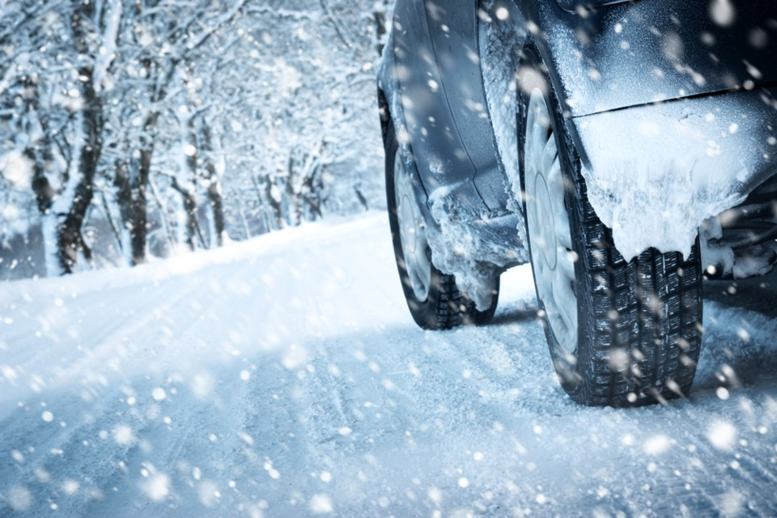

<!--  -->

Does anyone else feel like this cold winter has lasted a lifetime already this year? Because we sure feel like it! Our Saskatchewan winters definitely keep us on our feet, and throughout these months, we unfortunately experience dangerous driving conditions. So today, we wanted to talk about winter driving myths that you might have heard over the years and set the truth straight!

## 1.You Can Get Through Anything With All-Wheel Drive##

When you compare all-wheel drive, or two wheel drive, you just assume all-wheel drive will be a much safer option, but the truth is, it does not make any difference when trying to stop in winter driving conditions and it won’t help with steering any better. Most people think this way, and unfortunately this causes people to feel over confident behind the wheel on slippery roads. With all-wheel drive, you are able to accelerate much faster than two wheel drive, but the trick of maintaining control truly relies in the tires, which is why it is so important to change your tires before the first snow fall.

## 2.Black Ice: There Is Nothing You Can Do When You Hit Black Ice##

When it comes to winter driving, black ice is one of the most dangerous thing you need to try to be aware of when driving. Most people say you can’t do anything to help when you hit black ice, but there is definitely a few things you can do to get out of it safely. If you find yourself on black ice, you need to try and stay calm, because sudden movements will make you lose control, especially when you pump the breaks. We know hitting the breaks or jerking the wheel is a normal reflex, but you need to restrain from doing either. The safest result is if you take your foot off the gas and keep the wheel as steady as possible as your vehicle slides over the ice patch.

## 3.Tires: Under-Inflated Tires Are Better In Snowy Driving Conditions##

This is definitely false. When you under-inflate your tires, it actually takes away more traction, which in turn takes away your performance and safety. Did you know air pressure is related to temperature, so your tires are already losing one pound of pressure per square inch for every 5.5 degree drop Celsius? You definitely check in with what your manufacturer recommends for tire level and be sure to inflate your tires properly to stay safe on the roads.

## 4.Engines: They Need A Few Minutes To Warm Up In The Cold##

This seems to be the most surprising to people when they hear that this is a myth! When we live in a freezing ice box, obviously our first thought is to warm up our car before driving it, otherwise it feels like were moving a big rock, and it feels like we are harming our vehicle. But the truth is, your car does not perform any better than a cold one. It just leads to wasted gas, gives off greenhouse gas emissions and other types of pollution and more wear on the car. In today’s age, modern cars have new synthetic oils, so even on the coldest days of a Canadian winter, you don’t need to warm up your car for no more than 30 seconds before you can start driving. So as much as we all love warm vehicles, next time you start your car remember that starting your vehicle long before using it, will actually decrease the life span of your engine.

## 5.Emergency Kits Are Just For Rural Drivers##

If you are located in a city, most people think they don’t need an emergency kit because they are always around close resources that can help. However, that is not a smart way of thinking. Even if you are just driving in the city, you never know how busy tow trucks are that day, and it could take hours for one to get to you. What if your phone is dead, and you become dependent on motorists stopping to help you out? You just never know the circumstances so it really doesn’t hurt to carry a kit with you just in case. Most kits include items like a shovel, a blanket, non-perishable food such as granola bars, flashlight, matches etc. It is also a very good idea to keep winter boots, and gloves in case you aren’t dressed properly that day.

## 6.The Roads Will Be Fine When They Are Salted##

People often feel relieved when they know the roads they take have been salted; however, it doesn’t actually melt ice, so you still need to be cautious. Salt is helpful by lowering the freezing point of water, so it stays fluid at lower temperatures. Salt also helps with making it easier for plows to clear the road because it breaks the bond between the ice and the asphalt. In order for the salt to work its magic, the crystals work best when they are heated from the sun or the friction from the tires when they go over them. So if you happen to be one of the first cars on the road after a salt truck goes by, you need to be very careful because it could still be very slippery. Another thing to keep in mind, especially in Saskatchewan, is salt slowly loses its effectiveness as temperatures drop, and when it is below -18°C, the salt doesn’t do anything.
We hope you found this information helpful! If you ever have any questions about tires, or winter driving, please don’t hesitant to reach out to one of our dealerships, because we would love to help you out!

## Stay Safe out there!##

## -FFUN Family##
